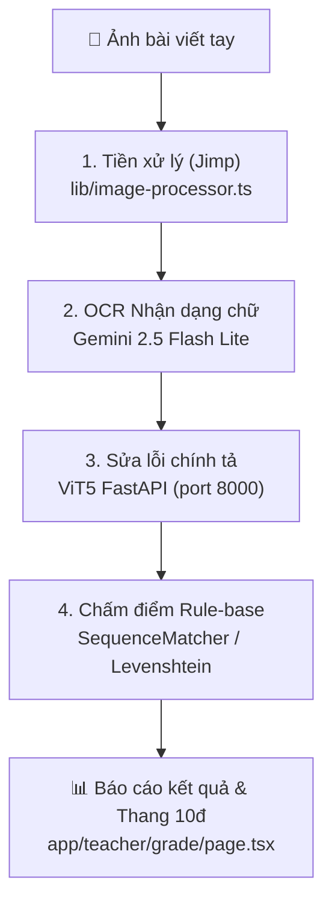

# ViHand Grade — Architecture & Workflow Cheat Sheet

> Tài liệu tham khảo nhanh cho AI Agent khi làm việc với codebase ViHand Grade.
> Được nạp theo cơ chế **Progressive Disclosure** khi kích hoạt skill `project-context-prep`.

---

## 1. Tổng quan hệ thống

**ViHand Grade** là hệ thống AI hỗ trợ chấm điểm và sửa lỗi chính tả bài viết tay tiếng Việt dành cho học sinh tiểu học (Đề tài NCKH Sinh viên — Đại học Tôn Đức Thắng).

### Cấu trúc 4 tầng (Hybrid AI Architecture):


---

## 2. Các dịch vụ & Cổng kết nối (Services & Ports)

| Service | Đường dẫn | Công nghệ | Cổng mặc định | Vai trò |
|:---|:---|:---|:---:|:---|
| **Web App (Frontend + API)** | `/` | Next.js 16, React 19, Tailwind v4 | `3000` (Local) / `7860` (Docker) | Giao diện giáo viên/học sinh/admin + API routes |
| **AI Spelling Engine** | `python_service/` | Python 3.11, FastAPI, ViT5 Transformers | `8000` | Sửa lỗi chính tả tiếng Việt qua mô hình Seq2Seq ViT5 |
| **MCP Dictation Server** | `mcp_service/` | Python FastMCP, Edge-TTS | `8001` / stdio | Tạo bài đọc chính tả AI từ kho văn bản SGK |
| **Database** | `prisma/` | SQLite (`prisma/vihand.db`), Prisma ORM 5 | File-based | Lưu trữ User, Class, GradeRecord, DictationSession |

Khởi động toàn bộ dịch vụ cục bộ bằng file batch:
```bat
start_all.bat
```

---

## 3. Luồng dữ liệu cốt lõi (Core Data Flows)

### A. Pipeline Chấm điểm bài chính tả (`app/api/grade/route.ts`)
1. **Tiền xử lý ảnh (`lib/image-processor.ts`)**:
   - Jimp thực hiện chuỗi 9 bước: Auto-rotate -> Cân bằng sáng -> Grayscale -> CLAHE/Contrast -> Khử bóng -> Khử nhiễu -> Nhị phân hóa Otsu -> Crop lề -> Chuẩn hóa kích thước (1600px).
2. **Gemini Vision OCR**:
   - Trích xuất văn bản thô từ ảnh đã tiền xử lý.
3. **ViT5 Spelling Correction (`http://localhost:8000/predict`)**:
   - Đưa văn bản OCR qua mô hình `chamdentimem/ViT5_Vietnamese_Correction`.
   - Nếu service Python offline hoặc lỗi, fallback sang prompt chuyên dụng của Gemini Flash.
4. **Thuật toán Chấm điểm & Phân loại lỗi**:
   - So khớp văn bản học sinh với văn bản mẫu / văn bản sửa bằng `SequenceMatcher`.
   - Phân loại lỗi thành 6 nhóm: **Dấu thanh**, **Phụ âm đầu**, **Vần**, **Chính tả viết hoa**, **Lặp từ**, **Bỏ từ/thiếu chữ**.
   - Tính điểm theo thang 10:
     - Chính tả: tối đa **4.0 điểm** (trừ theo số lỗi)
     - Hình thức: tối đa **3.0 điểm** (độ sạch đẹp, thụt đầu dòng)
     - Nội dung: tối đa **2.0 điểm** (độ hoàn thiện so với bài mẫu)
     - Sáng tạo / Chữ viết: tối đa **1.0 điểm**

### B. Module Đọc chính tả (`app/teacher/dictation/page.tsx` + `mcp_service/`)
- Giáo viên chọn bài từ kho SGK Lớp 1-5 hoặc nhập tùy ý.
- Chia câu theo nhịp đọc tiểu học (3-5 từ/nhịp, lặp 2 lần, ngắt nghỉ 5-8 giây).
- Stream audio trực tiếp bằng Microsoft Edge-TTS tiếng Việt (`vi-VN-HoaiMyNeural` / `vi-VN-NamMinhNeural`).

---

## 4. Bản đồ mã nguồn quan trọng (Anchor Points)

```
Web_sua_loi/
├── app/
│   ├── api/
│   │   ├── grade/route.ts          ⭐ Core grading pipeline
│   │   ├── ocr/route.ts            ⭐ Gemini OCR endpoint
│   │   └── dictation/              ⭐ Dictation & TTS API
│   ├── teacher/
│   │   ├── grade/page.tsx          ⭐ Giao diện chấm bài của giáo viên
│   │   ├── dictation/page.tsx      ⭐ Giao diện đọc chính tả
│   │   └── reports/page.tsx        ⭐ Báo cáo thống kê lớp học
│   ├── student/history/page.tsx    ⭐ Học sinh xem lại bài chấm
│   └── admin/                      ⭐ Quản lý phân quyền 3 cấp (RBAC)
├── lib/
│   ├── image-processor.ts          ⭐ 9 bước tiền xử lý ảnh (Jimp)
│   ├── prisma.ts                   ⭐ Prisma Client singleton
│   └── types.ts                    ⭐ TypeScript interfaces dùng chung
├── python_service/
│   └── main.py                     ⭐ FastAPI ViT5 inference server
├── mcp_service/
│   └── main.py                     ⭐ FastMCP server tạo bài đọc chính tả
├── prisma/
│   └── schema.prisma               ⭐ SQLite database schema
└── 01_Bao_cao_Nghien_cuu/
    └── Tai_lieu_Bao_cao/           ⭐ Toàn bộ tài liệu NCKH / TechSpec v2.3
```

---

## 5. Quy tắc bảo mật & vận hành bắt buộc

1. **Database SQLite (`prisma/*.db*`)**: Chứa thông tin học sinh thực tế — **TUYỆT ĐỐI KHÔNG** commit lên GitHub công khai.
2. **API Keys**: Các biến trong `.env` (`GEMINI_API_KEY`, `HF_TOKEN`, `NEXTAUTH_SECRET`) không bao giờ được hardcode hoặc push lên git.
3. **Môi trường chạy**: Môi trường Windows sử dụng lệnh `python` (không dùng `python3`).
