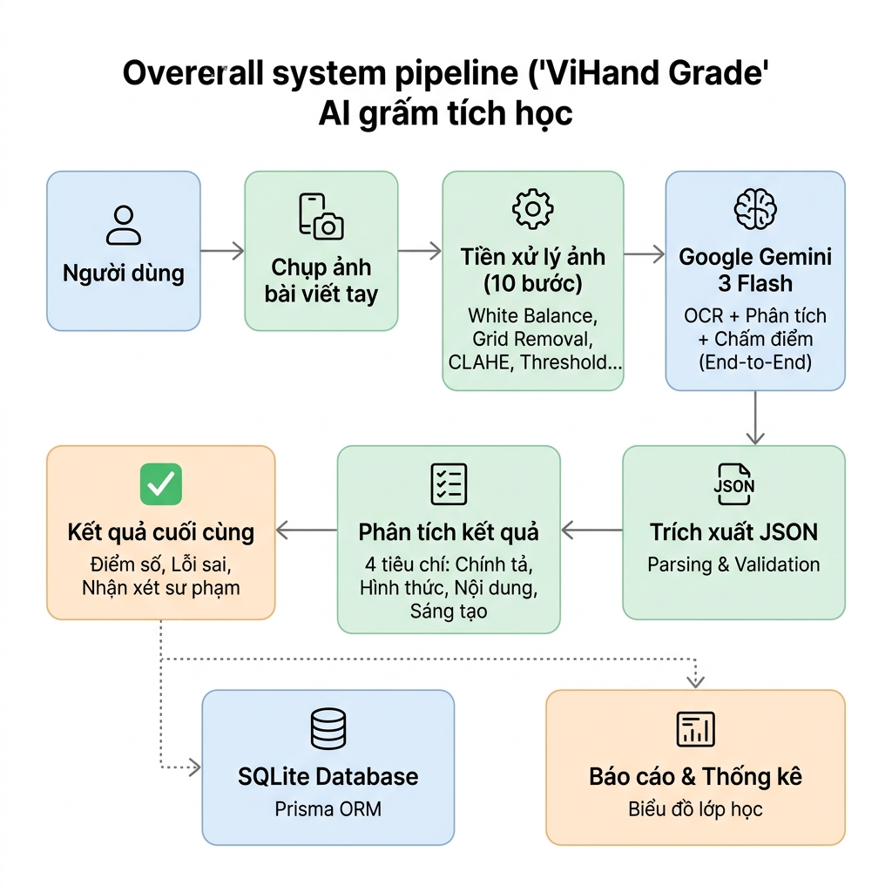
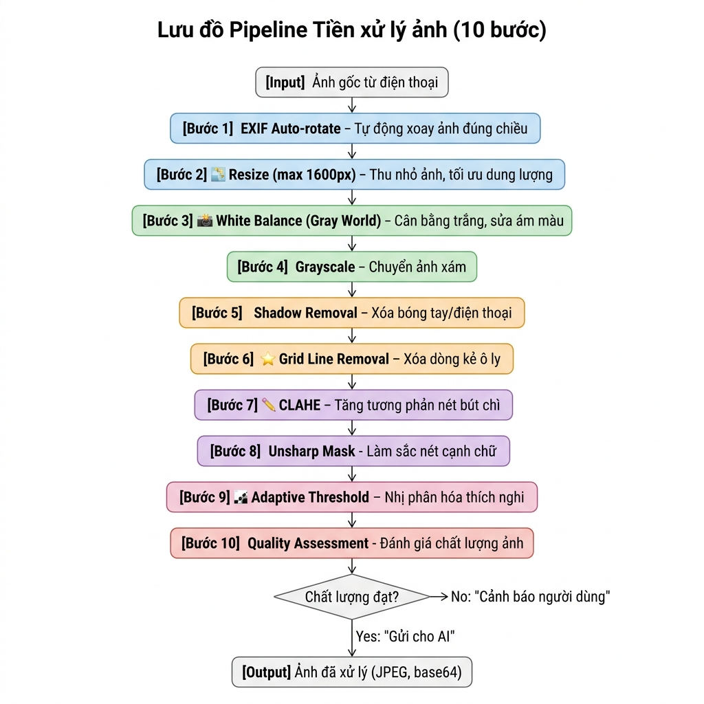
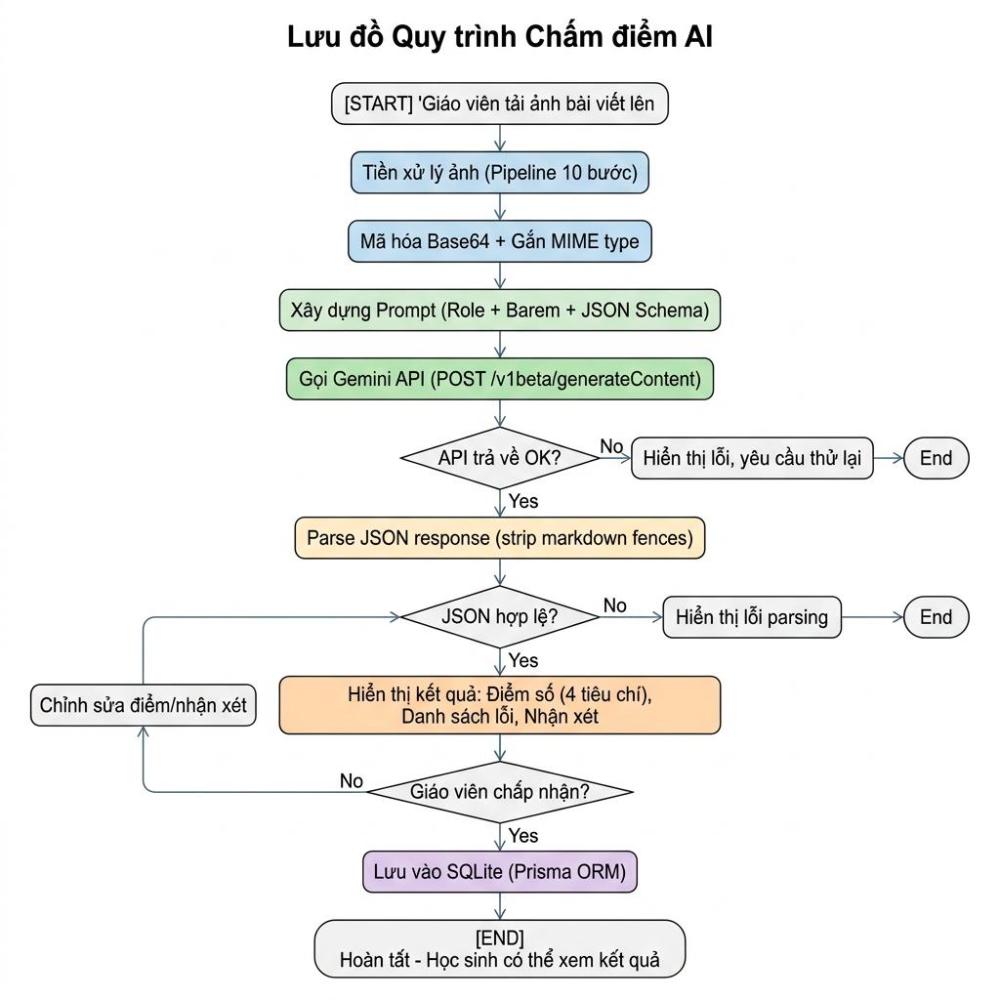
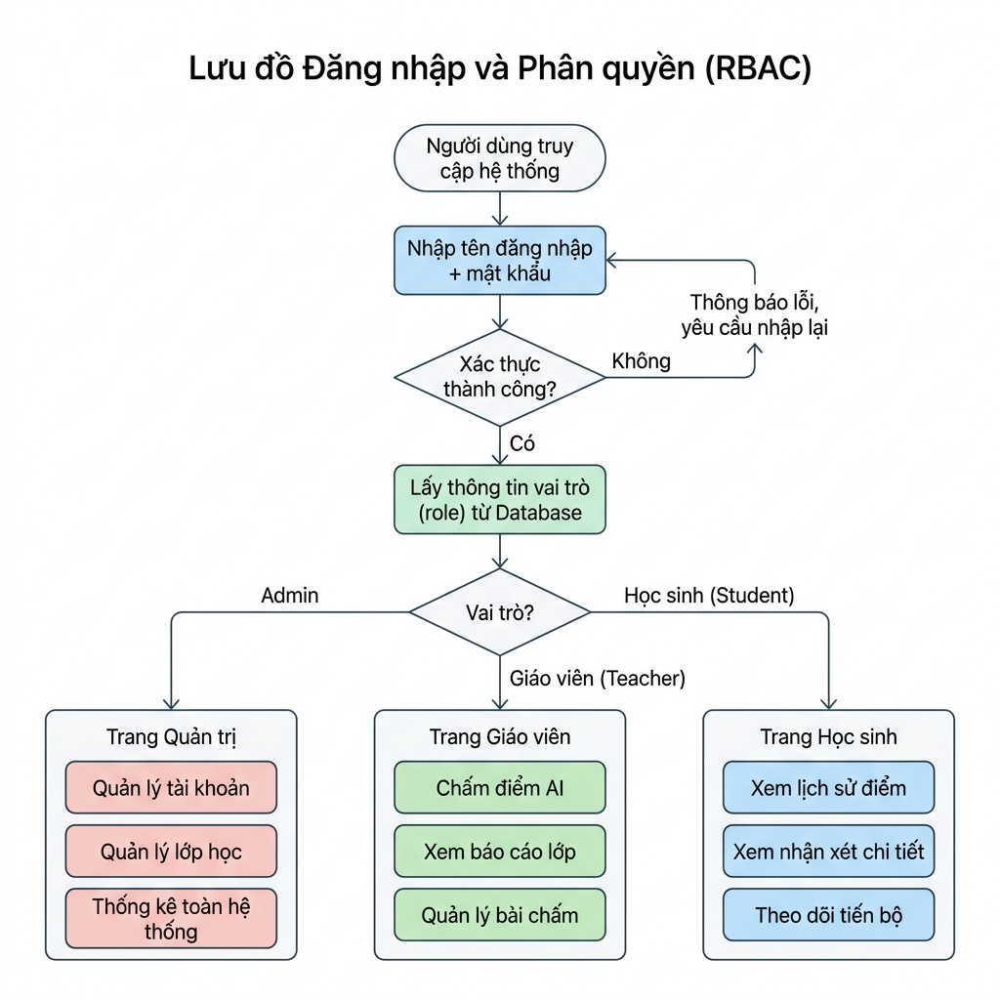

# CHƯƠNG 3: THIẾT KẾ HỆ THỐNG VÀ TỔNG QUAN MÔ HÌNH

---

## 3.1. KIẾN TRÚC TỔNG THỂ HỆ THỐNG (OVERALL ARCHITECTURE)

Hệ thống **ViHand Grade** được thiết kế dựa trên kiến trúc Web PWA (Progressive Web App) hiện đại, sử dụng framework **Next.js App Router** cho cả frontend và backend, kết hợp với cơ sở dữ liệu **SQLite** thông qua **Prisma ORM**. Mô hình hoạt động dựa trên sự phối hợp chặt chẽ giữa bộ tiền xử lý ảnh số cục bộ và Trí tuệ nhân tạo (AI) đa phương thức trên điện toán đám mây.

Sơ đồ luồng hoạt động tổng thể của hệ thống được thể hiện chi tiết tại **Hình 3.1**.



Quy trình xử lý dữ liệu tổng thể diễn ra qua các giai đoạn tuần tự sau:
1. **Thu nhận dữ liệu (Input):** Người dùng (giáo viên hoặc học sinh) sử dụng điện thoại thông minh chụp ảnh trực tiếp bài viết tay chính tả trên giấy ô ly của học sinh tiểu học và tải lên giao diện Web.
2. **Tiền xử lý ảnh số (Preprocessing):** Hệ thống tự động kích hoạt bộ tiền xử lý gồm 9 bước viết trên nền thư viện `Jimp` (TypeScript). Ảnh thô được chuẩn hóa kích thước, loại bỏ ám màu, bóng che, tăng cường tương phản và nét chữ viết tay để tạo ra một tệp ảnh tối ưu nhất cho OCR.
3. **Nhận dạng chữ viết tay (OCR - Gemini Engine):** Ảnh sau xử lý được truyền đến API của mô hình **Google Gemini 3.1 Flash Lite** kèm theo Prompt hệ thống. Ở bước này, Gemini chỉ làm một nhiệm vụ duy nhất là trích xuất chính xác văn bản thô (kể cả lỗi chính tả) từ ảnh, lọc bỏ các dòng luyện từ nháp và giữ nguyên cấu trúc đoạn văn.
4. **Sửa lỗi và Chấm điểm tự động (ViT5 Python Microservice):** Văn bản thô được gửi tới dịch vụ cục bộ Python chạy mô hình **ViT5 (Vietnamese Text-to-Text Transformer)** đã được lượng tử hóa INT8. Dịch vụ này thực hiện đồng thời:
   - Chạy ViT5 để sinh ra bản dịch đúng chính tả.
   - Sử dụng thuật toán Levenshtein (SequenceMatcher) so sánh văn bản gốc và bản đúng để định vị chính xác vị trí lỗi, phân loại lỗi (phụ âm đầu, vần, dấu thanh, viết hoa...) và tính toán điểm số trừ.
5. **Lưu trữ & Hiển thị (Database & Output):** Kết quả (bao gồm văn bản gốc, văn bản đã sửa, danh sách lỗi chi tiết và điểm số) được trả về Frontend để hiển thị. Giáo viên có quyền can thiệp chỉnh sửa thủ công trước khi lưu trữ vào cơ sở dữ liệu SQLite thông qua Prisma ORM.

---

## 3.2. PIPELINE TIỀN XỬ LÝ ẢNH SỐ (IMAGE PREPROCESSING PIPELINE)

Một trong những đóng góp khoa học cốt lõi của đề tài là việc thiết kế và phát triển thành công **Pipeline tiền xử lý ảnh 9 bước** chuyên biệt cho giấy ô ly tiểu học Việt Nam. Thay vì phụ thuộc vào thư viện `OpenCV` dạng WebAssembly (`opencv-wasm`) có dung lượng tải lớn (~8MB) và khó tích hợp trên môi trường serverless, nhóm tác giả đã tự xây dựng toàn bộ thuật toán xử lý ở cấp độ điểm ảnh (pixel-level) bằng TypeScript thuần thông qua thư viện xử lý ảnh `Jimp` gọn nhẹ.

Lưu đồ cấu trúc chi tiết của pipeline tiền xử lý ảnh được thể hiện tại **Hình 3.2**.



### 3.2.1. Chi tiết thuật toán từng bước trong pipeline

#### Bước 1: EXIF Auto-rotate
Ảnh chụp từ điện thoại thường chứa siêu dữ liệu định hướng (EXIF orientation tag) khiến ảnh bị xoay ngược 90 hoặc 180 độ khi hiển thị trên web. Thư viện `Jimp` tự động phân tích thẻ EXIF này ngay khi đọc ảnh và tiến hành xoay ma trận điểm ảnh về đúng hướng thực tế của bài viết.

#### Bước 2: Resize (max 1600px)
Nhằm giảm thiểu độ trễ truyền dữ liệu mạng LAN/WAN và tối ưu số lượng token tiêu thụ khi gửi sang API của Gemini, ảnh gốc được tự động thu nhỏ tỷ lệ sao cho chiều rộng tối đa đạt `resizeMaxWidth = 1600px` nhưng vẫn đảm bảo giữ nguyên tỷ lệ khung hình và độ sắc nét của các nét chữ viết tay.

#### Bước 3: White Balance (Gray World Assumption)
Để loại bỏ tình trạng ám sắc màu (ám vàng do đèn sợi đốt, ám xanh do ánh sáng ngoài trời lệch góc), hệ thống áp dụng thuật toán cân bằng trắng Gray World. Thuật toán giả định rằng giá trị trung bình của các kênh màu đỏ ($R$), xanh lá ($G$) và xanh dương ($B$) trong một bức ảnh chuẩn đều bằng một mức xám trung tính $Gray_{avg}$:
$$Gray_{avg} = \frac{\overline{R} + \overline{G} + \overline{B}}{3}$$
Từ đó, tính các hệ số hiệu chỉnh kênh màu $k_R, k_G, k_B$:
$$k_R = \frac{Gray_{avg}}{\overline{R}}; \quad k_G = \frac{Gray_{avg}}{\overline{G}}; \quad k_B = \frac{Gray_{avg}}{\overline{B}}$$
Giá trị mới của từng điểm ảnh tại vị trí $(x,y)$ được nhân tương ứng với các hệ số này để đưa nền giấy ô ly về trạng thái màu trắng tự nhiên.

#### Bước 4: Grayscale
Ảnh màu sau khi cân bằng trắng được chuyển đổi sang hệ màu xám (1-channel) nhằm giảm dung lượng bộ nhớ xử lý xuống còn $1/3$ và chuẩn bị cho các bước lọc hình thái tiếp theo. Công thức chuyển đổi sử dụng phân bổ độ nhạy sáng của mắt người đối với ba kênh màu:
$$Y = 0.299R + 0.587G + 0.114B$$

#### Bước 5: Shadow Removal (Khử bóng che)
Để xử lý bóng đen do tay giáo viên hoặc điện thoại che khi chụp bài viết dưới ánh đèn, hệ thống sử dụng phương pháp chuẩn hóa nền (Background Normalization). Đầu tiên, ảnh nền ước lượng được tạo ra bằng phép lọc làm mờ hộp (Box Blur) với kích thước kernel cực đại $kernel\_size = 51$:
$$Background(x,y) = \text{BoxBlur}(Image_{gray}(x,y), 51)$$
Ảnh đã khử bóng được tạo thành bằng cách chia giá trị của ảnh xám gốc cho ảnh nền ước lượng:
$$Result(x,y) = \min \left( 255, \text{round}\left( \frac{Image_{gray}(x,y)}{Background(x,y)} \times 255 \right) \right)$$
Nhờ ứng dụng cấu trúc **Integral Image (Summed-Area Table)**, phép lọc mờ Box Blur với kernel lớn vẫn đạt hiệu suất thực thi $O(1)$ trên mỗi pixel, giúp giảm thiểu tối đa thời gian tính toán.

#### Bước 6: CLAHE (Cân bằng Histogram cục bộ giới hạn tương phản)
Để tăng cường độ tương phản cho nét chữ viết tay của học sinh (đặc biệt là nét bút chì mờ nhạt), thuật toán CLAHE được áp dụng:
1. Chia ảnh thành lưới $8 \times 8$ các khối nhỏ (tiles).
2. Tính toán biểu đồ tần suất (histogram) cục bộ cho mỗi khối.
3. Giới hạn độ tương phản bằng cách cắt histogram tại ngưỡng `clipLimit = 2.0` và phân phối đều phần dư sang các bin khác để tránh hiện tượng cháy sáng cục bộ hoặc phóng đại nhiễu.
4. Chuyển đổi giá trị xám thông qua hàm phân phối tích lũy (CDF) và áp dụng **nội suy song tuyến (bilinear interpolation)** giữa các khối liền kề để loại bỏ hoàn toàn hiệu ứng răng cưa tại biên giới các ô.

#### Bước 7: Sharpen (Làm sắc nét bằng mặt nạ mờ - Unsharp Mask)
Tăng cường độ rõ nét cho các nét chữ viết tay bị nhòe thông qua việc cộng thêm một phần sai khác giữa ảnh gốc và ảnh mờ:
$$Image_{sharp}(x,y) = Image_{gray}(x,y) + \alpha \times \left[ Image_{gray}(x,y) - \text{BoxBlur}(Image_{gray}(x,y), 3) \right]$$
Với $\alpha = 0.5$ (hệ số sắc nét) mang lại độ chi tiết cao mà không làm tăng quá nhiều nhiễu hạt.

#### Bước 8: Quality Assessment (Đánh giá chất lượng)
Hệ thống đo lường chất lượng ảnh thực tế và xuất ra báo cáo `QualityReport` gồm các cảnh báo sư phạm trực quan:
- **Blur score (Điểm mờ):** Tính bằng phương sai của toán tử Laplacian xấp xỉ trên nhân $3 \times 3$. Nếu chỉ số $< 80$, hệ thống sẽ cảnh báo ảnh bị mờ nét.
- **Brightness (Độ sáng):** Tính trung bình cường độ pixel của toàn ảnh. Nếu độ sáng $< 50$ (ảnh quá tối) hoặc $> 220$ (ảnh cháy sáng), hệ thống sẽ cảnh báo.
- **Nét chữ nhạt:** Đo tỷ lệ pixel tối ($< 100$) trên tổng số pixel. Nếu tỷ lệ $< 2\%$, hệ thống cảnh báo nét viết quá mờ.

#### Bước 9: Adaptive Threshold (Nhị phân hóa thích nghi)
Chuyển đổi ảnh xám liên tục thành ảnh nhị phân (chữ đen hoàn toàn trên nền trắng tinh khiết). Ngưỡng thích nghi cục bộ được tính toán cho từng điểm ảnh dựa trên giá trị trung bình Gaussian của cửa sổ lân cận kích thước $31 \times 31$:
$$T(x,y) = \text{mean}_{local}(x,y) - C$$
Với $C = 20$ (đã được tối ưu qua 4 vòng thực nghiệm trên 13 ảnh thật, giúp nền giấy trắng hoàn toàn trong khi giữ lại trọn vẹn nét bút chì mảnh nhất).

---

## 3.3. QUY TRÌNH CHẤM ĐIỂM BẰNG AI ĐA PHƯƠNG THỨC (AI GRADING PIPELINE)

Quy trình chấm điểm AI của ViHand Grade tích hợp chặt chẽ công nghệ đám mây (Cloud OCR) và máy học cục bộ (Edge AI) thành một luồng xử lý đồng nhất (Hybrid AI).

Sơ đồ quy trình thực thi chấm điểm chi tiết được biểu diễn tại **Hình 3.3**.



### 3.3.1. Các thành phần chính của quy trình chấm điểm

Quy trình chấm điểm AI của hệ thống ViHand Grade được thiết kế thành một luồng xử lý tuần tự 8 bước, như mô tả trong **Hình 3.3**, bao gồm:

**Bước 1 — Tiền xử lý ảnh (Preprocessing - Pipeline 9 bước):**
Giáo viên tải ảnh chụp bài viết của học sinh lên hệ thống. Ảnh đầu vào thô lập tức được đưa vào pipeline tiền xử lý gồm 9 bước liên tiếp thông qua thư viện `Jimp`, bao gồm: tự động xoay EXIF, resize, cân bằng trắng, chuyển grayscale, khử bóng, tăng cường tương phản CLAHE, làm nét, đánh giá chất lượng và nhị phân hóa thích nghi. Mục tiêu là tạo ra một ảnh nhị phân đen-trắng tối ưu, loại bỏ hoàn toàn nhiễu nền, giúp AI tập trung phân tích hình thái nét chữ.

**Bước 2 — Mã hóa Base64 và gán MIME type:**
Ảnh nhị phân sau khi xử lý được mã hóa thành chuỗi ký tự `Base64` và gắn kèm nhãn định dạng `MIME type` là `image/jpeg`. Đây là bước bắt buộc để đóng gói dữ liệu hình ảnh nhị phân vào bên trong Body của một yêu cầu HTTP JSON gửi đến API của Gemini, do giao thức HTTP chỉ cho phép truyền tải dữ liệu văn bản một cách an toàn.

**Bước 3 — Xây dựng Prompt (Role + Barem + JSON Schema):**
Hệ thống lắp ráp một Payload hoàn chỉnh gửi đến Gemini, bao gồm ba thành phần: **(a) Role** — định nghĩa vai trò của mô hình là giáo viên tiểu học Việt Nam am hiểu đặc thù phương ngữ miền Nam; **(b) Barem điểm** — quy định rõ ràng thang điểm 10 theo 4 tiêu chí (Chính tả 4.0đ, Hình thức 3.0đ, Nội dung 2.0đ, Sáng tạo 1.0đ) cùng nguyên tắc trừ điểm; **(c) JSON Schema** — ràng buộc chặt định dạng phản hồi đầu ra, yêu cầu mô hình chỉ được trả về một đối tượng JSON hợp lệ chứa đủ các trường `original_text`, `fixed_text`, `corrections`, `score_breakdown`, `score`, `overall_rating`, và `feedback`.

**Bước 4 — Gọi Gemini API (POST /v1beta/generateContent):**
Payload hoàn chỉnh (Prompt văn bản + dữ liệu ảnh `inline_data`) được gửi đến endpoint `POST /v1beta/models/gemini-3-flash-preview:generateContent` của Google Generative Language API qua giao thức HTTPS với xác thực bằng API Key. Mô hình được cấu hình chạy ở chế độ tất định cao ($Temperature = 0.1$, $topP = 0.95$, $maxOutputTokens = 8192$) để đảm bảo phản hồi nhất quán và trung thực với nội dung ảnh.

**Bước 5 — Kiểm tra phản hồi API:**
Hệ thống kiểm tra mã trạng thái HTTP của phản hồi từ Gemini. Nếu API trả về mã lỗi (HTTP status ≠ 200), toàn bộ nội dung lỗi được ghi log trên server và một thông báo lỗi rõ ràng được gửi ngược về phía giao diện người dùng để yêu cầu thử lại, đảm bảo hệ thống không rơi vào trạng thái treo hoặc không phản hồi.

**Bước 6 — Phân tích phản hồi JSON (Parse JSON Response):**
Văn bản phản hồi thô từ Gemini được xử lý để loại bỏ các đánh dấu Markdown thừa mà mô hình có thể tự ý thêm vào (ví dụ: ` ```json ... ``` `). Sau đó, chuỗi đã làm sạch được phân tích cú pháp (parse) bằng hàm `JSON.parse()` của JavaScript.

**Bước 7 — Kiểm tra tính hợp lệ của JSON:**
Kết quả từ bước phân tích cú pháp được kiểm tra tính hợp lệ. Nếu `JSON.parse()` ném ra ngoại lệ (JSON không hợp lệ do mô hình trả về nội dung bất thường), hệ thống sẽ trả về thông báo lỗi phân tích cú pháp (parsing error) kèm nội dung thô từ Gemini để hỗ trợ gỡ lỗi.

**Bước 8 — Hiển thị kết quả, chỉnh sửa và lưu vào SQLite:**
Nếu JSON hợp lệ, toàn bộ dữ liệu chấm điểm (điểm số theo 4 tiêu chí, danh sách lỗi chi tiết, văn bản nhận dạng và đã sửa, nhận xét) được trả về cho Frontend để hiển thị. Giáo viên có thể xem xét và chỉnh sửa điểm số hoặc nhận xét trước khi xác nhận lưu. Dữ liệu cuối cùng được ghi vào bảng `Grade` trong cơ sở dữ liệu SQLite thông qua Prisma ORM. Học sinh ngay sau đó có thể xem kết quả bài chấm thông qua giao diện lịch sử cá nhân của mình.

### 3.3.2. Thuật toán phân tích lỗi và cấu trúc Barem

Hệ thống thiết lập một barem chấm điểm toán học chặt chẽ. Sau khi nhận được bản sửa từ ViT5, backend sẽ sử dụng thuật toán **Levenshtein Distance** (khoảng cách chỉnh sửa) để đối chiếu trực tiếp từng từ giữa bản sai và bản đúng. 

#### 1. Thiết lập Barem điểm quy chuẩn (Thang điểm 10)
*   **Tiêu chí A: Chính tả & Ngữ pháp (Tối đa 4.0đ):** Điểm khởi điểm là 4.0đ. Hệ thống tự động trừ đi giá trị do giáo viên thiết lập (ví dụ: `-0.5đ/lỗi`) đối với từng sai lệch đếm được.
*   **Tiêu chí B: Hình thức trình bày (Tối đa 3.0đ):** Giáo viên trực tiếp đánh giá thủ công trên giao diện sau khi xem ảnh.
*   **Tiêu chí C: Nội dung & Ý tưởng (Tối đa 2.0đ):** Tương tự như hình thức, giáo viên đánh giá mạch lạc và sự đầy đủ ý.
*   **Tiêu chí D: Sáng tạo (Tối đa 1.0đ):** Thuật toán tự động tìm kiếm các từ láy phức tạp (ví dụ: *ríu rít, long lanh, xôn xao*) trong chuỗi sửa lỗi để tự động đề xuất điểm cộng (tối đa +1.0đ). Giáo viên có thể chỉnh sửa lại thanh trượt này.

#### 2. Phân loại cấu trúc nhóm lỗi tiếng Việt
Để cung cấp báo cáo lỗi trực quan cho giáo viên và học sinh, thuật toán Python định nghĩa 6 nhóm lỗi chuẩn hóa bao gồm:
1.  `phu_am_dau`: Nhầm lẫn phụ âm đầu (kiểm tra các cặp phổ biến: *ch/tr, s/x, l/n, c/k/q, d/gi/r*).
2.  `dau_thanh`: Xóa dấu thanh của 2 từ giống nhau (ví dụ: *sưa* và *sữa*).
3.  `viet_hoa`: Khác biệt ở chuẩn in hoa / in thường.
4.  `van`: Viết sai phần vần.
5.  `bo_sot_them`: Bỏ quên từ/tiếng hoặc tự ý viết thêm từ (dựa trên thuật toán OpCodes).
6.  `dau_cau`: Lỗi chấm phẩy.

#### 3. Định cấu trúc đầu ra JSON từ Python Service
Dịch vụ Python trả về cấu trúc JSON để Next.js tiếp nhận:
```json
{
  "score": "8.0/10",
  "score_breakdown": {
    "chinh_ta":  { "raw": 3.5, "max": 4.0, "error_count": 1, "deduction": 0.5 },
    "hinh_thuc": { "raw": 2.5, "max": 3.0, "note": "" },
    "noi_dung":  { "raw": 1.5, "max": 2.0, "note": "" },
    "sang_tao":  { "raw": 0.5, "max": 1.0, "note": "Có từ láy" }
  },
  "corrections": [
    {
      "error": "cộng",
      "suggestion": "công",
      "error_type": "dau_thanh",
      "is_dialect": false,
      "reason": "Sai dấu thanh: 'cộng' nên sửa thành 'công'"
    }
  ],
  "feedback": "Nhận xét tự động...",
  "overall_rating": "Tốt"
}
```

### 3.3.3. Cơ chế xoay vòng khóa API (API Key Rotation) và Khả năng chịu lỗi (Fault Tolerance)

Để giải quyết triệt để lỗi nghẽn hoặc quá tải tạm thời từ máy chủ Google Gemini (như lỗi `503 Service Unavailable` hoặc `429 Too Many Requests` do đạt giới hạn quota trên mỗi khóa API tự do), hệ thống thiết kế **Cơ chế xoay vòng khóa API (API Key Rotation) tích hợp Khả năng chịu lỗi chủ động**:

1. **Bể khóa API (API Key Pool):** Hệ thống không sử dụng duy nhất một khóa cứng mà thiết lập một bể khóa động (Pool) chứa nhiều API Keys được phân tách bằng dấu phẩy trong biến môi trường `GEMINI_API_KEYS`.
2. **Chọn ngẫu nhiên tải trọng (Random Load Balancing):** Với mỗi yêu cầu chấm điểm gửi lên, hệ thống sẽ thực hiện trộn ngẫu nhiên (shuffle) và chọn ngẫu nhiên một khóa API từ Pool để phát lệnh nhằm giảm thiểu khả năng trùng lặp và dàn đều tần suất yêu cầu trên toàn bộ các khóa.
3. **Cơ chế tự động chuyển đổi khóa (Failover & Fallback):** Khi khóa API đang gọi trả về lỗi `503` hoặc `429`, hệ thống sẽ tự động bắt ngoại lệ này, tạm dừng trong `1500ms` (backoff ngắn) để thực hiện thử lại cùng khóa lần thứ 2. Nếu vẫn tiếp tục lỗi, hệ thống sẽ tự động chuyển sang khóa tiếp theo trong hàng đợi đã trộn ngẫu nhiên. Quy trình này lặp lại liên tục cho đến khi tìm được khóa trống hoặc duyệt hết toàn bộ danh sách khóa trong bể.
4. **Báo lỗi có cấu trúc:** Chỉ khi toàn bộ các khóa API được cấu hình trong hệ thống đều báo bận, hệ thống mới chính thức trả về thông điệp từ chối phục vụ một cách thân thiện đến người dùng, đảm bảo tỷ lệ sẵn sàng hoạt động (Availability) đạt mức tối đa.

---

## 3.4. PHÂN QUYỀN VÀ XÁC THỰC NGƯỜI DÙNG (AUTHENTICATION & RBAC FLOW)

Nhằm đảm bảo an toàn thông tin và tính cách ly dữ liệu trong môi trường giáo dục học đường, hệ thống ViHand Grade triển khai mô hình phân quyền dựa trên vai trò (Role-Based Access Control - RBAC). Có ba vai trò người dùng chính được định nghĩa chặt chẽ trong hệ thống: **Quản trị viên (Admin)**, **Giáo viên (Teacher)**, và **Học sinh (Student)**.

Lưu đồ phân quyền và kiểm soát truy cập của hệ thống được thể hiện tại **Hình 3.4**.



### 3.4.1. Cơ chế quản lý và phân quyền dữ liệu

Hệ thống quản lý phiên làm việc của người dùng và thực hiện phân vùng giao diện chức năng tương ứng tại Next.js Backend Middleware:

1. **Phân hệ Giáo viên (Teacher Interface):**
   - Được quyền truy cập chức năng **Chấm bài bằng AI** (gửi ảnh đến API và lưu kết quả).
   - Chỉ được quản lý, xem danh sách học sinh và báo cáo thống kê của **những lớp học do chính giáo viên đó được phân công chủ nhiệm hoặc giảng dạy**.
   - Có quyền phê duyệt, chỉnh sửa điểm số và nhận xét thủ công trước khi hệ thống lưu chính thức dữ liệu chấm điểm vào database SQLite, đảm bảo tính chủ động của giáo viên trong sư phạm.
2. **Phân hệ Học sinh (Student Interface):**
   - Bị cấm hoàn toàn quyền gọi API chấm điểm hoặc thay đổi cơ sở dữ liệu.
   - Giao diện được cách ly tối đa: chỉ được xem lịch sử điểm số, bảng phân tích lỗi sai và các biểu đồ theo dõi sự tiến bộ chính tả **của chính cá nhân học sinh đó** (dựa trên liên kết `userId` của học sinh trong database), đảm bảo tính riêng tư trong giáo dục.
3. **Phân hệ Quản trị viên (Admin Interface):**
   - Có toàn quyền xem và chỉnh sửa tất cả dữ liệu hệ thống.
   - Thực hiện các nghiệp vụ quản trị hệ thống: khởi tạo lớp học mới, tạo tài khoản cho giáo viên và học sinh, phân công giảng dạy cho giáo viên, quản lý và dọn dẹp bộ nhớ lưu trữ hình ảnh.

---

## 3.5. KẾT LUẬN CHƯƠNG

Trong chương này, nhóm tác giả đã trình bày chi tiết về mặt kiến trúc hệ thống và các mô hình thuật toán cốt lõi của hệ thống **ViHand Grade**. Bằng cách kết hợp linh hoạt pipeline xử lý ảnh số 9 bước cục bộ, đám mây **Google Gemini 3.1 Flash Lite** phục vụ trích xuất OCR, và **ViT5 Python Microservice** để hiệu đính, chấm điểm (thông qua lượng tử hóa INT8 và Levenshtein SequenceMatcher), hệ thống đã giải quyết triệt để các bài toán khó về nhiễu nền giấy ô ly, tính nhất quán của điểm số, và giới hạn phần cứng trên thiết bị Raspberry Pi 4. Mô hình phân quyền RBAC được tích hợp giúp đảm bảo tính an toàn dữ liệu và phù hợp tối đa với quy trình vận hành thực tế tại các trường tiểu học tại Việt Nam.
