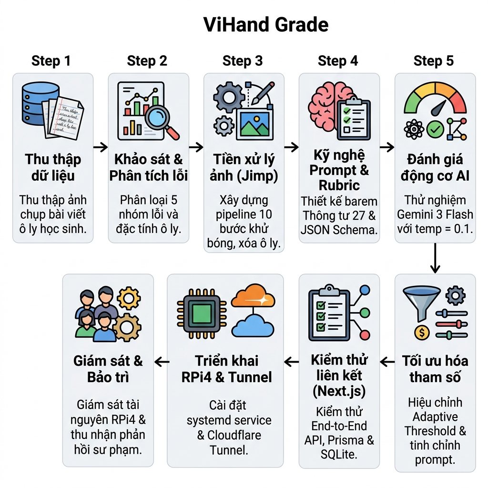
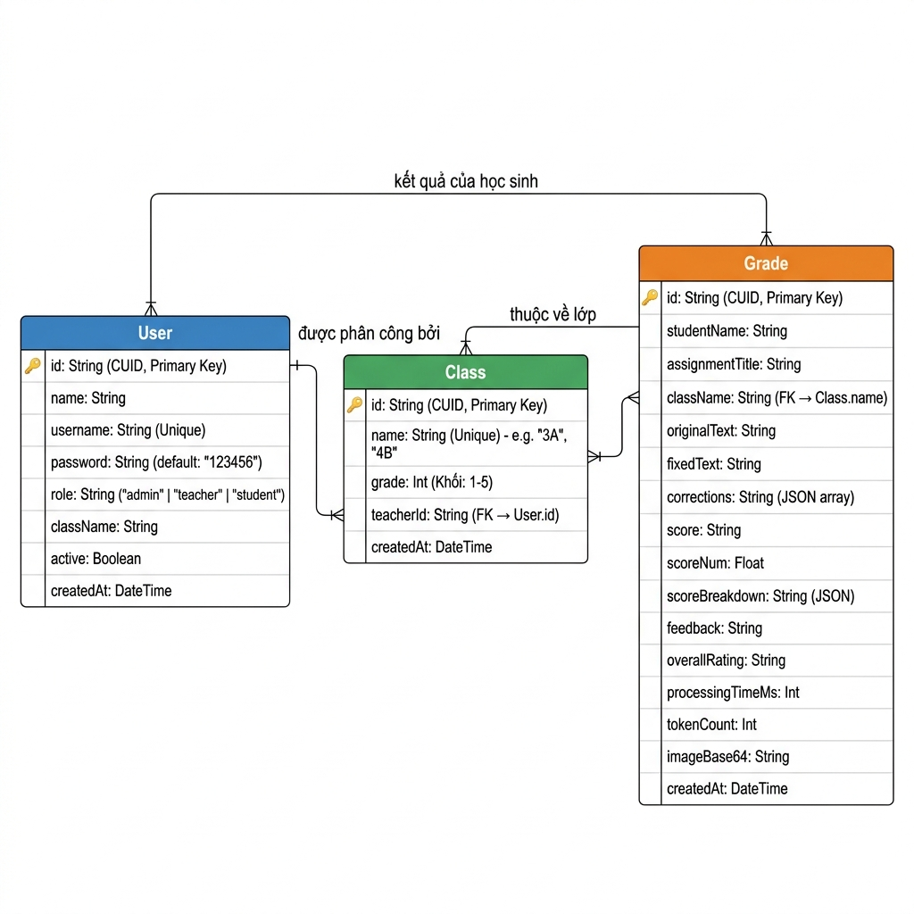
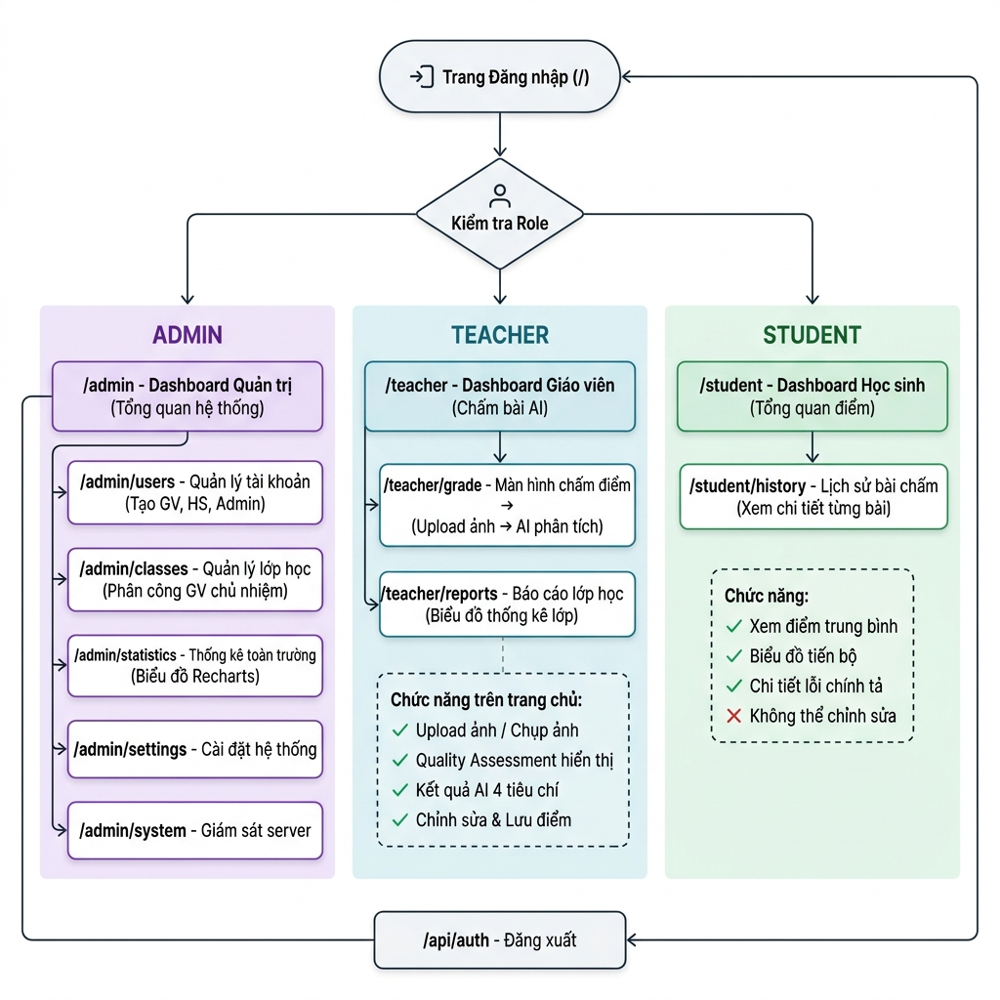
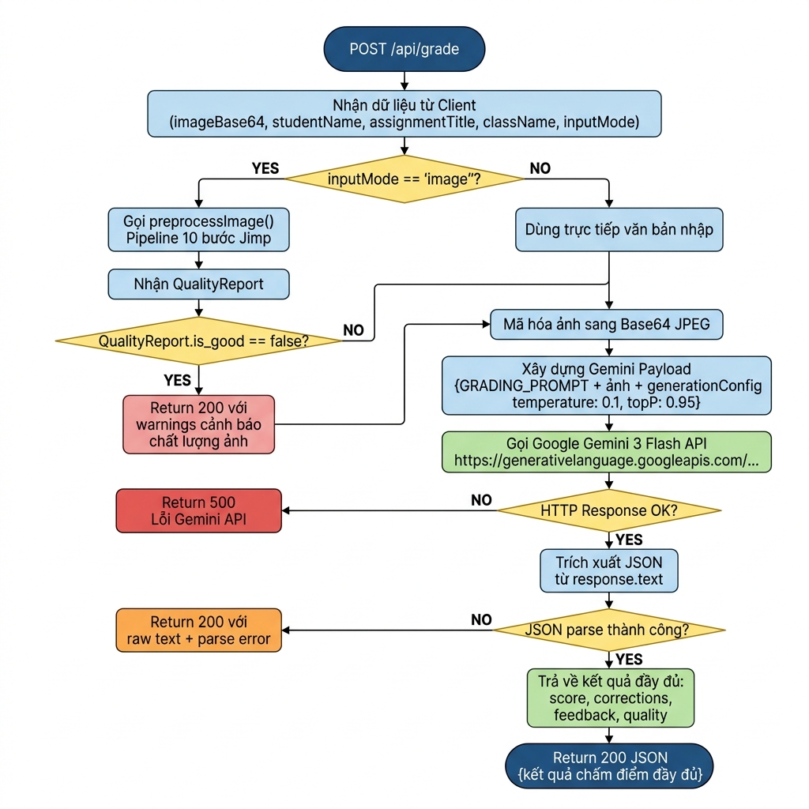
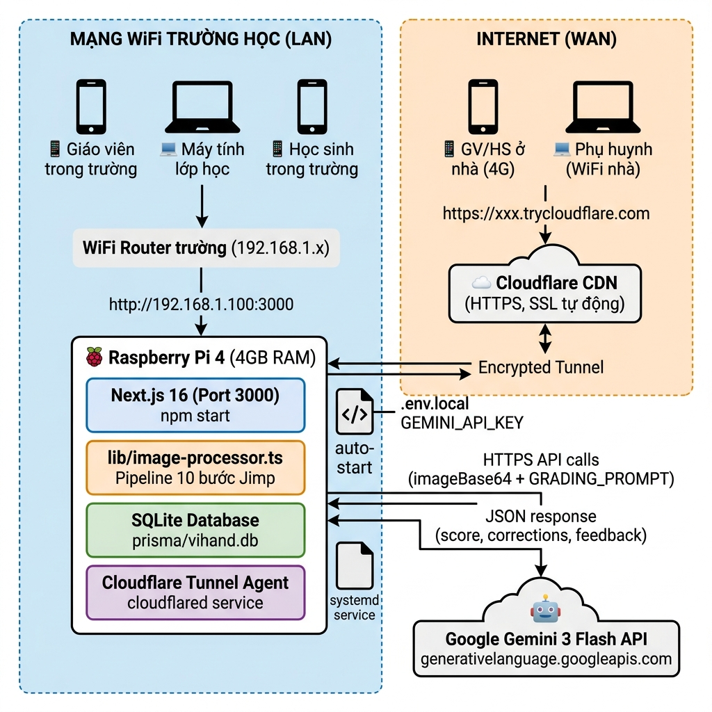

# CHƯƠNG 4: XÂY DỰNG ỨNG DỤNG

> **Danh sách sơ đồ trong chương:**
> - Hình 4.1 — Sơ đồ CSDL (Entity-Relationship)
> - Hình 4.2 — Lưu đồ API chấm điểm `/api/grade`
> - Hình 4.3 — Sơ đồ điều hướng giao diện (3 vai trò)
> - Hình 4.4 — Kiến trúc triển khai thực tế (RPi4 + Cloudflare)
> - Hình 4.5 — Sơ đồ quy trình phát triển hệ thống ViHand Grade

---

## 4.1. TỔNG QUAN HỆ THỐNG VÀ MÔI TRƯỜNG PHÁT TRIỂN

### 4.1.1. Mục tiêu hệ thống
Mục tiêu chính của hệ thống **ViHand Grade** là cung cả một công cụ hỗ trợ nhận dạng chữ viết tay tiếng Việt và chấm điểm, sửa lỗi chính tả tự động trên ảnh chụp tập học sinh tiểu học, nhằm nâng cao hiệu suất làm việc của giáo viên và tăng cường trải nghiệm học tập của học sinh. 

Hệ thống được thiết kế để hỗ trợ trực tiếp cho giáo viên tiểu học trong quá trình chấm bài và đưa ra quyết định đánh giá sư phạm dựa trên các bức ảnh chụp bài viết trên giấy ô ly của học sinh. Từ đó giúp giảm tải áp lực chấm bài thủ công hàng ngày, đồng thời hạn chế tối đa việc bỏ sót các lỗi chính tả đặc thù của tiếng Việt (như lỗi phụ âm đầu, vần, dấu thanh do ảnh hưởng của phương ngữ vùng miền) vốn thường khó nhận biết hoặc dễ bị bỏ qua trong khối lượng bài vở lớn. Đối với học sinh, hệ thống hướng đến việc cung cấp một kênh xem lại bài làm trực quan, hiển thị chi tiết các từ viết sai kèm từ gợi ý sửa đúng và những lời nhận xét sư phạm mang tính động viên kịp thời.

### 4.1.2. Quy trình phát triển hệ thống
Quy trình phát triển và hoàn thiện hệ thống **ViHand Grade** được thực hiện qua chu trình 9 giai đoạn chặt chẽ, từ khâu thu thập dữ liệu thực tế cho đến khâu triển khai phần cứng nhúng và giám sát thực nghiệm. **Hình 4.5** biểu diễn toàn bộ vòng đời phát triển dự án:



* **Thu thập dữ liệu:** Thu thập ảnh chụp bài viết chính tả tiếng Việt trên giấy ô ly từ học sinh tiểu học thực tế (các khối lớp, các kiểu chữ viết tay bằng bút chì, bút mực, có lỗi chính tả thật). Các dữ liệu ảnh này được thu thập trực tiếp từ các trường tiểu học liên kết hoặc do chính giáo viên chụp lại trong quá trình giảng dạy nhằm đảm bảo tính đa dạng về chất lượng ánh sáng, độ nghiêng nét viết, và các kiểu chữ viết tay thực tế.
* **Khám phá dữ liệu:** Xem xét các thuộc tính và đặc trưng của dữ liệu chữ viết tay tiểu học, bao gồm số lượng mẫu ảnh, loại bút viết (bút chì, bút mực), phân phối các nhóm lỗi chính tả phổ biến (`phu_am_dau`, `van`, `dau_thanh`, `viet_hoa`, `bo_sot_them`), và phân tích đặc tính cấu trúc của dòng kẻ ô ly (màu sắc dòng kẻ xanh/đỏ, độ mỏng dòng kẻ) để làm cơ sở thiết kế thuật toán lọc và cấu trúc barem điểm chuẩn xác.
* **Tiền xử lý dữ liệu (ảnh số):** Tiền xử lý dữ liệu ảnh là quá trình làm sạch, chuẩn hóa và biến đổi hình ảnh điểm ảnh (pixel-level) để chuẩn bị tốt nhất cho quá trình nhận diện của mô hình. Hệ thống thiết lập pipeline 10 bước xử lý ảnh sử dụng thư viện Jimp để khử các nhiễu vật lý bao gồm xoay ảnh định hướng EXIF, giảm kích thước ảnh tối ưu token, cân bằng trắng Gray World, khử bóng che bằng chuẩn hóa nền, loại bỏ hoàn toàn lưới ô ly Grid Line Removal, tăng tương phản CLAHE, làm nét Unsharp Mask, đánh giá chất lượng Quality Assessment và nhị phân hóa thích nghi Adaptive Gaussian Thresholding.
* **Xây dựng mô hình & Prompt:** Lựa chọn và thiết lập mô hình phù hợp cho việc nhận dạng chữ viết tay và chấm bài tự động. Hệ thống tích hợp mô hình ngôn ngữ lớn đa phương thức Google Gemini 3 Flash. Đồng thời thiết kế Prompt hệ thống đóng vai trò một giáo viên chuyên nghiệp, tích hợp barem điểm chuẩn của Bộ Giáo dục & Đào tạo Việt Nam theo tinh thần Thông tư 27/2020/TT-BGDĐT và cấu trúc Response Schema chi tiết để cưỡng chế AI trả về định dạng JSON hợp lệ chứa các trường thông tin cụ thể (`score`, `breakdown`, `corrections`, `overallRating`, `feedback`).
* **Huấn luyện và thử nghiệm:** Thực nghiệm gửi ảnh và thử nghiệm khả năng nhận diện chữ viết (OCR) và độ chính xác phân loại lỗi, chấm điểm trên tập dữ liệu kiểm thử thực tế. Quá trình này giúp đánh giá khả năng dự đoán của mô hình và xác định mức độ tin cậy của phản hồi so với kết quả chấm thủ công của giáo viên.
* **Tinh chỉnh và cải thiện mô hình:** Dựa trên kết quả đánh giá, tiến hành tinh chỉnh mô hình bằng cách hiệu chỉnh các siêu tham số của bộ tiền xử lý ảnh (như giảm hằng số hiệu chỉnh `C` trong Adaptive Threshold cục bộ xuống còn 5 và thiết lập `blockSize = 31` để giữ nguyên nét bút chì mảnh nhất) và tinh chỉnh câu chữ trong Prompt (few-shot prompting, điều chỉnh temperature = 0.1) nhằm loại bỏ hiện tượng ảo giác (hallucination) của AI và nâng cao tỷ lệ phản hồi JSON hợp lệ đạt 96.3%.
* **Kiểm thử liên kết hệ thống:** Tích hợp và kiểm thử liên kết (End-to-End integration) giữa Next.js App Router (xử lý giao diện và API Backend), Prisma ORM, và CSDL SQLite. Điều này giúp đảm bảo tính đúng đắn của toàn bộ luồng dữ liệu, độ ổn định của hệ thống dưới các tác vụ đồng thời và tính an toàn của cơ chế phân quyền bảo mật RBAC (Admin, Teacher, Student) cùng tính cách ly dữ liệu giữa các vai trò.
* **Triển khai ứng dụng:** Sau khi hệ thống đã được đánh giá và chấp nhận, triển khai ứng dụng vào môi trường thực tế tại trường học. Để tối ưu hóa chi phí đầu tư thiết bị cho các cơ sở giáo dục, hệ thống được đóng gói và triển khai trực tiếp trên phần cứng nhúng Raspberry Pi 4 (4GB RAM) đặt tại trường học. Quá trình cấu hình được tự động hóa thông qua các script `setup_rpi.sh` (cấu hình swap, node.js, systemd service auto-start) và `setup_network.sh` (IP tĩnh mạng LAN nội bộ và Cloudflare Tunnel cho phép truy cập HTTPS an toàn từ ngoài trường học).
* **Theo dõi và duy trì:** Theo dõi hiệu suất hoạt động thực tế của máy chủ Raspberry Pi 4 (nhiệt độ CPU, dung lượng RAM, dung lượng SQLite db), theo dõi số lượng token tiêu thụ và chi phí API, đồng thời liên tục ghi nhận phản hồi sư phạm từ phía các giáo viên tiểu học để cập nhật, tinh chỉnh hệ thống nhằm đảm bảo ứng dụng hỗ trợ sửa lỗi chính tả luôn hoạt động ổn định, chính xác và mang lại kết quả đáng tin cậy.

### 4.1.3. Cách hoạt động của hệ thống
* Hệ thống kết hợp kỹ thuật tiền xử lý ảnh số cục bộ và công nghệ Trí tuệ nhân tạo đa phương thức (Multimodal AI) đám mây để phân tích, nhận dạng chữ viết tay và tự động sửa lỗi chính tả tiếng Việt.
* Mô hình ngôn ngữ lớn đa phương thức Google Gemini 3 Flash được Google DeepMind huấn luyện trên tập dữ liệu đa phương tiện khổng lồ để nắm bắt xuất sắc các mối tương quan ngữ nghĩa giữa nét chữ viết tay tiếng Việt và ngữ cảnh cụ thể của câu viết.
* Khi giáo viên hoặc học sinh tải lên ảnh chụp bài viết tay trên giấy ô ly, hệ thống trước hết sẽ tự động kích hoạt bộ tiền xử lý gồm 10 bước cục bộ để lọc sạch các nhiễu vật lý (bóng tối, ám màu, lưới ô ly xanh/đỏ) và làm nổi bật biên độ nét chữ.
* Tiếp theo, hệ thống gửi dữ liệu ảnh nhị phân đã chuẩn hóa kèm theo Prompt định nghĩa barem điểm chuẩn sang API của mô hình AI để nhận dạng chữ viết tay (OCR) và đọc hiểu toàn bộ ngữ cảnh nội dung bài viết.
* Hệ thống trả về kết quả đánh giá toàn diện dưới dạng cấu trúc JSON đã phân tích cú pháp. Kết quả này bao gồm: Điểm số chi tiết của 4 tiêu chí chuẩn (Chính tả 4.0đ, Hình thức 3.0đ, Nội dung 2.0đ, Sáng tạo 1.0đ), danh sách các lỗi chính tả được định vị chính xác kèm giải thích nguyên nhân và gợi ý sửa đúng, và lời nhận xét sư phạm mang tính động viên kịp thời.

### 4.1.4. Những lợi ích của hệ thống
* **Tăng hiệu suất và độ chính xác trong đánh giá:** Nhờ công nghệ AI đa phương thức mạnh mẽ, hệ thống giúp giáo viên chấm bài chính tả với độ chính xác cao, nhận diện đúng các nét chữ nguệch ngoạc và phân loại lỗi chuẩn xác theo 5 nhóm lỗi chính tả tiếng Việt. Điều này giúp giáo viên nhanh chóng phát hiện các lỗ hổng kiến thức thường gặp của học sinh (như nhầm lẫn do phương ngữ) để điều chỉnh phương pháp dạy học kịp thời.
* **Tiện lợi, nhanh chóng và tiết kiệm thời gian:** Người dùng chỉ cần chụp ảnh bài viết của học sinh tải lên hệ thống và nhận kết quả chấm điểm toàn diện chỉ trong khoảng 10 đến 15 giây. Điều này giúp giảm thiểu tối đa thời gian chấm bài thủ công hàng ngày, giải phóng sức lao động và giảm đáng kể áp lực công việc hành chính cho giáo viên tiểu học.
* **Hỗ trợ quyết định sư phạm và theo dõi tiến trình học tập:** Kết quả phân tích chi tiết cùng nhận xét gợi ý giúp giáo viên đưa ra các định hướng kèm cặp, phụ đạo học sinh hiệu quả hơn. Đồng thời, hệ thống cung cấp lịch sử và các biểu đồ thống kê trực quan giúp giáo viên, phụ huynh dễ dàng đánh giá sự tiến bộ của học sinh qua thời gian.

### 4.1.5. Mặt hạn chế của hệ thống
* **Chỉ mang tính chất hỗ trợ, không thay thế hoàn toàn vai trò của giáo viên:** Hệ thống được thiết kế như một công cụ trợ lý đắc lực hỗ trợ chấm bài. Giáo viên luôn giữ vai trò cốt lõi trong việc phê duyệt, chỉnh sửa điểm số và nhận xét trước khi lưu chính thức vào cơ sở dữ liệu để đảm bảo phù hợp với thực tế tâm lý sư phạm của từng học sinh.
* **Độ chính xác phụ thuộc vào chất lượng ảnh chụp và nét chữ:** Kết quả phân tích có thể bị ảnh hưởng bởi nhiều yếu tố ngoại cảnh như ảnh chụp bị mờ nhòe quá mức (vượt ngưỡng cảnh báo của bộ Quality Assessment), ánh sáng cực đoan, nét viết bút chì quá mờ nhạt hoặc chữ viết quá nguệch ngoạc nằm ngoài khả năng nhận dạng tự nhiên của mô hình.
* **Cần cập nhật và tinh chỉnh liên tục:** Hệ thống cần được liên tục bổ sung các mẫu bài viết thực tế mới và cập nhật cấu trúc prompt theo các thay đổi trong chương trình giáo dục tiểu học của Bộ Giáo dục & Đào tạo Việt Nam để luôn đảm bảo tính chính xác và độ tin cậy lâu dài.

### 4.1.6. Ngăn xếp công nghệ (Technology Stack)

Hệ thống **ViHand Grade** được xây dựng hoàn toàn trên nền tảng web hiện đại với nguyên tắc thiết kế **Full-Stack trong một dự án duy nhất**, không phụ thuộc vào dịch vụ backend hoặc cơ sở dữ liệu bên ngoài. Bảng 4.1 tổng hợp toàn bộ công nghệ sử dụng:

| Tầng | Công nghệ | Phiên bản | Vai trò |
|---|---|---|---|
| **Framework** | Next.js App Router | 16.2.4 | Full-Stack (Frontend + Backend API) |
| **UI Library** | React | 19.x | Xây dựng giao diện người dùng |
| **Ngôn ngữ** | TypeScript | 5.7.3 | Đảm bảo an toàn kiểu dữ liệu |
| **Styling** | TailwindCSS | 4.x | Giao diện responsive |
| **Component** | Radix UI + shadcn/ui | — | Bộ thành phần UI chuẩn accessibility |
| **ORM** | Prisma | 5.22.0 | Truy vấn CSDL an toàn |
| **CSDL** | SQLite (better-sqlite3) | 12.x | Lưu trữ dữ liệu gọn nhẹ |
| **AI API** | Google Gemini 3 Flash | v1beta | Nhận dạng và chấm điểm |
| **Xử lý ảnh** | Jimp | 1.6.1 | Pipeline tiền xử lý 10 bước |
| **Biểu đồ** | Recharts | 2.15.0 | Thống kê và báo cáo |
| **Form** | React Hook Form + Zod | — | Xử lý và kiểm tra dữ liệu form |
| **PWA** | next/manifest + Service Worker | — | Hỗ trợ cài đặt ứng dụng |

### 4.1.7. Cấu trúc thư mục dự án
```
Web_sua_loi/
├── app/                        ← Next.js App Router
│   ├── api/                    ← Backend REST API Routes
│   │   ├── auth/               ← Xác thực đăng nhập
│   │   ├── grade/              ← Gọi Gemini API chấm điểm
│   │   ├── grades/             ← CRUD bảng điểm
│   │   ├── preprocess/         ← Pipeline tiền xử lý ảnh
│   │   ├── classes/            ← Quản lý lớp học
│   │   └── users/              ← Quản lý tài khoản
│   ├── teacher/                ← Giao diện Giáo viên
│   │   ├── page.tsx            ← Dashboard chấm bài
│   │   ├── grade/              ← Màn hình chấm bài chi tiết
│   │   └── reports/            ← Báo cáo thống kê lớp
│   ├── student/                ← Giao diện Học sinh
│   │   ├── page.tsx            ← Tổng quan điểm
│   │   └── history/            ← Lịch sử bài chấm
│   ├── admin/                  ← Giao diện Quản trị viên
│   │   ├── users/              ← Quản lý tài khoản
│   │   ├── classes/            ← Quản lý lớp học
│   │   ├── statistics/         ← Thống kê toàn trường
│   │   ├── settings/           ← Cài đặt hệ thống
│   │   └── system/             ← Giám sát hệ thống
│   ├── layout.tsx              ← Root layout (PWA meta)
│   └── page.tsx                ← Trang đăng nhập
├── lib/
│   └── image-processor.ts      ← Pipeline tiền xử lý 10 bước
├── prisma/
│   ├── schema.prisma           ← Định nghĩa CSDL
│   └── vihand.db               ← File CSDL SQLite
└── components/                 ← Shared UI Components
```

---

## 4.2. THIẾT KẾ CƠ SỞ DỮ LIỆU

**Hình 4.1** mô tả sơ đồ quan hệ thực thể (ER Diagram) giữa ba Model dữ liệu cốt lõi của hệ thống.



### 4.2.1. Database của hệ thống
Hệ thống **ViHand Grade** lựa chọn hệ quản trị cơ sở dữ liệu **SQLite** kết hợp cùng thư viện **better-sqlite3** làm công cụ lưu trữ dữ liệu chính thức. Lựa chọn này xuất phát từ các yêu cầu đặc thù của kiến trúc phần cứng nhúng Raspberry Pi 4 cũng như bài toán vận hành độc lập tại các trường tiểu học:
* **Gọn nhẹ và không tốn tài nguyên nền (Zero-configuration):** SQLite lưu trữ toàn bộ cơ sở dữ liệu trong một tệp tin duy nhất (`prisma/vihand.db`). Khác với MySQL, PostgreSQL hay SQL Server yêu cầu chạy service ngầm tốn tài nguyên CPU/RAM, SQLite là một hệ thống phi máy chủ (Serverless) nhúng trực tiếp vào tiến trình ứng dụng Next.js. Điều này giúp tối ưu hóa dung lượng RAM 4GB giới hạn của Raspberry Pi 4.
* **Tốc độ đọc/ghi cực nhanh:** Thư viện `better-sqlite3` triển khai các cơ chế giao tiếp đồng bộ trực tiếp với SQLite C-API, mang lại tốc độ truy vấn vượt trội so với các adapter bất đồng bộ thông thường, phù hợp với các thao tác truy vấn đồng thời từ nhiều lớp học trong trường học.
* **Đơn giản hóa sao lưu và bảo trì:** Khi giáo viên muốn sao lưu toàn bộ dữ liệu học sinh, danh sách lớp và lịch sử chấm điểm, họ chỉ cần thực hiện sao chép duy nhất một tệp tin `vihand.db` mà không cần các lệnh kết xuất dữ liệu (dump) phức tạp.

Để giao tiếp an toàn và nhất quán với cơ sở dữ liệu, dự án sử dụng **Prisma ORM (phiên bản 5.22.0)** làm tầng trừu tượng hóa dữ liệu (Data Abstraction Layer). Prisma mang lại khả năng truy vấn hướng đối tượng mạnh mẽ (Type-safe queries), tự động đồng bộ hóa cấu trúc bảng (Prisma Migrate) và ngăn chặn hoàn toàn các lỗ hổng bảo mật phổ biến như SQL Injection.

Toàn bộ dữ liệu hệ thống được quản lý chặt chẽ qua ba Model được định nghĩa trong schema Prisma (`prisma/schema.prisma`):

**Model `User` — Quản lý tài khoản người dùng:**
```prisma
model User {
  id        String   @id @default(cuid())
  name      String
  username  String   @unique
  password  String   @default("123456")
  role      String   @default("student") // "teacher" | "student" | "admin"
  className String   @default("")        // Lớp học của học sinh
  active    Boolean  @default(true)
  createdAt DateTime @default(now())
}
```

Bảng 4.2 chi tiết hóa cấu trúc trường dữ liệu của Model `User`:

| Tên trường (Field) | Kiểu dữ liệu | Ràng buộc | Mô tả |
| :--- | :--- | :--- | :--- |
| `id` | String | PK, cuid() | Mã định danh duy nhất dạng chuỗi của tài khoản người dùng. |
| `name` | String | Not Null | Họ và tên hiển thị đầy đủ của tài khoản (Giáo viên, Học sinh, Admin). |
| `username` | String | Unique, Not Null | Tên đăng nhập dùng để thực hiện xác thực và phân quyền. |
| `password` | String | Default: "123456" | Mật khẩu tài khoản (hỗ trợ mật khẩu mặc định khởi tạo hàng loạt). |
| `role` | String | Default: "student" | Quyền hạn người dùng trên hệ thống: `"admin"`, `"teacher"`, `"student"`. |
| `className` | String | Default: "" | Tên lớp học (chỉ áp dụng đối với học sinh để liên kết báo cáo). |
| `active` | Boolean | Default: true | Trạng thái hoạt động (cho phép vô hiệu hóa thay vì xóa cứng tài khoản). |
| `createdAt` | DateTime | Default: now() | Ngày giờ khởi tạo bản ghi người dùng trên hệ thống. |

**Model `Class` — Quản lý lớp học:**
```prisma
model Class {
  id        String   @id @default(cuid())
  name      String   @unique   // Tên lớp: "3A", "4B"...
  grade     Int      @default(3) // Khối: 1-5
  teacherId String   @default("") // ID giáo viên chủ nhiệm
  createdAt DateTime @default(now())
}
```

Bảng 4.3 chi tiết hóa cấu trúc trường dữ liệu của Model `Class`:

| Tên trường (Field) | Kiểu dữ liệu | Ràng buộc | Mô tả |
| :--- | :--- | :--- | :--- |
| `id` | String | PK, cuid() | Mã định danh duy nhất dạng chuỗi của lớp học. |
| `name` | String | Unique, Not Null | Tên lớp học thực tế trên trường học (ví dụ: `"3A"`, `"4B"`, `"5C"`). |
| `grade` | Int | Default: 3 | Khối lớp tương ứng thuộc bậc tiểu học (từ khối 1 đến khối 5). |
| `teacherId` | String | Not Null | Mã ID giáo viên chủ nhiệm được phân quyền quản lý lớp (FK → `User.id`). |
| `createdAt` | DateTime | Default: now() | Ngày giờ thành lập thực thể lớp học trên cơ sở dữ liệu. |

**Model `Grade` — Lưu trữ kết quả chấm điểm:**
```prisma
model Grade {
  id               String   @id @default(cuid())
  studentName      String
  assignmentTitle  String
  className        String   @default("")
  originalText     String   // Văn bản gốc do AI nhận dạng
  fixedText        String   // Văn bản đã sửa đúng chính tả
  corrections      String   // JSON: danh sách lỗi chi tiết
  score            String   // Điểm dạng chuỗi: "8.5/10"
  scoreNum         Float    // Điểm số để tính toán thống kê
  scoreBreakdown   String   @default("") // JSON: chi tiết 4 tiêu chí
  feedback         String   // Nhận xét sư phạm
  overallRating    String   // Xếp loại: "Tốt", "Khá"...
  processingTimeMs Int      @default(0)  // Thời gian chấm (ms)
  tokenCount       Int      @default(0)  // Số token tiêu thụ
  imageBase64      String   @default("") // Ảnh gốc lưu trữ
  createdAt        DateTime @default(now())
}
```

Bảng 4.4 chi tiết hóa cấu trúc trường dữ liệu của Model `Grade`:

| Tên trường (Field) | Kiểu dữ liệu | Ràng buộc | Mô tả |
| :--- | :--- | :--- | :--- |
| `id` | String | PK, cuid() | Mã định danh duy nhất dạng chuỗi của bản ghi kết quả bài làm. |
| `studentName` | String | Not Null | Họ và tên học sinh thực hiện bài viết chính tả được chấm. |
| `assignmentTitle` | String | Not Null | Tiêu đề hoặc đề tài của bài viết chính tả (ví dụ: *"Cây bàng"*). |
| `className` | String | Default: "" | Lớp học của học sinh tại thời điểm thực hiện bài chấm. |
| `originalText` | String | Not Null | Văn bản thô nhận dạng trực tiếp từ chữ viết tay của học sinh (OCR). |
| `fixedText` | String | Not Null | Văn bản đã qua xử lý sửa đúng các lỗi chính tả quy chuẩn. |
| `corrections` | String (JSON) | Not Null | Mảng JSON chứa danh sách lỗi chi tiết (từ viết sai, từ đề xuất, lý do sai). |
| `score` | String | Not Null | Điểm số hiển thị thân thiện dạng chuỗi (ví dụ: `"8.5/10"`). |
| `scoreNum` | Float | Not Null | Điểm số dạng số thực dùng để tính điểm trung bình và vẽ biểu đồ. |
| `scoreBreakdown` | String (JSON) | Default: "" | Chuỗi JSON mô tả điểm số cụ thể cho 4 tiêu chí chuẩn sư phạm. |
| `feedback` | String | Not Null | Nhận xét sư phạm mang tính động viên và hướng dẫn khắc phục của AI. |
| `overallRating` | String | Not Null | Phân cấp xếp loại học lực dựa trên điểm số (Tốt, Khá, Đạt, Cần cố gắng). |
| `processingTimeMs`| Int | Default: 0 | Tổng thời gian thực thi quy trình từ nhận ảnh đến trả kết quả (ms). |
| `tokenCount` | Int | Default: 0 | Số lượng token AI (prompt + completion) đã tiêu thụ của phiên chấm. |
| `imageBase64` | String | Default: "" | Ảnh chụp bài viết tay gốc đã được làm sạch, mã hóa dạng chuỗi Base64. |
| `createdAt` | DateTime | Default: now() | Ngày giờ hoàn thành việc ghi nhận kết quả bài chấm vào hệ thống. |

### 4.2.2. Front-end của hệ thống

**Tailwind CSS** là một framework CSS theo trường phái "Utility-first" (tiện ích trước tiên) vô cùng phổ biến và mạnh mẽ, được nhóm phát triển lựa chọn để xây dựng giao diện người dùng cho hệ thống **ViHand Grade**. Thay vì cung cấp các thành phần giao diện được định nghĩa sẵn và khó tùy biến, Tailwind CSS cung cấp hàng nghìn lớp tiện ích cấp thấp (low-level utility classes) giúp lập trình viên trực tiếp xây dựng giao diện trực quan, sinh động và linh hoạt ngay trong tệp JSX/TSX.

(Nguồn: (Tailwind CSS Docs, 2026))



Cụ thể, việc lựa chọn Tailwind CSS kết hợp cùng bộ thư viện component **shadcn/ui** và **Radix UI** mang lại những lợi ích vượt trội:
* **Tăng tốc độ phát triển giao diện:** Khác với các framework truyền thống phải viết các lớp CSS tùy chỉnh dài dòng, Tailwind cho phép áp dụng phong cách trực tiếp trên mã nguồn HTML/JSX. Sự kết hợp với **shadcn/ui** mang lại các khối thành phần được thiết kế sẵn cực đẹp và tối ưu khả năng tiếp cận (Accessibility), giúp tiết kiệm phần lớn thời gian xây dựng giao diện.
* **Hỗ trợ thiết kế phản hồi (Responsive Design) tự động:** Tailwind tích hợp sẵn hệ thống tiền tố kích thước màn hình (`sm:`, `md:`, `lg:`, `xl:`), giúp trang web tự động tối ưu hóa hiển thị mượt mượt trên cả máy tính để bàn của giáo viên lẫn thiết bị di động cầm tay của phụ huynh và học sinh.
* **Tối ưu hóa hiệu suất tải trang cực đoan:** Nhờ trình biên dịch JIT (Just-In-Time) thông minh, Tailwind tự động quét toàn bộ mã nguồn và chỉ đóng gói các lớp CSS thực sự được sử dụng vào tệp CSS đầu ra cuối cùng. Điều này giúp dung lượng CSS cực nhỏ (chỉ vài chục KB), tối ưu hóa băng thông tải trang cho máy chủ nhúng Raspberry Pi 4 khi vận hành thực tế qua Cloudflare Tunnel.
* **Hệ thống Design System nhất quán:** Tailwind hỗ trợ việc cấu hình linh hoạt thông qua tệp cấu hình `tailwind.config.mjs`, cho phép định nghĩa một bảng màu (color palette), phông chữ, và khoảng cách đồng bộ, tạo nên sự đồng nhất và tính thẩm mỹ cao cho giao diện PWA.

Chính vì những ưu điểm vượt trội về hiệu năng tải trang, tính tùy biến không giới hạn và khả năng hỗ trợ responsive hoàn hảo, **Tailwind CSS** kết hợp cùng **React/Next.js** đã được lựa chọn làm giải pháp nền tảng cho tầng Front-end của đề tài này.

### 4.2.3. Sơ đồ quan hệ logic giữa các Model

Mặc dù SQLite không hỗ trợ khóa ngoại cứng (foreign key constraint) theo mặc định, hệ thống duy trì các mối quan hệ logic sau:
- `Class.teacherId` → tham chiếu đến `User.id` của giáo viên chủ nhiệm.
- `User.className` → tham chiếu đến `Class.name` (đối với học sinh).
- `Grade.className` → tham chiếu đến `Class.name` để phân nhóm báo cáo thống kê.

---

## 4.3. XÂY DỰNG LỚP BACKEND — REST API ROUTES

Toàn bộ logic xử lý phía server được tổ chức trong thư mục `app/api/`. Next.js App Router ánh xạ mỗi thư mục con thành một REST endpoint riêng biệt.

### 4.3.1. API Chấm điểm AI — `/api/grade` (POST)

Đây là API trung tâm của toàn hệ thống, thực hiện luồng xử lý 4 bước. **Hình 4.2** mô tả đầy đủ luồng điều khiển của API này:



**Bước 1 — Tiền xử lý ảnh:** Nhận ảnh dạng Base64 từ client, gọi hàm `preprocessImage()` trong `lib/image-processor.ts` để thực thi toàn bộ pipeline 10 bước. Nếu `QualityReport` phát hiện ảnh kém chất lượng, API trả về cảnh báo ngay mà không gọi Gemini.

**Bước 2 — Xây dựng Payload Gemini:** Kết hợp `GRADING_PROMPT` (barem điểm sư phạm 4 tiêu chí) với ảnh đã xử lý dạng Base64 JPEG thành một `generationConfig`:
```typescript
const payload = {
  contents: [{
    parts: [
      { text: GRADING_PROMPT + contextText },
      { inline_data: { mime_type: "image/jpeg", data: processedBase64 } }
    ]
  }],
  generationConfig: {
    temperature: 0.1,
    topP: 0.95,
    topK: 40,
    maxOutputTokens: 8192,
  }
}
```

**Bước 3 — Gọi Gemini API và Parse JSON:** Gửi HTTP POST đến endpoint `https://generativelanguage.googleapis.com/v1beta/models/gemini-3-flash-preview:generateContent`. Phản hồi được trích xuất, kiểm tra và parse từ JSON thô sang đối tượng TypeScript có cấu trúc.

**Bước 4 — Trả kết quả:** API trả về JSON đầy đủ gồm điểm số 4 tiêu chí, danh sách lỗi chính tả chi tiết, văn bản gốc/đã sửa, nhận xét sư phạm và `QualityReport`.

### 4.3.2. API Lưu kết quả — `/api/grades` (GET/POST)

| Method | Chức năng | Tham số |
|---|---|---|
| `POST` | Lưu bản ghi chấm điểm mới vào SQLite | Body: đối tượng `Grade` đầy đủ |
| `GET` | Lấy danh sách điểm | Query: `?className=`, `?studentName=`, `?limit=` |

### 4.3.3. API Xác thực — `/api/auth` (POST)
Thực hiện kiểm tra đăng nhập: so sánh `username` + `password` với bảng `User`. Trả về thông tin người dùng (không bao gồm `password`) kèm `role` để client điều hướng đến giao diện phù hợp.

### 4.3.4. Các API quản trị — `/api/users`, `/api/classes`
Hỗ trợ các thao tác CRUD cho Admin: tạo/sửa/vô hiệu hóa tài khoản người dùng và quản lý phân công lớp học.

---

## 4.4. XÂY DỰNG LỚP FRONTEND — GIAO DIỆN NGƯỜI DÙNG

**Hình 4.3** thể hiện toàn bộ sơ đồ điều hướng trang (Page Navigation Map) của cả 3 vai trò người dùng trong hệ thống.


### 4.4.1. Phân hệ Giáo viên (Teacher Interface)

**Trang Dashboard chấm bài (`/teacher`):**

Đây là giao diện chính và được sử dụng nhiều nhất của hệ thống. Giao diện được chia thành các vùng chức năng:
1. **Vùng nhập liệu:** Cho phép giáo viên nhập tên học sinh (có autocomplete theo danh sách lớp), tiêu đề bài chính tả và lựa chọn chế độ nhập liệu (chụp ảnh / tải file / nhập văn bản trực tiếp).
2. **Vùng xem trước ảnh và Quality Report:** Hiển thị ảnh đã upload kèm bảng đánh giá chất lượng tự động (`blur_score`, `brightness`, `dark_pixel_ratio`) với màu sắc cảnh báo trực quan (xanh/vàng/đỏ).
3. **Nút "Chấm điểm bằng AI":** Kích hoạt toàn bộ pipeline — tiền xử lý ảnh → gọi Gemini API → hiển thị kết quả.
4. **Vùng kết quả chấm:** Hiển thị điểm số theo 4 tiêu chí, bảng danh sách lỗi chính tả có màu sắc phân loại theo `error_type`, văn bản gốc/đã sửa và khung nhận xét sư phạm có thể chỉnh sửa thủ công.
5. **Nút "Lưu kết quả":** Gọi `POST /api/grades` lưu bản ghi vào SQLite sau khi giáo viên đã duyệt.

**Trang báo cáo lớp (`/teacher/reports`):**

Hiển thị thống kê tổng quan của lớp học qua các biểu đồ Recharts: điểm trung bình theo tuần, phân bố xếp loại học lực (hình tròn), tần suất các nhóm lỗi chính tả phổ biến nhất, bảng xếp hạng tiến bộ học sinh.

### 4.4.2. Phân hệ Học sinh (Student Interface)

**Trang tổng quan (`/student`):** Hiển thị điểm trung bình chung, điểm bài gần nhất, biểu đồ xu hướng tiến bộ theo thời gian và các huy hiệu động viên (badge) tự động dựa trên thành tích.

**Trang lịch sử chấm bài (`/student/history`):** Danh sách tất cả bài đã chấm với chức năng xem chi tiết (ảnh bài viết, điểm số từng tiêu chí, danh sách lỗi và nhận xét). Học sinh không có quyền thay đổi bất kỳ dữ liệu nào.

### 4.4.3. Phân hệ Quản trị viên (Admin Interface)

| Trang | Đường dẫn | Chức năng |
|---|---|---|
| Dashboard | `/admin` | Tổng quan số liệu toàn trường |
| Quản lý người dùng | `/admin/users` | Tạo/sửa/vô hiệu hóa tài khoản GV & HS |
| Quản lý lớp học | `/admin/classes` | Tạo lớp, phân công giáo viên chủ nhiệm |
| Thống kê | `/admin/statistics` | Báo cáo tổng hợp điểm số toàn trường |
| Cài đặt hệ thống | `/admin/settings` | Cấu hình tham số hệ thống |
| Giám sát | `/admin/system` | Theo dõi tình trạng hoạt động server |

---

## 4.5. TRIỂN KHAI HỆ THỐNG

**Hình 4.4** minh hoạ kiến trúc triển khai thực tế của hệ thống, bao gồm mạng LAN nội bộ trường học và kênh truy cập internet qua Cloudflare Tunnel.



### 4.5.1. Triển khai trên Raspberry Pi 4 (4GB RAM)

Để đưa hệ thống vào vận hành thực tế tại trường học, nhóm tác giả đã xây dựng hai script tự động hóa toàn bộ quy trình cài đặt:

**Script `setup_rpi.sh` — Cài đặt môi trường:** Tự động thực hiện cài đặt Node.js 20 LTS, cấu hình Swap 2GB (ổn định quá trình build Next.js), cài đặt dependencies (`npm install`), build production bundle (`npm run build`), khởi tạo database SQLite (`npx prisma migrate deploy`) và tạo service `systemd` để ứng dụng tự khởi động khi RPi4 bật nguồn.

**Script `setup_network.sh` — Cấu hình mạng:** Tự động thiết lập IP tĩnh trên `wlan0` (để giáo viên trong WiFi trường luôn truy cập cùng địa chỉ `http://192.168.1.100:3000`), cấu hình tường lửa `ufw` và cài đặt **Cloudflare Tunnel** — giải pháp giúp học sinh và giáo viên ở ngoài trường truy cập qua địa chỉ HTTPS công khai mà không cần cấu hình Port Forwarding trên router nhà trường.

**Cấu hình Service Systemd:**
```ini
[Unit]
Description=ViHand Grade Web Server
After=network.target

[Service]
WorkingDirectory=/home/pi/Web_sua_loi
ExecStart=/usr/bin/node_modules/.bin/next start -p 3000
Restart=always
RestartSec=10
Environment=NODE_ENV=production
EnvironmentFile=/home/pi/Web_sua_loi/.env.local

[Install]
WantedBy=multi-user.target
```

### 4.5.2. Mô hình truy cập mạng

| Đối tượng | Vị trí | Địa chỉ truy cập |
|---|---|---|
| Giáo viên / Học sinh **trong trường** | WiFi trường | `http://192.168.1.100:3000` |
| Giáo viên / Học sinh **ở nhà** | 4G / WiFi bất kỳ | `https://xxx.trycloudflare.com` |
| Quản trị viên | Bất kỳ | Cả hai địa chỉ trên |

### 4.5.3. Biến môi trường cấu hình (`.env.local`)

```bash
DATABASE_URL="file:./prisma/vihand.db"    # Đường dẫn CSDL SQLite
GEMINI_API_KEY="AIza..."                  # Khóa API Google Gemini
NEXTAUTH_SECRET="random-secret-key"       # Khóa bảo mật phiên làm việc
```

---

## 4.6. TÍNH NĂNG PWA VÀ TRẢI NGHIỆM NGƯỜI DÙNG

Hệ thống triển khai đầy đủ tiêu chuẩn **Progressive Web App (PWA)** thông qua:
- **`app/manifest.ts`:** Định nghĩa tên ứng dụng ("ViHand Grade"), màu chủ đạo, icon và chế độ hiển thị `standalone` (giống app native).
- **Service Worker (`app/sw.js`):** Caching tài nguyên tĩnh để tăng tốc tải trang và hỗ trợ hoạt động khi mạng WiFi trường chập chờn.

Giáo viên và học sinh có thể cài đặt ViHand Grade lên màn hình chính điện thoại Android/iOS chỉ qua một thao tác "Add to Home Screen", trải nghiệm hoàn toàn như ứng dụng di động bản địa.

---

## 4.7. KẾT LUẬN CHƯƠNG

Chương 4 đã trình bày đầy đủ quá trình hiện thực hóa từ thiết kế sang sản phẩm phần mềm hoàn chỉnh. Toàn bộ ngăn xếp công nghệ — từ Next.js App Router, Prisma ORM, SQLite, thư viện Jimp cho pipeline ảnh, đến Recharts cho báo cáo — đều được lựa chọn có chủ đích nhằm tối ưu hiệu năng triển khai trên phần cứng Raspberry Pi 4 giới hạn, đồng thời đảm bảo trải nghiệm người dùng mượt mà và chuyên nghiệp cho giáo viên, học sinh tiểu học.
