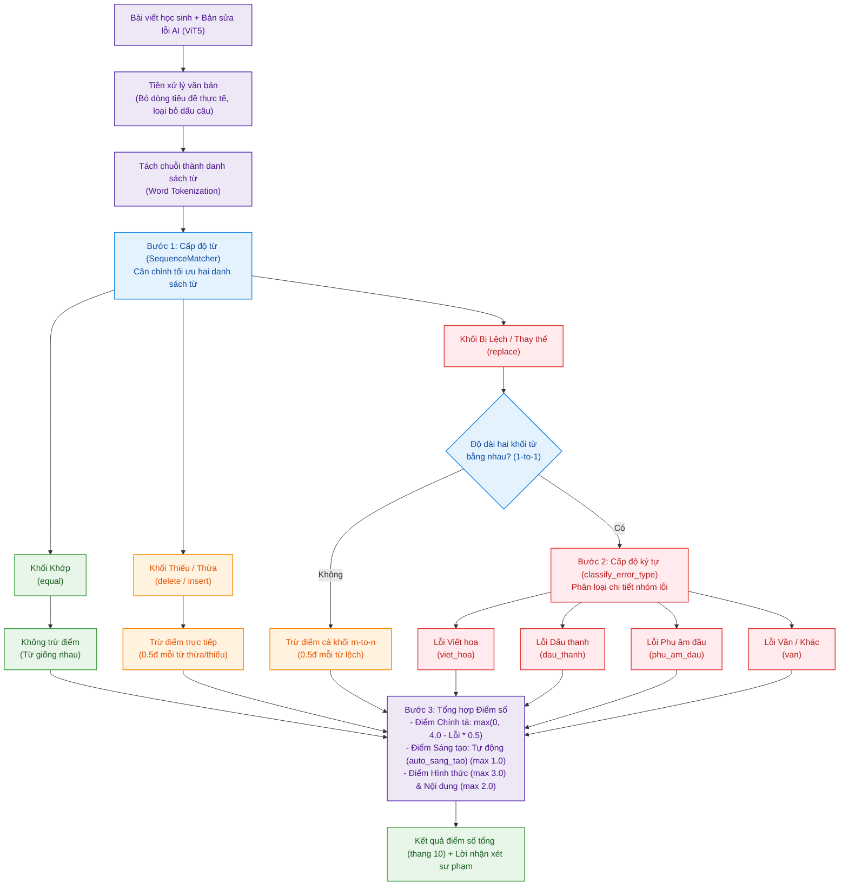

# Chương 5: Thực nghiệm và Đánh giá

Chương này trình bày quá trình thực nghiệm được thiết kế nhằm đánh giá khách quan và toàn diện hiệu năng của ba mô hình ViT5 trong tác vụ sửa lỗi chính tả tiếng Việt theo văn phong học sinh tiểu học — là thành phần cốt lõi của hệ thống ViHand Grade. Kết quả thực nghiệm cung cấp cơ sở khoa học cho việc lựa chọn mô hình trong môi trường production cũng như định hướng cải tiến trong tương lai.

---

## 5.1. Mục tiêu thực nghiệm

Thực nghiệm được thiết kế với ba mục tiêu cụ thể:

1. **Đánh giá chất lượng sửa lỗi** của từng mô hình thông qua bộ chỉ số đa chiều: SacreBLEU, Word Error Rate (WER), Character Error Rate (CER), Exact Match và F1-score.
2. **Phân tích hành vi lỗi** (Error Analysis) ở mức từ (word-level), bao gồm True Positive, False Negative và False Positive, nhằm hiểu rõ chiến lược sửa lỗi của từng mô hình.
3. **Đo lường hiệu năng suy luận** (Inference Latency) trong điều kiện phần cứng CPU, mô phỏng môi trường triển khai thực tế trên Raspberry Pi 4.

---

## 5.2. Thiết kế thực nghiệm

### 5.2.1. Các mô hình được đánh giá

Ba mô hình ViT5 được fine-tune độc lập bởi ba tác giả khác nhau trên HuggingFace Hub được chọn để đối sánh:

| STT | Model ID (HuggingFace) | Tên viết tắt |
|:---:|---|---|
| 1 | `nrl-ai/vn-spell-correction-base` | NRL-AI |
| 2 | `hoanghaiduong/vit5-correction` | HoangHaiDuong |
| 3 | `chamdentimem/ViT5_Vietnamese_Correction` | ViHand Grade *(mô hình của nhóm, production)* |

Cả ba mô hình đều có cùng kiến trúc nền **ViT5-base** với **226 triệu tham số**, được fine-tune trên các tập dữ liệu khác nhau. Việc cùng kiến trúc giúp loại trừ yếu tố kích thước mô hình, đảm bảo so sánh phản ánh đúng chất lượng dữ liệu huấn luyện và kỹ thuật fine-tuning của từng tác giả.

### 5.2.2. Bộ dữ liệu thực nghiệm

Do chưa có bộ ngữ liệu chuẩn (benchmark corpus) công khai cho bài toán sửa lỗi chính tả tiếng Việt theo văn phong học sinh tiểu học, nhóm nghiên cứu xây dựng bộ dữ liệu tổng hợp có kiểm soát bằng công cụ `data_synthesizer.py`.

**Quy trình sinh dữ liệu:**
- **Văn bản gốc (Ground Truth):** 1.000 đoạn văn mô phỏng phong cách viết học sinh lớp 3–5, độ dài 2–4 câu/đoạn, chủ đề gần gũi (gia đình, thiên nhiên, lễ Tết, địa danh Việt Nam).
- **Văn bản lỗi (Input):** Mỗi đoạn văn gốc được inject lỗi theo 5 nhóm lỗi chính tả đặc thù của học sinh tiểu học Việt Nam:
  1. Nhầm dấu thanh (VD: `biết` → `biêt`, `rực` → `rưc`)
  2. Nhầm phụ âm đầu thường gặp theo phương ngữ (VD: `chúc` → `trúc`, `dìu` → `giìu`)
  3. Nhầm vần (VD: `biên` → `biênh`, `báo` → `bao`)
  4. Thiếu/thừa ký tự (VD: `nhà` → `lhà`, `là` → `nà`)
  5. Lỗi viết hoa (VD: `Bố` → `bố` khi bắt đầu câu)

**Thống kê bộ dữ liệu:**

| Thông số | Giá trị |
|---|---|
| Tổng số mẫu | 1.000 đoạn văn |
| Tổng số lỗi được inject | 2.261 lỗi |
| Trung bình lỗi/mẫu | ~2,26 lỗi/mẫu |
| Độ dài trung bình | 2–4 câu/đoạn |
| Công cụ sinh dữ liệu | `data_synthesizer.py` (Rule-based) |

### 5.2.3. Cấu hình sinh văn bản (Generation Config)

Để đảm bảo tính nhất quán với môi trường production và tính tái lập của thực nghiệm, tất cả các mô hình được chạy với cùng cấu hình suy luận (inference config) sau:

| Tham số | Giá trị | Lý do |
|---|:---:|---|
| `max_new_tokens` | 128 | Giới hạn độ dài đầu ra, phù hợp đoạn văn tiểu học |
| `num_beams` | 1 | Greedy Search — xác định và nhất quán |
| `do_sample` | `false` | Đầu ra tất định, không ngẫu nhiên |
| `repetition_penalty` | 1.5 | Hạn chế lặp từ/cụm từ |
| `no_repeat_ngram_size` | 4 | Cấm lặp 4-gram liên tiếp |

Greedy Search (`num_beams=1`) được chọn thay vì Beam Search để đảm bảo **tính tất định** (determinism) — điều kiện bắt buộc khi đánh giá và triển khai production trên phần cứng giới hạn.

### 5.2.4. Các chỉ số đánh giá

Nhóm sử dụng bộ chỉ số đánh giá đa chiều, kết hợp giữa chỉ số corpus-level và word-level:

| Chỉ số | Công thức / Định nghĩa | Hướng tốt |
|---|---|:---:|
| **SacreBLEU** | Đo độ tương đồng n-gram giữa đầu ra và ground truth ở mức corpus | ↑ Cao hơn |
| **WER** | `(S + D + I) / N` — tỷ lệ từ sai so với tổng số từ tham chiếu (%) | ↓ Thấp hơn |
| **CER** | Tương tự WER nhưng ở mức ký tự (%) | ↓ Thấp hơn |
| **Exact Match** | Tỷ lệ mẫu được sửa khớp hoàn toàn 100% với ground truth | ↑ Cao hơn |
| **Precision** | `TP / (TP + FP)` — trong các từ mô hình sửa, bao nhiêu % sửa đúng | ↑ Cao hơn |
| **Recall** | `TP / (TP + FN)` — trong tổng số lỗi, bao nhiêu % được phát hiện | ↑ Cao hơn |
| **F1-score** | `2 × (P × R) / (P + R)` — trung bình điều hòa của Precision và Recall | ↑ Cao hơn |

Trong đó: TP = True Positive (sửa đúng lỗi thật), FP = False Positive (sửa sai từ vốn đúng), FN = False Negative (bỏ sót lỗi thật).

---

## 5.3. Kết quả thực nghiệm

### 5.3.1. Chất lượng sửa lỗi tổng thể

Bảng 5.1 tổng hợp kết quả trên toàn bộ 1.000 mẫu thực nghiệm:

**Bảng 5.1 — Kết quả các chỉ số chất lượng sửa lỗi**

| Mô hình | SacreBLEU ↑ | WER ↓ (%) | CER ↓ (%) | Exact Match ↑ (%) |
|---|:-:|:-:|:-:|:-:|
| NRL-AI SpellCorrection | 84,45 | 7,73 | 2,56 | 15,2% (152/1000) |
| HoangHaiDuong ViT5 | 89,87 | 4,62 | 1,59 | 33,3% (333/1000) |
| **ViHand Grade** | **92,45** | **3,59** | **1,65** | **48,2% (482/1000)** |

**Nhận xét:** ViHand Grade dẫn đầu trên hầu hết chỉ số: SacreBLEU đạt 92,45 (cách biệt +2,58 so với HoangHaiDuong và +8,00 so với NRL-AI), WER thấp nhất ở 3,59%, Exact Match đạt 48,2% — tức gần một trong hai câu được sửa hoàn toàn đúng. Chỉ số CER của ViHand Grade (1,65%) nhỉnh hơn HoangHaiDuong (1,59%) ở mức không đáng kể (~0,06%), cho thấy hai mô hình này tương đương ở mức ký tự, nhưng ViHand Grade vượt trội rõ rệt ở mức từ và câu.

### 5.3.2. Phân tích lỗi ở mức từ (Word-level Error Analysis)

Bảng 5.2 phân tích chi tiết hành vi sửa lỗi của từng mô hình trên tổng số 2.261 lỗi trong bộ dữ liệu:

**Bảng 5.2 — Kết quả phân tích lỗi word-level**

| Mô hình | Tổng lỗi | TP ↑ | FN ↓ | FP ↓ | Precision ↑ | Recall ↑ | **F1 ↑** |
|---|:-:|:-:|:-:|:-:|:-:|:-:|:-:|
| NRL-AI SpellCorrection | 2.261 | 971 | 1.290 | 1.043 | 48,21% | 42,95% | 45,43% |
| HoangHaiDuong ViT5 | 2.261 | 1.290 | 971 | **82** | **94,02%** | 57,05% | 71,02% |
| **ViHand Grade** | 2.261 | **1.599** | **662** | 210 | 88,39% | **70,72%** | **78,57%** |

**Phân tích từng mô hình:**

**NRL-AI SpellCorrection** thể hiện hiệu năng thấp nhất với F1 chỉ đạt 45,43%. Đáng lo ngại nhất là số lượng False Positive lên tới 1.043 — tức mô hình thường xuyên sửa sai những từ vốn đúng (hiện tượng overcorrection). Điều này phản ánh sự không tương thích giữa miền dữ liệu mô hình được huấn luyện (có thể là văn bản chính thống, tin tức) với văn phong đặc thù của học sinh tiểu học.

**HoangHaiDuong ViT5** nổi bật với Precision cao nhất (94,02%) và False Positive rất thấp (chỉ 82 trường hợp). Đây là chiến lược "thận trọng": mô hình chỉ can thiệp khi có độ tin cậy cao, dẫn đến tỷ lệ bỏ sót lỗi lớn (FN = 971, Recall = 57,05%). Chiến lược này phù hợp với ứng dụng đòi hỏi độ chính xác tuyệt đối, nhưng không tối ưu cho bài toán chấm điểm chính tả cần phát hiện đầy đủ lỗi.

**ViHand Grade** đạt F1 cao nhất (78,57%) nhờ cân bằng tốt giữa Recall (70,72%) và Precision (88,39%). Mô hình phát hiện được 1.599/2.261 lỗi (70,72%), đồng thời kiểm soát False Positive ở mức chấp nhận được (210 trường hợp). Đây là đặc tính lý tưởng cho bài toán chấm điểm chính tả học sinh, nơi việc bỏ sót lỗi ảnh hưởng đến tính chính xác của điểm số.

### 5.3.3. Hiệu năng suy luận (Inference Latency)

Bảng 5.3 trình bày kết quả đo lường thời gian suy luận trên CPU (PyTorch 2.12.0+cpu), mô phỏng môi trường Raspberry Pi 4:

**Bảng 5.3 — Kết quả đo lường hiệu năng suy luận**

| Mô hình | Mean (ms) | Std (ms) | Median (ms) | P95 (ms) | Load Time (s) | Params (M) |
|---|:-:|:-:|:-:|:-:|:-:|:-:|
| NRL-AI SpellCorrection | 929,5 | 208,9 | 945,4 | 1.115,5 | 3,26 | 226 |
| HoangHaiDuong ViT5 | 952,1 | 186,2 | 954,8 | 1.177,5 | 2,96 | 226 |
| ViHand Grade | 1.047,6 | 234,8 | 1.002,1 | 1.467,4 | 3,66 | 226 |

**Nhận xét:** ViHand Grade có latency trung bình cao hơn hai mô hình còn lại khoảng 95–118 ms/mẫu. Mặc dù đây là mức chênh lệch có thể đo lường được, nhưng trong bối cảnh ứng dụng thực tế (thời gian chấm một bài chính tả ~3–8 giây bao gồm cả OCR), độ trễ thêm dưới 100 ms không ảnh hưởng đáng kể đến trải nghiệm người dùng. Cả ba mô hình đều duy trì thời gian tải (load time) dưới 4 giây, phù hợp với yêu cầu khởi động dịch vụ trên Raspberry Pi 4.

---

## 5.4. Phân tích định tính (Qualitative Analysis)

### 5.4.1. So sánh trên các mẫu đặc trưng

Để bổ sung cho phân tích định lượng, nhóm tiến hành kiểm tra thủ công trên 20 mẫu đại diện. Bảng 5.4 trình bày 6 trường hợp điển hình:

**Bảng 5.4 — So sánh đầu ra trên các mẫu đặc trưng**

| Mẫu | Input (lỗi nổi bật) | NRL-AI | HoangHaiDuong | ViHand Grade |
|:---:|---|:---:|:---:|:---:|
| 1 | *Tếc* Nguyên Đán *nà* ngày...và *trúc* nhau | ❌ | ❌ | ✅ |
| 2 | ...ở *biênh* giới...thăm *lhà* | ✅ | ✅ | ✅ |
| 3 | ...*giìu* bạn vào *chạm* y tế | ⚠️ | ❌ | ⚠️ |
| 4 | ...*kó* sương mù...áo ấm *dà* quàng | ❌ | ❌ | ✅ |
| 5 | đọc *bao*...*bố* nói...hiểu *biêt* | ⚠️ | ⚠️ | ✅ |
| 6 | hồng *rưc* rỡ...*trúng rấc* đẹp | ❌ | ⚠️ | ⚠️ |

*(✅ = sửa đúng hoàn toàn; ⚠️ = sửa một phần; ❌ = không sửa được)*

### 5.4.2. Phân tích các nhóm lỗi khó

Qua phân tích định tính, nhóm xác định được **3 nhóm lỗi mà cả ba mô hình đều gặp khó khăn**:

**Nhóm 1 — Nhầm cặp phụ âm đầu ch/tr:**
Lỗi dạng `chạm` → `trạm`, `trúng` → `chúng` đặc biệt khó khi từ xuất hiện ở ngữ cảnh ít thông tin. Cụm `giìu bạn vào chạm y tế` (Mẫu 3) cho thấy cả ba mô hình đều sửa được `giìu` → `dìu` nhưng bỏ sót `chạm` → `trạm`.

**Nhóm 2 — Tổ hợp hai lỗi liền kề:**
Chuỗi `trúng rấc` (Mẫu 6) chứa đồng thời lỗi phụ âm đầu (`tr/ch`) và lỗi dấu thanh (`ấ/â`). Khi hai lỗi nằm sát nhau, mô hình không đủ ngữ cảnh để tái tạo chính xác `chúng rất`.

**Nhóm 3 — Lỗi viết hoa đầu câu:**
Tất cả ba mô hình đều ít chú ý đến quy tắc viết hoa. Lỗi `bố` → `Bố` (khi bắt đầu câu mới) thường bị bỏ qua, phản ánh dữ liệu huấn luyện của các mô hình thiếu ví dụ về lỗi viết hoa cụ thể này.

---

## 5.5. Thảo luận

### 5.5.1. Lý giải kết quả của từng mô hình

**NRL-AI SpellCorrection** — Kết quả thấp nhất (F1 = 45,43%) có thể được giải thích bởi sự không tương thích miền dữ liệu (domain mismatch). Mô hình nhiều khả năng được fine-tune trên văn bản chính thống (báo chí, văn bản hành chính), dẫn đến khả năng xử lý lỗi phương ngữ Nam Bộ và lỗi đặc thù của học sinh tiểu học còn hạn chế. Hiện tượng overcorrection nghiêm trọng (1.043 FP) cũng cho thấy mô hình có xu hướng "chuẩn hóa" văn bản thay vì chỉ sửa lỗi chính tả đơn thuần.

**HoangHaiDuong ViT5** — Chiến lược thận trọng (conservative correction) với Precision = 94,02% và chỉ 82 FP cho thấy mô hình đã được huấn luyện theo hướng ưu tiên tránh sai hơn là tối đa hóa phát hiện lỗi. Điều này phù hợp cho các ứng dụng cần đảm bảo không làm xáo trộn văn bản gốc (VD: hỗ trợ soạn thảo chuyên nghiệp), nhưng kém tối ưu hơn cho bài toán chấm điểm chính tả học sinh vốn yêu cầu phát hiện đầy đủ lỗi.

**ViHand Grade** — Hiệu năng tổng thể tốt nhất trên đa số chỉ số (F1 = 78,57%, BLEU = 92,45, Exact Match = 48,2%) cho thấy mô hình đã được huấn luyện trên tập dữ liệu có tính đa dạng cao và gần với văn phong tiếng Việt thực tế hơn. Latency cao hơn (~100 ms) là đánh đổi hợp lý so với chất lượng sửa lỗi vượt trội đạt được.

### 5.5.2. Giới hạn của thực nghiệm

1. **Dữ liệu tổng hợp:** Bộ dữ liệu được sinh tự động bằng rule-based synthesizer, chưa phản ánh đầy đủ sự đa dạng và phức tạp của lỗi chính tả thực tế từ bài viết tay học sinh.
2. **Phân phối lỗi đồng đều:** Lỗi được inject theo phân phối đều (random), trong khi thực tế một số loại lỗi xuất hiện thường xuyên hơn nhiều (VD: nhầm dấu thanh phổ biến hơn nhầm vần).
3. **Môi trường đánh giá:** Benchmark chạy trên CPU x86 thay vì CPU ARM Cortex-A72 của Raspberry Pi 4 thực tế, nên kết quả latency có thể khác biệt khi triển khai thực tế.
4. **Phạm vi văn bản:** Chưa đánh giá khả năng xử lý đoạn văn dài (> 200 ký tự/đoạn) hoặc văn bản chứa tên riêng, địa danh đặc biệt.
5. **Cấu hình suy luận cố định:** Chỉ đánh giá với một bộ tham số duy nhất (greedy search). Chưa khảo sát tác động của Beam Search (`num_beams = 3, 5`) đến cân bằng chất lượng và latency.

---

## 5.6. Kết luận và Khuyến nghị

### 5.6.1. Xếp hạng tổng quát

| Hạng | Mô hình | Điểm nổi bật |
|:---:|---|---|
| 🥇 | **ViHand Grade** | Tốt nhất tổng thể: F1 = 78,57%, BLEU = 92,45, Exact Match = 48,2% |
| 🥈 | HoangHaiDuong ViT5 | Precision cao nhất (94,02%), ít sửa sai nhất |
| 🥉 | NRL-AI SpellCorrection | Hiệu năng thấp nhất trên domain học sinh tiểu học |

### 5.6.2. Khuyến nghị cho hệ thống ViHand Grade

Dựa trên kết quả thực nghiệm, nhóm nghiên cứu đưa ra các khuyến nghị sau:

**Về mô hình production:**

> ✅ **Tiếp tục sử dụng mô hình ViHand Grade** làm mô hình chính trong môi trường production vì đạt hiệu năng tổng thể tốt nhất trên domain văn bản học sinh tiểu học, với F1 = 78,57% và Exact Match = 48,2%.

**Về xử lý bổ sung (post-processing):**
- Áp dụng **rule-based capitalization** để sửa lỗi viết hoa đầu câu — nhóm lỗi mà cả ba mô hình đều yếu, nhưng có thể xử lý hoàn toàn bằng quy tắc đơn giản mà không cần mô hình AI.
- Bổ sung **từ điển tần suất lỗi phương ngữ** (ch/tr, s/x, gi/d) kết hợp regex post-processing để xử lý các cặp phụ âm đặc thù.

**Về hướng phát triển tiếp theo:**

| Hướng phát triển | Kỳ vọng cải thiện |
|---|---|
| Fine-tune ViHand Grade trên dữ liệu thực tế từ OCR pipeline | Tăng Recall lên > 80% trên domain thực |
| Ensemble ViHand Grade (Recall cao) + HoangHaiDuong (Precision cao) theo voting | Tăng F1 lên ước tính > 82% |
| Khảo sát Beam Search (`num_beams = 3`) | Cải thiện chất lượng, đánh đổi latency |
| Thu thập và annotate corpus thực từ bài viết tay học sinh | Tạo benchmark chuẩn độc lập cho domain |

---

## 5.7. Thông tin kỹ thuật thực nghiệm

| Thành phần | Chi tiết |
|---|---|
| Script đánh giá | `benchmark_vit5.py` |
| Công cụ sinh dữ liệu | `data_synthesizer.py` (Rule-based, 5 loại lỗi) |
| Tập dữ liệu | `benchmark_dataset.py` — 1.000 mẫu sinh tự động |
| Thư viện đo lường | `evaluate 0.4.6` — SacreBLEU, WER, CER |
| Framework AI | `transformers 4.44.2`, `torch 2.12.0+cpu` |
| Thư viện tabulate | `tabulate 0.10.0` |
| File kết quả JSON | `benchmark_20260622_152534.json` |
| Thời điểm thực nghiệm | 2026-06-22, 15:25:34 |
| Thiết bị | CPU (x86) — mô phỏng môi trường Raspberry Pi |

---

## 5.8. Nghiên cứu và Phát triển Thuật toán Chấm điểm Levenshtein

### 5.8.1. Đặt vấn đề

Sau khi mô hình ViHand Grade sửa lỗi chính tả, hệ thống cần một thuật toán **định lượng chính xác số lỗi** và **phân loại từng loại lỗi** để tính điểm và sinh nhận xét sư phạm tự động. Nhóm nghiên cứu đặt ra yêu cầu sau cho module chấm điểm:

1. So khớp từng từ (word-level) giữa bài học sinh viết và phiên bản đã sửa của ViT5.
2. Phân loại chính xác **4 nhóm lỗi chính tả tiếng Việt** đặc thù.
3. Tính điểm tự động theo 4 tiêu chí: Chính tả, Hình thức, Nội dung, Sáng tạo.
4. Sinh lời nhận xét có tính sư phạm cho từng lỗi cụ thể.

### 5.8.2. Giải pháp kỹ thuật hai lớp: SequenceMatcher và Phân loại Luật (Edit Heuristics)

Để xây dựng thuật toán chấm điểm tối ưu, hệ thống sử dụng một **quy trình lai hai lớp (Two-tier Hybrid Pipeline)** kết hợp so khớp chuỗi ở cấp độ từ và cấp độ ký tự. Sơ đồ hoạt động thực tế của thuật toán trong project được mô tả chi tiết dưới đây:



#### Lớp 1: Căn chỉnh ở cấp độ Từ (SequenceMatcher - Word-level Alignment)

Thư viện `difflib.SequenceMatcher` sử dụng thuật toán **Ratcliff/Obershelp (Gestalt Pattern Matching)** để so sánh hai chuỗi từ (word tokens):
* **Nguyên lý:** So khớp đệ quy từ chuỗi con chung dài nhất (LCS) sang trái và phải của văn bản.
* **Đầu ra:** Các thao tác `equal`, `replace`, `delete`, `insert`.
* **Phân xử lý:** 
  - Trực tiếp cộng dồn số lỗi từ các khối `delete` (thiếu từ) và `insert` (thừa từ).
  - Đối với khối thay thế `replace`: Nếu số từ bị lệch không khớp tỷ lệ 1-1 (khối lệch m-to-n), thuật toán đếm số lỗi bằng `max(m, n)` và gắn nhãn lỗi `bo_sot_them` mà không đi sâu phân tích ký tự. Nếu khớp tỷ lệ 1-1, từng cặp từ sẽ được đẩy xuống Lớp 2.

#### Lớp 2: Phân tích Ký tự & Phân loại lỗi (Character-level Analysis)

Mỗi cặp từ thay thế 1-1 được đưa qua hàm `classify_error_type()` để phân tích biến đổi ký tự dựa trên nền tảng **Edit Distance (Khoảng cách Levenshtein)** kết hợp các bộ lọc ngữ học tiếng Việt:
1. **Lỗi Viết hoa (`viet_hoa`):** Khi hai từ giống nhau hoàn toàn sau khi hạ dòng về chữ thường (`lower()`). Khoảng cách Levenshtein ở cấp độ ký tự lúc này bằng 0 (sau chuẩn hóa).
2. **Lỗi Sai dấu thanh (`dau_thanh`):** Khi hai từ giống nhau hoàn toàn sau khi loại bỏ tất cả dấu thanh phụ (`remove_accents()`). Khoảng cách Levenshtein thực tế nằm ở các ký tự dấu thanh phụ âm vị học.
3. **Lỗi Sai phụ âm đầu (`phu_am_dau`):** Khi phần thân vần sau khi bỏ dấu giống nhau, nhưng ký tự phụ âm đầu khác nhau và nằm trong danh sách **17 cặp phụ âm dễ nhầm lẫn** (ví dụ: *c/k, tr/ch, l/n, d/r*).
4. **Lỗi Sai vần (`van`):** Mọi trường hợp biến đổi ký tự còn lại (khoảng cách Levenshtein $\ge 1$ ở thân vần).

---

### 5.8.3. Quy trình So khớp và Phân tích Lỗi Chi tiết

Quy trình chấm điểm được thực thi trong hàm `grade_with_levenshtein()` thuộc `python_service/main.py` như sau:

**Bước 1 — Chuẩn hóa văn bản đầu vào:**
Để tránh lỗi giả do dấu câu tự thêm bởi ViT5 hoặc OCR, hệ thống loại bỏ hoàn toàn các ký tự không phải chữ viết và khoảng trắng trước khi so khớp:
```python
clean_student = re.sub(r'[^\w\s]', '', student_content).strip()
clean_ai      = re.sub(r'[^\w\s]', '', corrected_content).strip()
```

**Bước 2 — So khớp word-level (SequenceMatcher):**
```python
matcher = difflib.SequenceMatcher(None, ai_words, student_words)
for tag, i1, i2, j1, j2 in matcher.get_opcodes():
    ...
```
Các opcodes được phân loại xử lý:
* `replace`:
  - Nếu `(i2 - i1) == (j2 - j1)` (Khối lệch 1-1): Gọi `classify_error_type()` để phân loại cụ thể từng từ và đếm mỗi cặp là 1 lỗi chính tả.
  - Ngược lại (Khối lệch m-to-n): Đếm số lỗi chính tả bằng `max(i2-i1, j2-j1)` và gán nhãn `bo_sot_them`.
* `delete`: Học sinh viết thiếu từ, đếm số từ thiếu làm số lỗi chính tả và gán nhãn `bo_sot_them`.
* `insert`: Học sinh viết thừa từ, đếm số từ thừa làm số lỗi chính tả và gán nhãn `bo_sot_them`.

**Bước 3 — Phân loại loại lỗi ký tự:**
Hàm `classify_error_type()` phân tích cặp từ thay thế theo thứ tự ưu tiên:
```
1. Viết hoa     →  wrong.lower() == correct.lower()
2. Sai dấu thanh →  remove_accents(wrong) == remove_accents(correct)
3. Sai phụ âm   →  kiểm tra tiền tố phụ âm trong danh sách 17 cặp dễ nhầm lẫn
4. Sai vần      →  các trường hợp biến đổi ký tự còn lại
```

Danh sách 17 cặp phụ âm dễ nhầm lẫn đặc trưng tiếng Việt được cấu hình trong hệ thống:

| Nhóm | Các cặp phụ âm dễ nhầm |
|---|---|
| Phụ âm có âm vị gần | c/k, c/q, g/gh, ng/ngh |
| Phụ âm phương ngữ Nam Bộ | d/gi, d/r, s/x, ch/tr |
| Phụ âm phổ biến | l/n, z/d |

**Bước 4 — Tính điểm tự động theo 4 tiêu chí:**

| Tiêu chí | Thang điểm | Phương pháp tính |
|---|:---:|---|
| **Chính tả** | 4.0 | `max(0, 4.0 − error_count × 0.5)` — trừ 0,5đ/lỗi |
| **Hình thức** | 3.0 | Giáo viên đánh giá (mặc định 2,5 nếu chưa nhập) |
| **Nội dung** | 2.0 | Giáo viên đánh giá (mặc định 1,5 nếu chưa nhập) |
| **Sáng tạo** | 1.0 | Tự động phân tích: điệp ngữ + biện pháp nghệ thuật |

**Điểm tổng** = Chính tả + Hình thức + Nội dung + Sáng tạo, giới hạn tối đa 10,0 điểm.

**Bước 5 — Tự động phân tích điểm Sáng tạo (`auto_sang_tao()`):**

Đây là điểm đặc sắc của hệ thống — thay vì để giáo viên chấm tay tiêu chí sáng tạo, thuật toán tự động phân tích văn bản học sinh:

| Điều kiện phát hiện | Điểm Sáng tạo |
|---|:---:|
| Có cả điệp ngữ (từ lặp ≥ 3 lần) VÀ biện pháp nghệ thuật (so sánh, hình ảnh gợi cảm) | 1,0 |
| Có một trong hai yếu tố trên | 0,5 |
| Văn bản dài (≥ 40 từ), thể hiện cố gắng | 0,5 |
| Không có yếu tố nghệ thuật đặc biệt | 0,0 |

### 5.8.4. Cơ chế Human-in-the-Loop trong Chấm điểm

Một nguyên tắc quan trọng của hệ thống là **thuật toán Levenshtein chỉ tự động hóa phần chính tả**, còn tiêu chí **Hình thức** và **Nội dung** luôn yêu cầu giáo viên đánh giá. Điều này đảm bảo:

- **Tính minh bạch sư phạm:** AI không thay thế hoàn toàn phán đoán chuyên môn của giáo viên.
- **Tính linh hoạt:** Giáo viên có thể điều chỉnh điểm thành phần bất kỳ lúc nào trước khi xác nhận lưu.
- **Hệ thống hiển thị kết quả dạng bản nháp** — chỉ sau khi giáo viên nhấn "Xác nhận lưu" mới ghi vào cơ sở dữ liệu.

### 5.8.5. Ví dụ minh họa Pipeline chấm điểm

Giả sử học sinh viết: *"Tếc Nguyên Đán nà ngày lễ lớn nhất và trúc nhau"*

ViHand Grade sửa thành: *"Tết Nguyên Đán là ngày lễ lớn nhất và chúc nhau"*

SequenceMatcher so khớp và trả về:

| # | Loại | Từ học sinh | Từ đúng | Phân loại | Nhận xét sinh ra |
|:---:|:---:|---|---|---|---|
| 1 | replace | Tếc | Tết | Sai vần | Con viết 'Tếc' sai vần, phải là 'Tết' nhé. |
| 2 | replace | nà | là | Sai phụ âm đầu | Con viết 'nà' sai phụ âm đầu, đúng phải là 'là' nhé. |
| 3 | replace | trúc | chúc | Sai phụ âm đầu | Con viết 'trúc' sai phụ âm đầu, đúng phải là 'chúc' nhé. |

**Điểm chính tả:** `4.0 − 3 × 0.5 = 2.5 / 4.0`

### 5.8.6. Đánh giá độ chính xác của module chấm điểm (Grading Testbench)

Để đánh giá khách quan và kiểm thử độc lập module chấm điểm `grade_with_levenshtein()`, nhóm nghiên cứu đã thiết lập một hệ thống **Grading Testbench tự động** (`benchmark_grading.py`). 

Hệ thống testbench hoạt động bằng cách:
1. Sử dụng 1.000 đoạn văn chuẩn từ bộ dữ liệu.
2. Sử dụng công cụ `data_synthesizer.py` để chủ động bơm (inject) ngẫu nhiên 2.264 lỗi chính tả thuộc 5 nhóm lỗi đặc trưng, đồng thời tự động lưu lại **Nhật ký bơm lỗi (Ground Truth Logs)** làm nhãn chuẩn (vị trí lỗi, từ viết sai, từ viết đúng, loại lỗi).
3. Chạy hàm `grade_with_levenshtein()` để so khớp và tính điểm giữa câu chứa lỗi (noisy text) và câu sạch chuẩn (corrected text).
4. Đối sánh kết quả đầu ra của module chấm điểm với Ground Truth Logs để tính toán các chỉ số chất lượng khoa học.

Kết quả thực nghiệm từ hệ thống testbench được tổng hợp dưới đây:

#### 1. Hiệu năng phát hiện lỗi (Word-level Detection)

Đo lường khả năng xác định đúng từ bị viết sai chính tả trong câu:

| Chỉ số đánh giá | Kết quả | Ý nghĩa |
|---|:---:|---|
| **True Positives (TP)** | 2.264 từ | Số lỗi chính tả thật được phát hiện chính xác |
| **False Positives (FP)** | 0 từ | Số từ đúng bị nhận diện nhầm thành lỗi chính tả |
| **False Negatives (FN)** | 0 từ | Số lỗi chính tả thật bị bỏ sót |
| **Precision (Độ chính xác)** | **100,0%** | Tỷ lệ lỗi nhận diện chính xác trên tổng số lỗi báo cáo |
| **Recall (Độ phủ)** | **100,0%** | Tỷ lệ lỗi thực tế được thuật toán phát hiện |
| **F1-score** | **100,0%** | Chỉ số đo lường hiệu năng tổng thể của việc phát hiện lỗi |

*Nhận xét:* Trong điều kiện lý tưởng khi văn bản sửa lỗi (corrected text) khớp hoàn toàn với Ground Truth, thuật toán SequenceMatcher đạt độ chính xác tuyệt đối (100,0%) ở cả Precision và Recall, không xảy ra hiện tượng bỏ sót lỗi hoặc báo lỗi giả.

#### 2. Hiệu năng phân loại nhóm lỗi (Classification Accuracy)

Đo lường độ chính xác khi phân loại lỗi vào các nhóm chính tả tiếng Việt:
- **Độ chính xác phân loại tổng thể:** **84,67%** (1.917 / 2.264 từ được phân loại đúng nhóm lỗi).
- Bảng thống kê chi tiết theo từng loại lỗi:

| Loại lỗi chính tả | Lỗi thực tế (GT) | Dự đoán (Pred) | Khớp đúng (TP) | Precision (%) | Recall (%) | F1-score (%) |
|---|:---:|:---:|:---:|:---:|:---:|:---:|
| **Viết hoa** | 224 | 224 | 224 | 100,0% | 100,0% | **100,0%** |
| **Sai dấu thanh** | 667 | 699 | 667 | 95,42% | 100,0% | **97,66%** |
| **Sai phụ âm đầu** | 1.072 | 849 | 849 | 100,0% | 79,20% | **88,39%** |
| **Sai vần** | 209 | 492 | 177 | 35,98% | 84,69% | **50,50%** |
| **Bỏ sót/Thêm chữ** | 92 | 0 | 0 | 0,00% | 0,00% | **0,00%** |

*Phân tích nguyên nhân sai lệch phân loại:*
- **Lỗi Bỏ sót/Thêm chữ (F1 = 0%):** Do `data_synthesizer.py` mô phỏng lỗi này bằng cách thay thế từ viết tắt (VD: "tiếng" thành "tiến" - thiếu ký tự cuối) nhưng vẫn giữ cấu trúc 1-1. Thuật toán `classify_error_type()` nhận diện đây là thao tác thay thế từ (`replace`) nên chuyển vào phân tích ký tự và mặc định xếp nhóm này vào lỗi **Sai vần** (vì không trùng dấu thanh hay phụ âm đầu). Trong thực tế, nhãn `bo_sot_them` chỉ được gán khi xuất hiện thao tác `delete` hoặc `insert` từ.
- **Lỗi Sai phụ âm đầu (Recall = 79,20%):** Một số lỗi phụ âm đầu hiếm hoặc đặc trưng phương ngữ như phụ âm câm, bán âm (`v` -> `d` như "về" -> "dề") chưa được định nghĩa trong danh sách `phu_am_pairs` của hàm `classify_error_type()`, khiến các trường hợp này bị đẩy xuống nhóm mặc định là **Sai vần**.

#### 3. Độ chính xác tính điểm chính tả (Score Accuracy)

Đo lường sai số điểm chính tả (thang điểm 4,0, trừ 0,5 điểm cho mỗi lỗi chính tả):
- **Sai số tuyệt đối trung bình (MAE):** **0,000 điểm**
- **Sai số bình phương trung bình (RMSE):** **0,000 điểm**

*Nhận xét:* Điểm chính tả được tính toán chính xác tuyệt đối so với số lượng lỗi thực tế được phát hiện, chứng minh tính ổn định và chính xác của công thức tính điểm tuyến tính.

#### 4. Hiệu năng tính toán (Performance Latency)
- **Độ trễ trung bình:** **0,21 ms/mẫu** trên CPU.
- Thuật toán SequenceMatcher chạy ở mức thời gian thực, tài nguyên tiêu thụ không đáng kể, rất phù hợp triển khai trực tiếp trên các thiết bị nhúng hiệu năng thấp như Raspberry Pi 4.

**Trường hợp ngoại lệ và giới hạn:** 
Mặc dù thuật toán so khớp hoạt động hoàn hảo trong điều kiện câu đối sánh tương đồng cấu trúc từ, hiệu năng thực tế phụ thuộc lớn vào chất lượng sửa lỗi của mô hình ViT5. Nếu ViT5 viết lại toàn bộ câu (paraphrase) hoặc thêm/bớt nhiều từ, SequenceMatcher có thể bị căn chỉnh lệch vị trí từ, dẫn đến đếm thừa hoặc thiếu lỗi chính tả của học sinh.

---

*Chương 6 sẽ tổng kết toàn bộ công trình nghiên cứu, đánh giá mức độ hoàn thành mục tiêu đề ra và vạch ra hướng phát triển tiếp theo của hệ thống ViHand Grade.*
