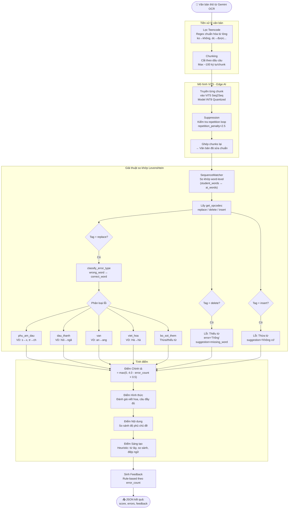
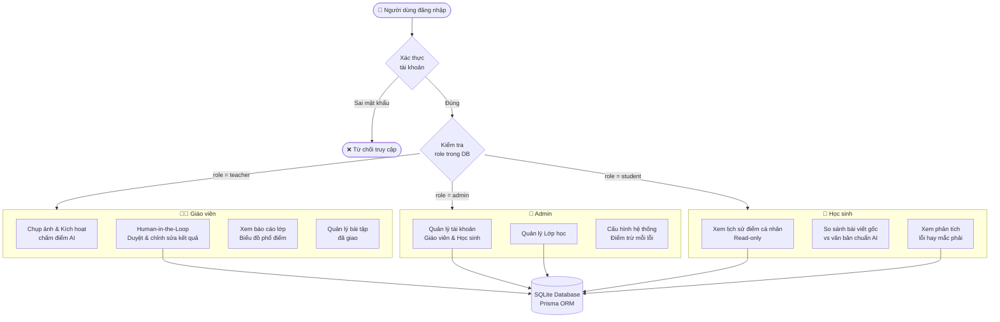
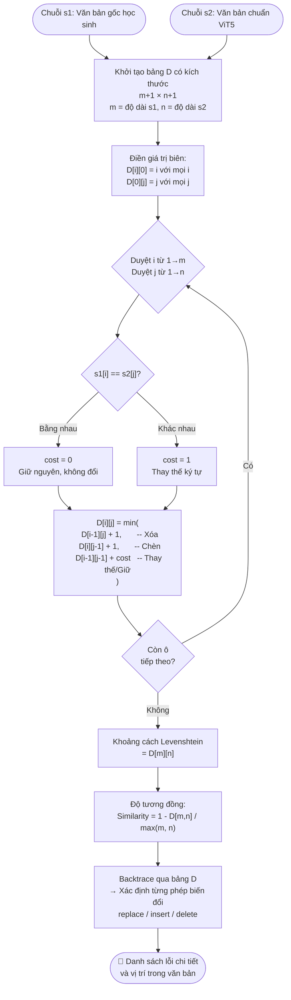
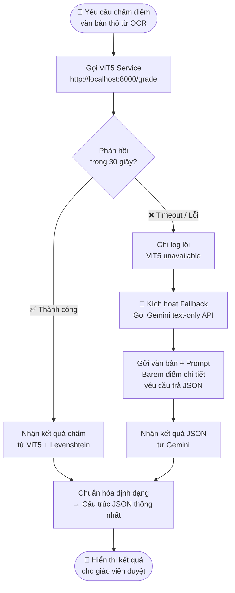

# Lưu đồ và Giải thuật hệ thống ViHand Grade

Tài liệu này tổng hợp các lưu đồ (flowchart) và giải thuật của hệ thống, tương ứng với nội dung lý thuyết ở Chương 2 và Chương 3. Các sơ đồ được viết bằng cú pháp Mermaid, có thể render trực tiếp trên GitHub, VS Code (với extension Mermaid) hoặc trang web mermaid.live.

---

## Hình 3.1 – Lưu đồ luồng hoạt động tổng thể (Hybrid AI Pipeline)

Mô tả toàn bộ quá trình từ khi giáo viên chụp ảnh đến khi lưu kết quả chấm điểm.

```mermaid
flowchart TD
    A([👨‍🏫 Giáo viên chụp ảnh bài chính tả]) --> B[Tải ảnh lên giao diện Web\nNext.js Frontend]
    B --> C[Gọi API: /api/preprocess\nThư viện Jimp - Node.js]

    subgraph img_pipeline ["⚙️ Bước 1: Tiền xử lý ảnh số (9 bước)"]
        C --> P0[Bước 0: EXIF Auto-rotate]
        P0 --> P05[Bước 0.5: Deskew - Căn góc nghiêng]
        P05 --> P1[Bước 1: Resize - Chuẩn hóa kích thước]
        P1 --> P2[Bước 2: White Balance - Cân bằng trắng]
        P2 --> P3[Bước 3: Grayscale - Chuyển ảnh xám]
        P3 --> P4[Bước 4: Shadow Removal - Khử bóng đổ]
        P4 --> P5[Bước 5: CLAHE - Tăng tương phản]
        P5 --> P6[Bước 6: Unsharp Mask - Làm nét chữ]
        P6 --> P7{Bước 7: Quality Assessment\nĐánh giá chất lượng ảnh}
        P7 -- Chất lượng kém --> WARN[⚠️ Cảnh báo:\nĐề nghị chụp lại]
        P7 -- Chất lượng tốt --> P8[Bước 8: Adaptive Threshold\nNhị phân hóa thích nghi]
    end

    P8 --> D[Ảnh PNG đã tối ưu\n+ Mã hóa Base64]
    D --> E[Gọi API: /api/ocr\nGoogle Gemini API]

    subgraph ocr_step ["☁️ Bước 2: Trích xuất văn bản (OCR)"]
        E --> F["Gửi ảnh + Prompt:\n'Chỉ trích xuất nguyên văn,\nkhông sửa lỗi'"]
        F --> G[Văn bản thô - OCR Output\nbao gồm cả lỗi chính tả của học sinh]
    end

    G --> H{Gọi API: /api/grade\nViT5 Service - port 8000}

    subgraph grade_step ["🤖 Bước 3: Chấm điểm cục bộ (Edge AI)"]
        H -- ViT5 hoạt động --> I[Tiền xử lý: Lọc Teencode\n+ Chunking văn bản]
        I --> J[ViT5 Model INT8\nSửa lỗi chính tả → văn bản chuẩn]
        J --> K[SequenceMatcher / Levenshtein\nSo khớp word-level]
        K --> L[Phân loại lỗi:\nphu_am_dau / dau_thanh / van / viet_hoa]
        L --> M[Tính điểm:\nChính tả - Hình thức - Nội dung - Sáng tạo]
        M --> N[Sinh Feedback tự động\nRule-based theo số lỗi]
        H -- ViT5 lỗi --> FB[Fallback:\nGemini text-only chấm điểm]
        FB --> N
    end

    N --> O[Hiển thị kết quả bản nháp\ncho Giáo viên duyệt]
    O --> P{Giáo viên\nxác nhận?}
    P -- Chỉnh sửa --> O
    P -- Xác nhận --> Q[(Lưu vào SQLite\nqua Prisma ORM)]
    Q --> R[📊 Hiển thị báo cáo\ntiến bộ học sinh]
```

---

## Hình 3.2 – Lưu đồ chi tiết thuật toán tiền xử lý ảnh (Image Processing Pipeline)

```mermaid
flowchart LR
    IN([🖼️ Ảnh gốc từ camera\nđiện thoại]) --> S0

    subgraph step0 ["Bước 0"]
        S0["EXIF Auto-rotate\nĐọc tag Orientation 0x0112\n→ Xoay 90°/180°/270°"]
    end

    subgraph step05 ["Bước 0.5"]
        S05["Deskew\n1. Thu nhỏ ảnh tạm thời\n2. Otsu threshold\n3. Xóa đường kẻ ô ly\n4. Projection Variance [-15°, +15°]\n5. Xoay ảnh về góc chuẩn"]
    end

    subgraph step1 ["Bước 1"]
        S1["Resize\nGiới hạn chiều rộng ≤ 1600px\nGiữ nguyên tỷ lệ khung hình"]
    end

    subgraph step2 ["Bước 2"]
        S2["White Balance\nGray World Assumption\nR' = R × (avg_gray / avg_R)\nG' = G × (avg_gray / avg_G)\nB' = B × (avg_gray / avg_B)"]
    end

    subgraph step3 ["Bước 3"]
        S3["Grayscale\nI = 0.299R + 0.587G + 0.114B\n→ 1-channel, 256 sắc độ"]
    end

    subgraph step4 ["Bước 4"]
        S4["Shadow Removal\n1. Box Blur kernel lớn → ảnh nền\n2. pixel' = (pixel / background) × 255"]
    end

    subgraph step5 ["Bước 5"]
        S5["CLAHE\nLưới 8×8 ô vuông\nHistogram Equalization / ô\nClip Limit = 2.0"]
    end

    subgraph step6 ["Bước 6"]
        S6["Unsharp Mask\nblurred = Gaussian Blur(ảnh)\nmask = ảnh - blurred\nresult = ảnh + α × mask"]
    end

    subgraph step7 ["Bước 7"]
        S7{"Quality Assessment\nLaplacian Variance\nBrightness Check\nBlack Pixel Ratio"}
        S7 -- Kém --> WARN([⚠️ Trả về qualityReport\nYêu cầu chụp lại])
    end

    subgraph step8 ["Bước 8"]
        S8["Adaptive Threshold\nSử dụng Integral Image\nNgưỡng riêng mỗi Block\n→ Ảnh đen/trắng tuyệt đối"]
    end

    S0 --> S05 --> S1 --> S2 --> S3 --> S4 --> S5 --> S6 --> S7
    S7 -- Tốt --> S8
    S8 --> OUT([✅ Ảnh PNG tối ưu\nSẵn sàng cho OCR])
```

---

## Hình 3.3 – Lưu đồ giải thuật chấm điểm và phân loại lỗi (Grading & Error Classification)

---

## Hình 3.4 – Lưu đồ phân quyền người dùng (RBAC)

---

## Hình 3.5 – Lưu đồ giải thuật Levenshtein Distance (Công thức quy hoạch động)

---

## Hình 3.6 – Lưu đồ cơ chế Fallback (Dự phòng đám mây)

