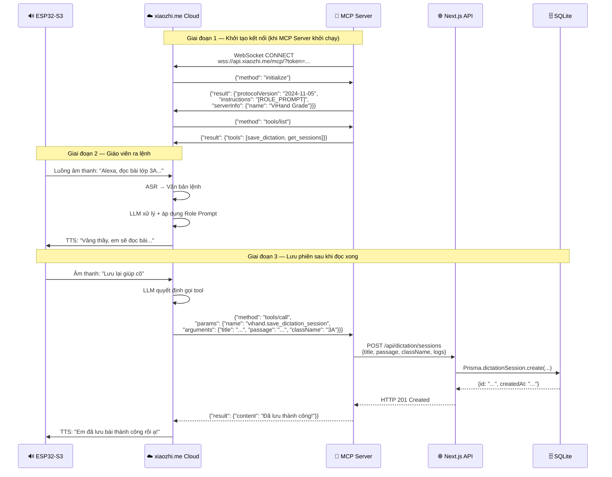
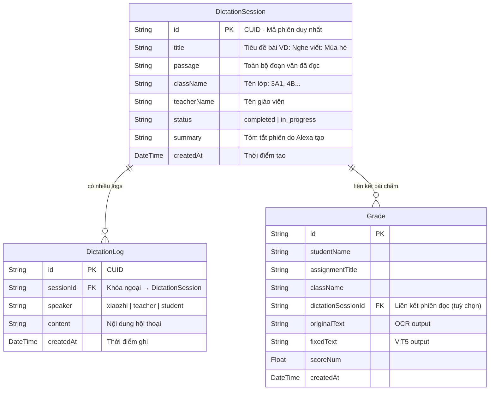

# Lưu đồ Module Xiaozhi AI Dictation Robot

Tài liệu này bổ sung các lưu đồ cho **Module Xiaozhi Dictation** — thành phần trợ lý giọng nói AI đọc chính tả, được thêm vào hệ thống ViHand Grade sau khi tích hợp thiết bị Xiaozhi ESP32-S3 và MCP Server.

---

## Hình X.1 – Kiến trúc tổng thể Module Xiaozhi Dictation

Sơ đồ mô tả luồng dữ liệu từ khi giáo viên ra lệnh giọng nói đến khi bài đọc được lưu vào cơ sở dữ liệu ViHand Grade.

```mermaid
flowchart TD
    GV([👨‍🏫 Giáo viên nói\n\"Alexa, soạn bài chính tả\nlớp 3A, chủ đề mùa hè\"]) --> ESP

    subgraph hw [\"🔊 Phần cứng Xiaozhi ESP32-S3\"]
        ESP[Microphone thu âm\nWake word: \"Alexa\"] --> STREAM[Luồng âm thanh\ngửi lên xiaozhi.me Cloud]
    end

    STREAM --> CLOUD

    subgraph cloud [\"☁️ xiaozhi.me Cloud Platform\"]
        CLOUD[ASR: Nhận dạng giọng nói\n→ Văn bản lệnh] --> LLM
        LLM[LLM xử lý lệnh\nvới Role: Alexa Sư phạm\n+ System Prompt từ MCP] --> DECIDE{Cần gọi\nMCP Tool?}
        DECIDE -- Không --> TTS[TTS: Chuyển văn bản\n→ Giọng đọc tự nhiên]
        DECIDE -- Có --> MCP_CALL[Gọi MCP Tool\nqua WebSocket]
    end

    TTS --> SPEAKER[🔈 Loa ESP32\nPhát âm thanh\ncho cả lớp nghe]
    MCP_CALL --> WS

    subgraph mcp [\"🐍 MCP Server - Python/FastAPI\n(localhost:8200)\"]
        WS[WebSocket Client\nKết nối vào\nwss://api.xiaozhi.me/mcp/] --> HANDLER[JSON-RPC Handler\ninitialize / tools/list\n/ tools/call]
        HANDLER --> TOOL_ROUTER{Tên Tool?}
        TOOL_ROUTER -- vihand.save_dictation_session --> SAVE_TOOL[Lưu phiên đọc\ngọi Next.js API]
        TOOL_ROUTER -- vihand.get_dictation_sessions --> GET_TOOL[Lấy lịch sử\ngọi Next.js API]
    end

    SAVE_TOOL --> API
    GET_TOOL --> API

    subgraph web [\"🌐 Next.js Web Server\n(localhost:3000)\"]
        API[POST /api/dictation/sessions\nGET /api/dictation/sessions] --> DB[(SQLite Database\nPrisma ORM\nDictationSession\nDictationLog)]
    end

    DB --> RESULT[JSON kết quả] --> WS
    WS --> CLOUD
    DB --> DASHBOARD[📊 Dashboard Giáo viên\n/teacher/dictation\nDanh sách phiên + Bộ lọc]
```

---

## Hình X.2 – Lưu đồ quy trình 3 bước của Alexa (Chi tiết)

```mermaid
flowchart TD
    START([🎙️ Giáo viên kích hoạt\n\"Alexa, ...\"])

    START --> CMD{Phân tích\nlệnh}

    CMD -- \"Lệnh chung chung\n(chưa đủ thông tin)\" --> ASK
    CMD -- \"Lệnh đầy đủ\n(lớp, chủ đề, tốc độ)\" --> COMPOSE
    CMD -- \"Hỏi lịch sử\" --> GET_HIST

    subgraph buoc1 [\"📋 Bước 1: Thu thập thông tin\"]
        ASK[Alexa hỏi lại giáo viên:\n1. Dành cho lớp mấy?\n2. Chủ đề / nội dung gì?\n3. Bao nhiêu câu?\n4. Đọc mấy lần?\n5. Tốc độ nhanh hay chậm?]
        ASK --> COLLECT[Giáo viên trả lời] --> COMPOSE
    end

    subgraph buoc2 [\"✍️ Bước 2: Soạn & Đọc bài\"]
        COMPOSE{Giáo viên\ncung cấp nội dung?}
        COMPOSE -- Có sẵn --> USE_CONTENT[Dùng nội dung\ngiáo viên cung cấp]
        COMPOSE -- Tự soạn --> GEN[LLM soạn đoạn văn\nphù hợp khối lớp\nvà chủ đề]
        USE_CONTENT & GEN --> READ1[Thông báo:\n\"Em sắp đọc bài X\ncho lớp Y\"]
        READ1 --> READ_SLOW[Đọc lần 1 liền mạch\n[Tốc độ: chậm/bình thường]\nToàn bộ đoạn văn]
        READ_SLOW --> PAUSE[Nghỉ 10–15 giây\n\"Các em đã nghe xong lần 1\nem sẽ đọc lại từng câu\"]
        PAUSE --> READ_SENT[Đọc lần 2 từng câu\n[Nghỉ đủ thời gian\ngiữa mỗi câu]]
        READ_SENT --> CHECK_DONE{Đọc đủ\nsố lần?}
        CHECK_DONE -- Chưa --> READ_SENT
        CHECK_DONE -- Rồi --> ASK_DONE[Hỏi học sinh:\n\"Các em đã viết xong chưa ạ?\"]
        ASK_DONE --> CONFIRM_DONE{Học sinh / GV\nxác nhận?}
        CONFIRM_DONE -- Chưa --> READ_SENT
        CONFIRM_DONE -- Xong --> ASK_SAVE
    end

    subgraph buoc3 [\"💾 Bước 3: Nhắc lưu / Đọc tiếp\"]
        ASK_SAVE[\"Bắt buộc hỏi:\n'Thầy/cô có muốn em lưu bài\nvào ViHand Grade không,\nhay muốn đọc thêm bài nữa?'\"]
        ASK_SAVE --> GV_CHOICE{Giáo viên\nchọn gì?}
        GV_CHOICE -- \"Lưu lại\" --> CALL_SAVE
        GV_CHOICE -- \"Đọc thêm bài\" --> COMPOSE
        GV_CHOICE -- \"Không cần\" --> END_SESSION
    end

    subgraph mcp_save [\"🔧 MCP Tool Call\"]
        CALL_SAVE[Gọi tool:\nvihand.save_dictation_session\n- title\n- passage\n- className\n- summary\n- logs]
        CALL_SAVE --> API_CALL[POST /api/dictation/sessions\nlocalhost:3000]
        API_CALL --> DB_WRITE[(Ghi vào SQLite)]
        DB_WRITE --> SUCCESS[Alexa thông báo:\n\"Em đã lưu bài thành công!\"]
    end

    subgraph get_hist [\"🔍 Tra cứu lịch sử\"]
        GET_HIST[Gọi tool:\nvihand.get_dictation_sessions\n- className (nếu có)\n- limit: 10]
        GET_HIST --> DB_READ[(Đọc SQLite)]
        DB_READ --> REPORT[Alexa đọc danh sách\nbài đã học hôm nay\n/ tuần này / theo lớp]
    end

    SUCCESS --> END_SESSION([✅ Kết thúc phiên])
```

---

## Hình X.3 – Lưu đồ MCP JSON-RPC Handshake (Giao thức kết nối)



---

## Hình X.4 – Lưu đồ Database Schema Module Xiaozhi



---

## Hình X.5 – Lưu đồ trang quản lý phiên đọc (Teacher Dashboard)

```mermaid
flowchart TD
    OPEN([👨‍🏫 Giáo viên mở\n/teacher/dictation]) --> FETCH

    subgraph load [\"Tải dữ liệu ban đầu\"]
        FETCH[GET /api/dictation/sessions?limit=50] --> SESSIONS[(Danh sách tất cả\nphiên đọc)]
    end

    SESSIONS --> RENDER[Hiển thị danh sách\n+ Thống kê: Tổng phiên,\nLớp đã đọc, Phiên gần nhất]

    subgraph filter [\"🔍 Bộ lọc & Tìm kiếm (Client-side)\"]
        RENDER --> SEARCH_BAR[Thanh tìm kiếm\ntên bài / nội dung / lớp]
        RENDER --> CLASS_FILTER[Dropdown Lớp\ntự động từ sessions]
        RENDER --> TIME_FILTER[Dropdown Thời gian\nHôm nay / Hôm qua\n7 ngày / Tháng này]
        SEARCH_BAR & CLASS_FILTER & TIME_FILTER --> FILTER_LOGIC[useMemo: lọc\nfilteredSessions]
    end

    FILTER_LOGIC --> RESULT_LIST{Có kết quả\nkhông?}
    RESULT_LIST -- Có --> SHOW_LIST[Hiển thị danh sách\nphiên đã lọc\n+ badge lớp + ngày]
    RESULT_LIST -- Không --> EMPTY[Thông báo trống\n+ Nút Xoá bộ lọc]

    SHOW_LIST --> USER_ACTION{Giáo viên\nthao tác gì?}
    USER_ACTION -- Click vào phiên --> DIALOG[Mở Dialog chi tiết\n- Tiêu đề, lớp, ngày\n- Đoạn văn chính tả]
    USER_ACTION -- Click Xoá --> CONFIRM{Xác nhận\nxoá?}
    CONFIRM -- Có --> DELETE[DELETE /api/dictation/sessions/:id\nXoá khỏi DB]
    DELETE --> REMOVE_UI[Cập nhật UI\n(setSessions filter)]
```

---

## Hình X.6 – Lưu đồ tổng hợp toàn hệ thống ViHand Grade (Bao gồm Xiaozhi)

```mermaid
flowchart LR
    subgraph input [\"📥 Đầu vào\"]
        V1[🎙️ Lệnh giọng nói\nGiáo viên → Alexa]
        V2[📷 Ảnh chụp\nBài viết tay học sinh]
    end

    subgraph xiaozhi_module [\"🤖 Module 1: Xiaozhi Dictation\"]
        XZ1[ESP32-S3\nMic + Loa]
        XZ2[xiaozhi.me Cloud\nASR + LLM + TTS]
        XZ3[MCP Server\nPython :8200]
        XZ1 <--> XZ2
        XZ2 <--> XZ3
    end

    subgraph img_module [\"🖼️ Module 2: Xử lý ảnh\"]
        IM1[Jimp Pipeline\n9 bước tiền xử lý\n/api/preprocess]
    end

    subgraph ocr_module [\"☁️ Module 3: OCR\"]
        OC1[Google Gemini API\ngemini-3.1-flash-lite\n/api/ocr]
    end

    subgraph ai_module [\"🤖 Module 4: Chấm điểm AI\"]
        AI1[ViT5 Python\nSeq2Seq sửa lỗi\n:8000]
        AI2[Levenshtein\nSo khớp & phân loại lỗi]
        AI3[Rule-based\nTính điểm 4 tiêu chí\nSinh Feedback]
        AI1 --> AI2 --> AI3
    end

    subgraph web [\"🌐 Module 5: Web Dashboard\"]
        W1[Next.js :3000\nAdmin / Teacher / Student]
        W2[(SQLite\nPrisma ORM)]
        W1 <--> W2
    end

    V1 --> XZ1
    XZ3 --> W1

    V2 --> IM1 --> OC1 --> AI1
    AI3 --> W1
```

---

## Ghi chú thuật ngữ

| Thuật ngữ | Giải thích |
|-----------|-----------|
| **MCP** | Model Context Protocol — chuẩn giao thức JSON-RPC cho phép LLM gọi công cụ bên ngoài |
| **WebSocket** | Giao thức kết nối hai chiều liên tục giữa MCP Server và xiaozhi.me Cloud |
| **ASR** | Automatic Speech Recognition — nhận dạng giọng nói tự động |
| **TTS** | Text-to-Speech — chuyển văn bản thành giọng nói |
| **LLM** | Large Language Model — mô hình ngôn ngữ lớn xử lý lệnh của giáo viên |
| **ESP32-S3** | Vi điều khiển của Xiaozhi, chứa mic, loa, màn hình; kết nối WiFi lên Cloud |
| **CUID** | Collision-resistant Unique Identifier — định danh duy nhất cho mỗi bản ghi |
| **Role Prompt** | System Prompt định nghĩa nhân vật Alexa gửi qua `initialize` response |
