```mermaid
flowchart TB
    %% ============================================================
    %% PATH A — Luồng đọc chính tả (Module 1: Xiaozhi Robot)
    %% ============================================================

    subgraph PATH_A ["🔵 LUỒNG A — Đọc chính tả tự động (Xiaozhi Dictation Robot)"]
        direction LR

        GV(["👨‍🏫 Giáo viên nói lệnh\n'Alexa, đọc bài lớp 3A...'"])

        subgraph M1 ["📦 Module 1: Xiaozhi Dictation Robot"]
            direction TB
            ESP["🎙️ ESP32-S3 Hardware\n• Microphone thu âm\n• Loa phát bài\n• Wake word: Alexa"]
            CLOUD_AI["☁️ xiaozhi.me Cloud\n• ASR: Giọng → Văn bản\n• LLM: Xử lý lệnh (Role Alexa)\n• TTS: Văn bản → Giọng"]
            MCP["🐍 MCP Server\nPython :8200\n• WebSocket Client\n• JSON-RPC Handler\n• Tools: save / get"]
            ESP <-->|WiFi Audio Stream| CLOUD_AI
            CLOUD_AI <-->|"WebSocket\nJSON-RPC 2.0"| MCP
        end

        subgraph M5A ["📦 Module 5: Web API (Dictation)"]
            API_D["🌐 Next.js :3000\nPOST /api/dictation/sessions\nGET  /api/dictation/sessions"]
            DB_D[("🗄️ SQLite\n─────────\nDictationSession\n(title, passage, className)\n─────────\nDictationLog\n(speaker, content)")]
            DASH_D["📊 Dashboard\n/teacher/dictation\n• Danh sách phiên đọc\n• Bộ lọc lớp / thời gian\n• Xem chi tiết bài"]
            API_D -->|"Prisma ORM\ndictationSession.create()"| DB_D
            DB_D --> DASH_D
        end

        GV --> ESP
        MCP -->|"HTTP POST\n/api/dictation/sessions"| API_D
    end

    %% ============================================================
    %% PATH B — Luồng chấm điểm bài viết tay (Module 2-3-4)
    %% ============================================================

    subgraph PATH_B ["🟠 LUỒNG B — Chấm điểm bài viết tay (AI Grading Pipeline)"]
        direction LR

        IMG(["📷 Ảnh chụp bài viết tay\ncủa học sinh"])

        subgraph M2 ["📦 Module 2: Xử lý ảnh"]
            JIMP["⚙️ Jimp Pipeline\n9 bước tiền xử lý\n/api/preprocess\n\nEXIF→Deskew→Resize\nWhiteBalance→Grayscale\nShadow→CLAHE\nSharpen→AdaptiveThreshold"]
        end

        subgraph M3 ["📦 Module 3: OCR"]
            GEMINI["☁️ Google Gemini API\ngemini-2.0-flash-lite\n/api/ocr\n\nTrích xuất nguyên văn\n(KHÔNG tự sửa lỗi)"]
        end

        subgraph M4 ["📦 Module 4: AI Grading Engine"]
            VIT5["🤖 ViT5 Python :8000\nSeq2Seq INT8 Quantized\nSửa lỗi chính tả"]
            LEVE["📐 SequenceMatcher\nLevenshtein so khớp\nword-by-word"]
            RULE["📏 Rule-based Scoring\n5 loại lỗi phân loại\nĐiểm 4 tiêu chí\nSinh Feedback sư phạm"]
            FALL(["⚡ Fallback\nGemini text-only\nnếu ViT5 timeout 30s"])
            VIT5 --> LEVE --> RULE
            VIT5 -. timeout .-> FALL
            FALL --> RULE
        end

        subgraph M5B ["📦 Module 5: Web API (Grading)"]
            API_G["🌐 Next.js :3000\nPOST /api/grade\nGET  /api/grades\nHuman-in-the-Loop: GV duyệt"]
            DB_G[("🗄️ SQLite\n─────────\nGrade\n(originalText, fixedText\ncorrections JSON\nscore, scoreBreakdown\nfeedback, overallRating\nimageBase64)")]
            DASH_G["📊 Dashboard\n/teacher\n• Kết quả chấm điểm\n• Báo cáo tiến bộ\n• Biểu đồ phổ điểm\n• So sánh bài viết"]
            API_G -->|"Prisma ORM\ngrade.create()"| DB_G
            DB_G --> DASH_G
        end

        IMG --> M2 --> M3 --> VIT5
        RULE -->|"Kết quả nháp\nGV xác nhận lưu"| API_G
    end

    %% ============================================================
    %% Liên kết tùy chọn giữa 2 luồng
    %% ============================================================
    DB_D -. "dictationSessionId\n(FK tùy chọn)" .-> DB_G

    %% ============================================================
    %% Styling
    %% ============================================================
    classDef moduleBox fill:#EFF6FF,stroke:#3B82F6,stroke-width:2px
    classDef dbBox fill:#F0FDF4,stroke:#22C55E,stroke-width:2px
    classDef cloudBox fill:#F5F3FF,stroke:#8B5CF6,stroke-width:2px
    classDef inputBox fill:#FFF7ED,stroke:#F97316,stroke-width:2px

    class M1,M5A moduleBox
    class M2,M3,M4,M5B moduleBox
    class DB_D,DB_G dbBox
    class CLOUD_AI,GEMINI cloudBox
```

# Sơ đồ tổng quát hệ thống ViHand Grade (Đúng)

> File này chứa sơ đồ Mermaid chính xác thay thế cho `SoDo_TongQuat_HeThong.png` đã bị xóa do vẽ sai luồng.  
> Render tại: [mermaid.live](https://mermaid.live) hoặc VS Code extension **Mermaid Preview**.

---

---

## Tóm tắt luồng đúng

| | **Luồng A — Xiaozhi** | **Luồng B — AI Grading** |
|---|---|---|
| **Đầu vào** | Giọng nói giáo viên | Ảnh chụp bài viết tay |
| **Modules** | 1 → 5 (trực tiếp) | 2 → 3 → 4 → 5 |
| **API** | `/api/dictation/sessions` | `/api/preprocess` → `/api/ocr` → `/api/grade` |
| **Bảng DB** | `DictationSession` + `DictationLog` | `Grade` |
| **Dashboard** | `/teacher/dictation` | `/teacher` (grades) |

> ⚠️ **Lưu ý quan trọng:** Module 1 (Xiaozhi) kết nối thẳng vào **Module 5** (Next.js API `/api/dictation/sessions`), **KHÔNG đi qua Module 4** (AI Grading Engine). Hai luồng hoạt động hoàn toàn độc lập.

> 🔗 **Điểm liên kết duy nhất:** Trường `dictationSessionId` trong bảng `Grade` — liên kết **tùy chọn** để biết bài viết tay này thuộc phiên đọc Xiaozhi nào.
