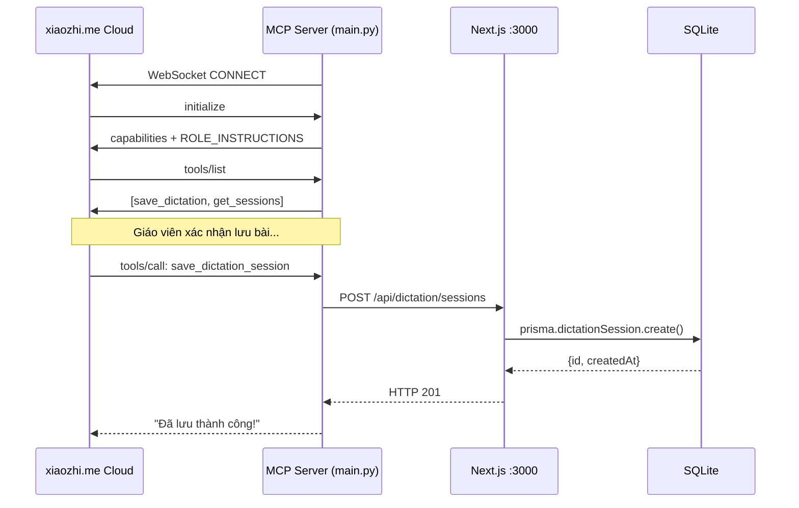

# MCP Server trong ViHand Grade — Thiết kế & Hiện thực

## 1. Tổng quan

File: `mcp_service/main.py`  
Port: `8200` (HTTP test) + WebSocket client đến xiaozhi.me  
Stack: **Python 3.11+** · **FastAPI** · **websockets** · **httpx**

MCP Server trong dự án này đóng vai trò **cầu nối** giữa:
- **Xiaozhi AI** (chạy trên cloud xiaozhi.me) — bên ra lệnh
- **Next.js API** (chạy local :3000) — bên lưu dữ liệu SQLite

---

## 2. Kiến trúc luồng dữ liệu

```
[Giáo viên nói với ESP32]
        ↓ âm thanh
[xiaozhi.me Cloud]
  ASR → văn bản lệnh
  LLM (với Role Prompt Alexa) → quyết định gọi tool
        ↓↑ WebSocket (JSON-RPC 2.0)
[MCP Server — main.py :8200]        ← WS Client, kết nối chủ động
  handle_jsonrpc()
  tool_save_dictation() / tool_get_sessions()
        ↓ HTTP REST (httpx)
[Next.js API — localhost:3000]
  POST /api/dictation/sessions
        ↓ Prisma ORM
[SQLite — prisma/vihand.db]
  DictationSession + DictationLog
```

---

## 3. Cấu hình môi trường

File: `mcp_service/.env`

```bash
# WebSocket endpoint từ xiaozhi.me
# Lấy tại: xiaozhi.me → Thiết bị → MCP Settings → MCP Endpoint
MCP_ENDPOINT=wss://api.xiaozhi.me/mcp/?token=eyJhbGci...

# URL của Next.js Web Server đang chạy
VIHAND_API_URL=http://localhost:3000
```

Server tự đọc `.env` khi khởi động (không cần `python-dotenv`):

```python
_env_file = os.path.join(os.path.dirname(__file__), ".env")
if os.path.exists(_env_file):
    with open(_env_file, encoding="utf-8") as f:
        for line in f:
            if "=" in line and not line.startswith("#"):
                k, v = line.split("=", 1)
                os.environ.setdefault(k.strip(), v.strip())
```

---

## 4. Role Instructions — Gửi qua `initialize`

Khi xiaozhi.me gửi `initialize`, server trả về `instructions` chứa **toàn bộ System Prompt** định nghĩa nhân vật Alexa:

```python
if method == "initialize":
    return {
        "jsonrpc": "2.0", "id": req_id,
        "result": {
            "protocolVersion": "2024-11-05",
            "capabilities": {"tools": {}},
            "serverInfo": {"name": "ViHand Grade Dictation", "version": "2.0.0"},
            "instructions": ROLE_INSTRUCTIONS,   # ← System Prompt nhân vật Alexa
        },
    }
```

**Ý nghĩa:** Mỗi lần MCP Server kết nối lại (do mất mạng, restart...), LLM tự động nhận lại Role Prompt — không cần cấu hình thủ công trên dashboard.

---

## 5. Hai Tools được đăng ký

### Tool 1: `vihand.save_dictation_session`

**Mục đích:** Lưu một phiên đọc chính tả vào database.

| Tham số | Kiểu | Bắt buộc | Mô tả |
|---------|------|----------|-------|
| `title` | string | ✅ | Tiêu đề bài, VD: "Nghe viết: Mùa hè" |
| `passage` | string | ✅ | Toàn bộ đoạn văn đã đọc |
| `className` | string | ❌ | Tên lớp: "3A1", "4B"... |
| `teacherName` | string | ❌ | Tên giáo viên |
| `summary` | string | ❌ | Tóm tắt ngắn phiên học |
| `logs` | string (JSON) | ❌ | Lịch sử hội thoại dạng JSON string |

**Luồng xử lý:**
```python
async def tool_save_dictation(args: dict) -> str:
    # 1. Validate bắt buộc có title và passage
    # 2. Parse logs từ JSON string → Python list
    # 3. POST đến Next.js: /api/dictation/sessions
    # 4. Trả về thông báo thành công hoặc lỗi
```

**Điều kiện kích hoạt (theo description):**
- GV xác nhận: "Có", "Lưu lại", "Ok lưu đi", "Được", "Ừ"
- GV nói rõ từ đầu: "đọc và lưu", "lưu buổi học vừa rồi"

---

### Tool 2: `vihand.get_dictation_sessions`

**Mục đích:** Tra cứu lịch sử các phiên đọc đã lưu.

| Tham số | Kiểu | Mặc định | Mô tả |
|---------|------|----------|-------|
| `className` | string | "" | Lọc theo lớp |
| `limit` | integer | 10 | Số kết quả tối đa |

**Điều kiện kích hoạt:** GV hỏi "Hôm nay đọc bài gì?", "Lớp 3A học bài nào rồi?"...

---

## 6. WebSocket Client — Cơ chế kết nối

```python
async def connect_to_xiaozhi(endpoint: str):
    reconnect_delay = 5  # giây

    while True:  # vòng lặp vô hạn: tự reconnect khi mất kết nối
        try:
            async with websockets.connect(
                endpoint,
                ping_interval=None,  # tắt auto-ping, để xiaozhi.me tự quản lý
                ping_timeout=None,
                open_timeout=15,
                max_size=10 * 1024 * 1024,  # 10MB
            ) as ws:
                reconnect_delay = 5  # reset delay khi kết nối thành công

                async for raw_msg in ws:
                    msg = json.loads(raw_msg)

                    # xiaozhi.me có thể gói trong {type:'mcp', payload:{...}}
                    # hoặc gửi bare JSON-RPC trực tiếp
                    if msg.get("type") == "mcp":
                        rpc_body = msg["payload"]
                        session_id = msg.get("session_id", "")
                    else:
                        rpc_body = msg
                        session_id = ""

                    result = await handle_jsonrpc(rpc_body)

                    # Bọc lại response với session_id nếu có
                    if session_id:
                        response = {"session_id": session_id, "type": "mcp", "payload": result}
                    else:
                        response = result

                    await ws.send(json.dumps(response, ensure_ascii=False))

        except (ConnectionClosedOK, ConnectionClosedError, OSError):
            pass  # log lỗi

        await asyncio.sleep(reconnect_delay)
        reconnect_delay = min(reconnect_delay * 2, 60)  # exponential backoff, tối đa 60s
```

**Tính năng quan trọng:**
- **Auto-reconnect** với exponential backoff (5s → 10s → 20s → 40s → 60s)
- Xử lý cả 2 định dạng message của xiaozhi.me (bare JSON-RPC và wrapped)
- `ping_interval=None`: tắt auto-ping của thư viện websockets, để xiaozhi.me tự gửi ping

---

## 7. JSON-RPC Handler — Xử lý tất cả method

```python
async def handle_jsonrpc(body: dict) -> dict | None:
    method = body.get("method", "")

    if method.startswith("notifications/"):
        return None  # notifications không cần reply

    if method == "initialize":    → trả capabilities + ROLE_INSTRUCTIONS
    if method == "tools/list":    → trả TOOLS[]
    if method == "tools/call":    → gọi tool tương ứng → trả kết quả
    if method == "ping":          → trả {} (keep-alive)
    # unknown method              → trả {} (tránh bị ngắt kết nối)
```

---

## 8. FastAPI HTTP — Test cục bộ

Ngoài WebSocket, server còn chạy FastAPI để test không cần xiaozhi.me:

```bash
# Health check
GET http://localhost:8200/health
→ {"status":"ok","tools":["vihand.save_dictation_session","vihand.get_dictation_sessions"]}

# Gọi tool trực tiếp qua HTTP (test)
POST http://localhost:8200/mcp
Content-Type: application/json
{
  "jsonrpc": "2.0",
  "id": 1,
  "method": "tools/call",
  "params": {
    "name": "vihand.save_dictation_session",
    "arguments": {"title": "Test", "passage": "Mùa xuân..."}
  }
}
```

---

## 9. Dependencies

```text
fastapi>=0.115.0       # HTTP framework + health endpoint
uvicorn>=0.30.0        # ASGI server chạy FastAPI
httpx>=0.27.0          # Async HTTP client → gọi Next.js API
starlette>=0.41.0      # Core của FastAPI
websockets>=12.0       # WebSocket client → kết nối xiaozhi.me
```

Cài đặt:
```bash
cd mcp_service
pip install -r requirements.txt
python main.py
```

---

## 10. Sơ đồ tóm tắt


