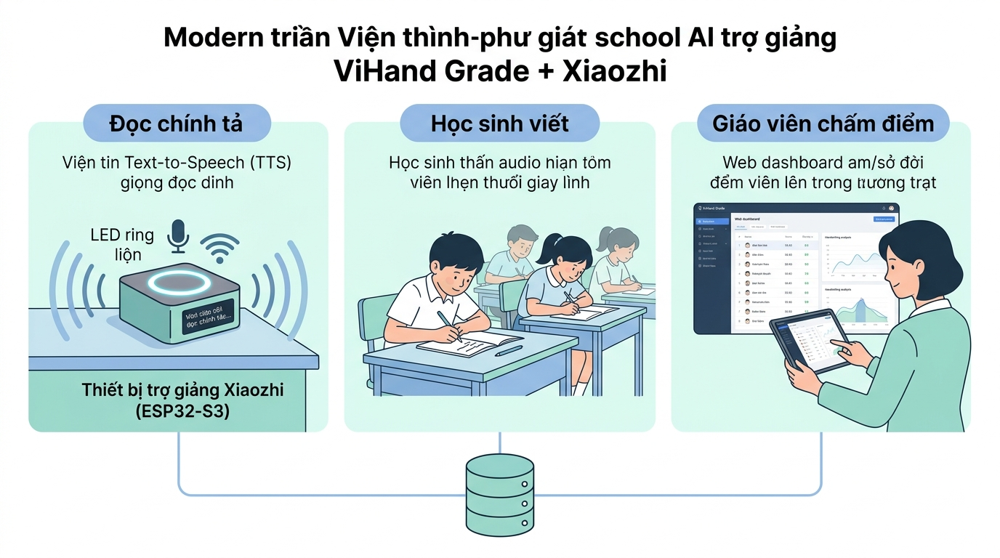
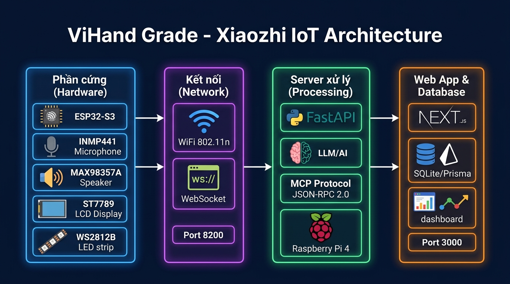
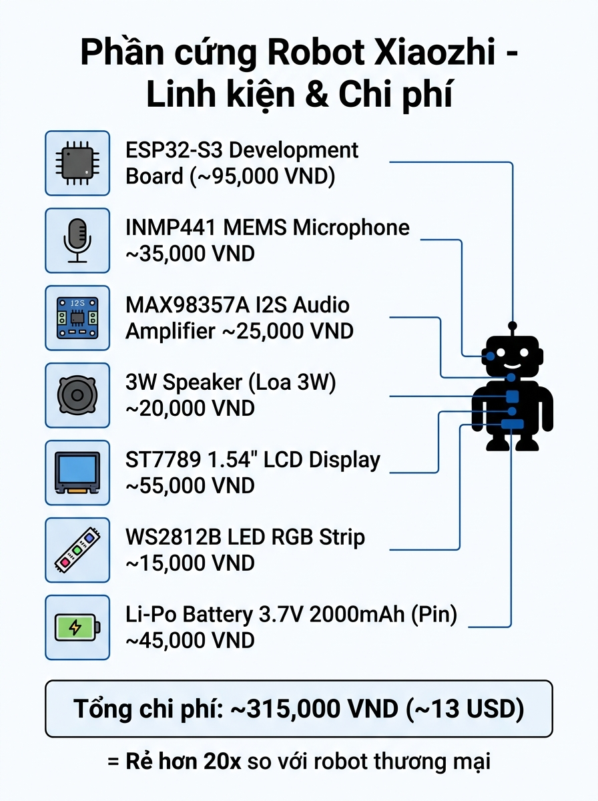
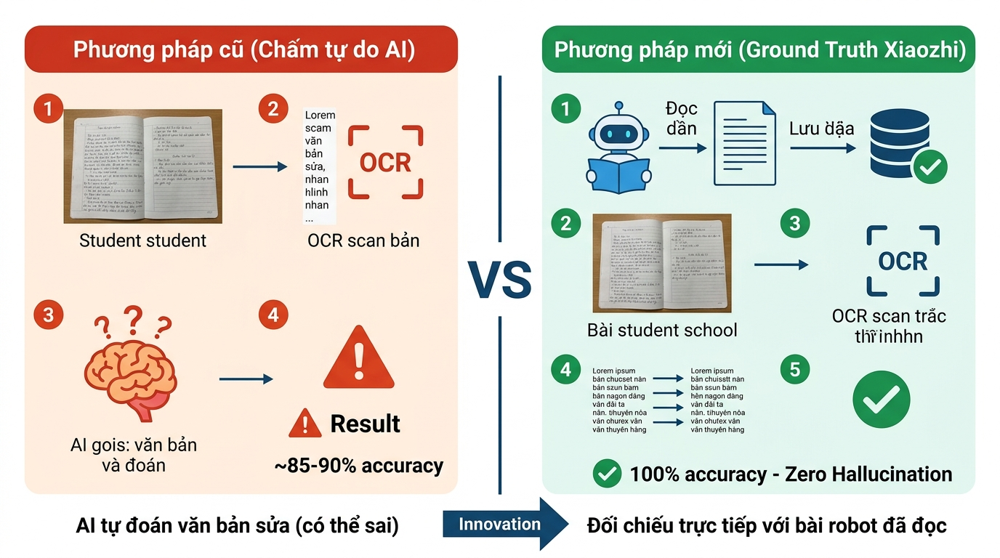

# 🎓 Tổng Quan Đề Tài Đồ Án Chuyên Ngành
## "ViHand Grade + Xiaozhi — Hệ Thống AI Hỗ Trợ Dạy Chính Tả Tiếng Việt Tiểu Học"

> **Sinh viên trình bày:** [Tên sinh viên]  
> **Ngày hỏi thầy:** 22/08/2026  
> **Tài liệu đặc tả đầy đủ:** [`ViHandGrade_Xiaozhi_DictationRobot_Spec.md`](./ViHandGrade_Xiaozhi_DictationRobot_Spec.md)

---

## 1. 📌 Đề Tài Là Gì? (Tóm Tắt 1 Câu)

> **Xây dựng hệ thống IoT + AI tích hợp Thiết bị trợ giảng thông minh ESP32-S3 (Xiaozhi) tự động đọc chính tả cho học sinh tiểu học, kết hợp với nền tảng Web ViHand Grade để chấm điểm bài viết tay bằng OCR và AI — tạo thành vòng đời dạy-học-chấm bài khép kín hoàn toàn.**

---

## 2. 🖼️ Hình Ảnh Tổng Quan Hệ Thống



### Giải thích hình trên:
| Thành phần | Vai trò |
| :--- | :--- |
| 🔊 **Thiết bị trợ giảng Xiaozhi (ESP32-S3)** | Thiết bị phần cứng đặt trên bàn giáo viên — tích hợp mic + loa + WiFi, tự động đọc bài chính tả bằng giọng TTS tiếng Việt. |
| ✏️ **Học sinh viết** | Học sinh nghe thiết bị đọc và chép tay vào vở như bình thường. |
| 💻 **Giáo viên chấm điểm** | Giáo viên chụp ảnh bài viết tay → Hệ thống Web AI tự động chấm điểm và trả kết quả ngay. |

---

## 3. 🗺️ Vấn Đề Thực Tiễn Đề Tài Giải Quyết

### Hiện trạng (Vấn đề đang xảy ra trong lớp học tiểu học):

```
❌ TRƯỚC KHI CÓ HỆ THỐNG:

  1. Giáo viên phải đọc chính tả tay (mệt mỏi, mất thời gian)
  2. Tốc độ đọc không đồng đều, học sinh yếu bị bỏ lại
  3. Giáo viên chấm bài từng tờ bằng tay (30-40 tờ/lớp)
  4. Không có thống kê lỗi phổ biến của cả lớp
  5. Không lưu trữ dữ liệu → Không theo dõi được tiến bộ học sinh
```

```
✅ SAU KHI CÓ HỆ THỐNG:

  1. Thiết bị đọc tự động, chuẩn tốc độ, đúng dấu thanh
  2. Giáo viên điều khiển thiết bị bằng giọng nói ("đọc lại", "chậm hơn")
  3. Chụp ảnh bài → AI chấm xong trong 5 giây
  4. Dashboard phân tích lỗi sai phổ biến toàn lớp
  5. Dữ liệu lưu vào cloud → Theo dõi tiến bộ từng học sinh
```

---

## 4. 🏗️ Kiến Trúc Kỹ Thuật Hệ Thống



### Luồng dữ liệu 3 tầng:

```text
┌─────────────────────────────────────────────────────────────┐
│  TẦNG 1: THIẾT BỊ TRỢ GIẢNG (ESP32-S3 Xiaozhi)              │
│  Chip ESP32-S3 → Mic INMP441 → Amply MAX98357A → Loa 3W     │
│  Màn hình LCD ST7789 → LED WS2812B → Pin LiPo 3.7V          │
└───────────────────────┬─────────────────────────────────────┘
                        │ WiFi + WebSocket (ws://IP:8200)
                        ▼
┌─────────────────────────────────────────────────────────────┐
│  TẦNG 2: LOCAL SERVER (Raspberry Pi 4 / Máy tính)           │
│  Python FastAPI → LLM (Gemini/GPT-4o) → MCP Bridge          │
│  • Nhận lệnh thoại từ thiết bị → Xử lý ý định (Intent)      │
│  • Gọi tools: tìm bài, lưu log, điều khiển phiên đọc        │
└───────────────────────┬─────────────────────────────────────┘
                        │ HTTP REST (localhost:3000)
                        ▼
┌─────────────────────────────────────────────────────────────┐
│  TẦNG 3: WEB APP + DATABASE (Next.js + SQLite)              │
│  • API quản lý bài đọc (DictationPassage)                   │
│  • API lưu phiên đọc (DictationSession)                     │
│  • API chấm điểm (Grade) ← OCR + ViT5 sửa lỗi              │
│  • Dashboard thống kê + báo cáo lớp học                     │
└─────────────────────────────────────────────────────────────┘
```

---

## 5. ⚙️ Phần Cứng Thiết Bị Trợ Giảng (Chi Phí & Linh Kiện)



### Tại sao chọn ESP32-S3 thay vì Raspberry Pi cho thiết bị trợ giảng?

| Tiêu chí | ESP32-S3 (Thiết bị trợ giảng) | Raspberry Pi 4 (Server) |
| :--- | :--- | :--- |
| **Giá thành** | ~95,000 VND | ~1,200,000 VND |
| **Vai trò** | Thiết bị đầu cuối (Edge Device) | Server xử lý trung tâm |
| **Tiêu thụ điện** | ~240mA (chạy pin dễ dàng) | ~2A (cần nguồn cố định) |
| **Kết nối WiFi** | Có sẵn trong chip | Cần adapter/module |
| **Phù hợp cho** | Đặt trên bàn, di chuyển được | Đặt cố định trong phòng server |

> **Kết luận**: Mỗi lớp học có 1 thiết bị trợ giảng ESP32-S3 (~315k VND), toàn trường dùng chung 1 server Raspberry Pi 4. Tổng chi phí cho 10 lớp: **~3.15 triệu + 1.2 triệu = ~4.35 triệu VND** (so với hệ thống thương mại tương đương ~50-100 triệu VND).

---

## 6. 🌟 Điểm Đổi Mới Quan Trọng Nhất — Ground Truth Grading



### Giải thích kỹ hơn:

**Vấn đề của hệ thống chấm điểm thông thường (bên trái hình):**
- Học sinh viết: *"Hạt gao nàn ta"*
- AI cố gắng đoán: *"Hạt gạo nàng ta"* ← **AI đoán sai ý nghĩa!**
- Đáp án thật: *"Hạt gạo làng ta"* (bài thơ của Trần Đăng Khoa)
- → AI đoán sai ngữ cảnh do không biết đề bài là gì!

**Giải pháp mới với Xiaozhi Ground Truth (bên phải hình):**
- Xiaozhi đọc bài thơ *"Hạt gạo làng ta"* → **Lưu nguyên văn vào Database**
- Học sinh viết → OCR → So khớp trực tiếp với bài đã lưu
- → **100% chính xác**, không có hiện tượng AI đoán sai ý đề bài

```
Ví dụ thực tế so khớp lỗi:

  Học sinh viết : "Hạt  gao   nàn    ta,  có  vị  phù  xa"
  Bài chuẩn     : "Hạt  gạo   làng   ta,  có  vị  phù  sa"
                         ▲      ▲                       ▲
                         │      │                       │
                    Thiếu dấu  Sai phụ âm           Sai phụ âm
                    nặng "ọ"   đầu n/l               đầu s/x
                    (-0.5đ)    (-0.5đ)               (-0.5đ)
                    
  Điểm chính tả: 4.0 - 1.5 = 2.5 / 4.0 điểm (tự động, < 0.5 giây)
```

---

## 7. 🔑 3 Tính Năng Cốt Lõi của Đề Tài

### Tính năng 1: Thiết Bị Trợ Giảng Đọc Chính Tả Thông Minh
```
Giáo viên nói: "Xiaozhi, đọc bài Hạt gạo làng ta lớp 3"
         ↓
Thiết bị tự tìm bài trong Database SGK Tiếng Việt 3
         ↓
Thiết bị đọc từng câu, tự dừng đúng thời gian học sinh chép
         ↓
Giáo viên có thể nói: "đọc lại", "chậm hơn", "dừng lại"
```

### Tính năng 2: Kho Ngữ Liệu SGK Tích Hợp
```
Database chứa toàn bộ bài chính tả SGK Tiếng Việt lớp 1–5
+ Các bài do giáo viên soạn thêm
→ Tìm kiếm nhanh theo: Tên bài / Tác giả / Khối lớp / Chủ đề
→ Zero-Hallucination: Thiết bị đọc đúng 100% nguyên tác
```

### Tính năng 3: Chấm Điểm Tự Động Với Ground Truth
```
Chụp ảnh bài viết tay → OCR Gemini Vision trích xuất text
→ So khớp với bài thiết bị vừa đọc (Ground Truth)
→ Phân loại 6 loại lỗi: phụ âm đầu, vần, dấu thanh, viết hoa, bỏ sót, dấu câu
→ Tính điểm tự động theo thang Bộ GD&ĐT
→ Dashboard thống kê lỗi phổ biến toàn lớp
```

---

## 8. 🔗 Liên Kết Với Track AiTA Lab (Đồ Án Nhúng/IoT)

Đề tài này phù hợp với **Track 5: Wireless & IoT Infrastructure** của AiTA Lab:

| Chủ đề AiTA | Nội dung tích hợp trong đề tài |
| :--- | :--- |
| **Topic 18: Edge Computing** | Raspberry Pi 4 làm Edge Server xử lý LLM + MCP Bridge tại chỗ |
| **Topic 19: Database & Dashboard** | SQLite + Prisma lưu phiên đọc, dashboard thống kê lớp học |
| **Wireless IoT** | ESP32-S3 ↔ WiFi ↔ WebSocket thời gian thực |
| **AI tại biên (On-device AI)** | Nhận diện từ khoá lệnh thoại trực tiếp trên ESP32-S3 |

**Đề xuất tên đề tài chính thức:**
> *"Thiết kế hệ thống IoT giáo dục tích hợp thiết bị giọng nói ESP32-S3 và nền tảng Edge Server Raspberry Pi 4 hỗ trợ dạy học chính tả tiếng Việt tiểu học"*

---

## 9. 📊 Công Nghệ Sử Dụng (Tech Stack)

```text
PHẦN CỨNG (Hardware):
  ├── ESP32-S3 (Chip xử lý chính)
  ├── INMP441 (Thu âm I2S Digital Mic)
  ├── MAX98357A (Amply loa I2S)
  ├── ST7789 (Màn hình LCD 1.54" SPI)
  └── WS2812B (LED trạng thái RGB)

FIRMWARE (C++):
  ├── Xiaozhi-ESP32 (mã nguồn mở GitHub)
  ├── ESP-IDF v5.x (Espressif IoT Development Framework)
  └── Giao thức WebSocket + Opus audio codec

BACKEND (Python):
  ├── FastAPI + WebSocket (MCP Bridge Service)
  ├── LLM: Google Gemini / GPT-4o (xử lý Intent + Tool Calling)
  └── MCP Protocol (JSON-RPC 2.0 - Model Context Protocol)

WEB APP (TypeScript):
  ├── Next.js 15 + React (Giao diện dashboard giáo viên)
  ├── Prisma ORM + SQLite (Database)
  ├── Gemini Vision API (OCR bài viết tay)
  └── ViT5 (Mô hình NLP tiếng Việt sửa lỗi chính tả)

TRIỂN KHAI (Infrastructure):
  ├── Raspberry Pi 4 (Local Edge Server)
  └── Có thể scale lên VPS/Cloud khi cần
```

---

## 10. ❓ Các Câu Hỏi Gợi Ý Để Hỏi Thầy

1. **Về phạm vi đề tài**: Phần cứng + Firmware ESP32 có cần phải tự thiết kế PCB riêng hay chỉ cần dùng module dev board là đủ cho đồ án chuyên ngành?

2. **Về mô hình AI**: Thầy có khuyến nghị dùng LLM nào (Gemini/GPT-4o/LLaMA local) để đảm bảo không phụ thuộc internet trong môi trường lớp học?

3. **Về đánh giá hệ thống**: Tiêu chí đánh giá đề tài nên tập trung vào phần IoT (độ trễ WebSocket, ổn định WiFi) hay phần AI (độ chính xác chấm điểm, phân loại lỗi)?

4. **Về SGK Database**: Có vấn đề bản quyền khi xây dựng database từ nội dung SGK Tiếng Việt Bộ GD&ĐT không? Có cần xin phép không?

5. **Về thời gian thực hiện**: Với khung đề tài này, thầy đánh giá cần bao nhiêu tháng để hoàn thiện ở mức tốt nghiệp loại Khá?

---

## 11. 📁 Tài Liệu Đặc Tả Kỹ Thuật Đầy Đủ

| Tài liệu | Nội dung |
| :--- | :--- |
| [`ViHandGrade_Xiaozhi_DictationRobot_Spec.md`](./ViHandGrade_Xiaozhi_DictationRobot_Spec.md) | Đặc tả kỹ thuật đầy đủ 12 mục (~500 dòng) |
| [`Tai_lieu_Ky_thuat_Xiaozhi_Dich/`](./Tai_lieu_Ky_thuat_Xiaozhi_Dich/) | Bộ tài liệu giao thức WebSocket/MCP đã dịch tiếng Việt |
| [`../../Luudo_Xiaozhi_MCP.md`](../../Luudo_Xiaozhi_MCP.md) | Lưu đồ sơ đồ khối toàn bộ hệ thống |

---

*Tài liệu chuẩn bị ngày 21/08/2026 — Phiên bản tổng quan để trình bày với thầy hướng dẫn*
