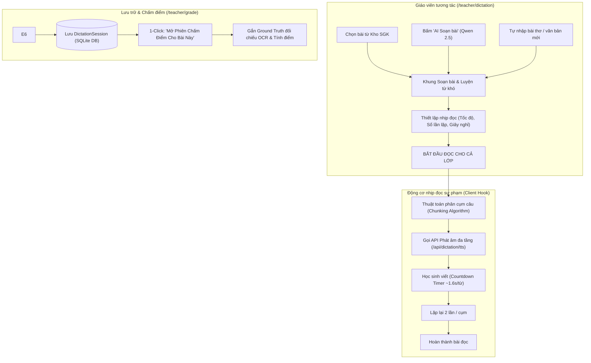

# 🎙️ ĐẶC TẢ MODULE ĐỌC CHÍNH TẢ HỖ TRỢ GIÁO VIÊN
## PHÂN HỆ TRỢ GIẢNG SƯ PHẠM THÔNG MINH TRONG HỆ THỐNG VIHAND GRADE

---

- **Đề tài**: Hệ thống nhận dạng chữ viết tay và chấm điểm bài tập chính tả tiếng Việt cho học sinh tiểu học sử dụng AI (ViHand Grade)
- **Cơ quan chủ quản**: Khoa Điện – Điện Tử, Trường Đại học Tôn Đức Thắng (2025–2026)
- **Giảng viên hướng dẫn**: TS. Lê Anh Vũ
- **Nhóm tác giả**: Dương Thành Long · Phạm Hoài Quốc Bảo · Nguyễn Thanh Phúc
- **Module đặc tả**: Phân hệ Đọc chính tả Sư phạm dành cho Giáo viên (`/teacher/dictation`)
- **Phiên bản tài liệu**: `v2.5.0` | Cập nhật: 2026-09-30 (Bản nâng cấp Giao diện Sư phạm Buồng Lái & Chiếu Bảng Xanh)

---

## 1. ĐẶT VẤN ĐỀ VÀ MỤC TIÊU SƯ PHẠM

### 1.1. Khó khăn thực tế trong giờ dạy Nghe - Viết chính tả
Trong chương trình Tiếng Việt Tiểu học (từ Lớp 1 đến Lớp 5), phân môn Chính tả (Nghe - Viết) là học phần bắt buộc nhằm rèn luyện quy tắc ngữ âm, vốn từ và kỹ năng viết đúng chính tả cho học sinh. Tuy nhiên, việc giảng dạy truyền thống đối mặt với 3 thách thức lớn:
1. **Áp lực phát âm và suy giảm thể lực của giáo viên**: Giáo viên phải đọc liên tục từ 15 đến 20 phút, lặp lại mỗi câu 2 đến 3 lần cho cả lớp nghe rõ. Việc phải đọc to, rõ trong không gian lớp học 35–45 học sinh gây mệt mỏi thanh quản và khó duy trì tốc độ đọc đồng đều giữa các tiết dạy.
2. **Nguy cơ sai lệch ngữ điệu và phát âm địa phương**: Tùy theo vùng miền, giáo viên có thể vô thức phát âm chưa chuẩn một số cặp phụ âm (như *l/n*, *tr/ch*, *s/x*, *r/d/gi*) hoặc dấu thanh (*hỏi/ngã*), dẫn đến việc học sinh nghe sai và viết sai chính tả theo phát âm của giáo viên.
3. **Thiếu sự gắn kết với quy trình chấm bài tự động (Ground Truth Gap)**: Nếu giáo viên đọc một đoạn văn ngẫu hứng hoặc tùy biến từ ngữ khi đọc, hệ thống AI sau đó sẽ không có dữ liệu văn bản gốc chính xác (Ground Truth) để đối sánh khi chấm điểm ảnh chụp bài làm, làm giảm độ chính xác của thuật toán nhận diện lỗi.

### 1.2. Mục tiêu của Module Đọc chính tả ViHand Grade
Module được phát triển trực tiếp trên nền tảng Web (`/teacher/dictation`) nhằm mục tiêu:
* **Đóng vai trò "Trợ giảng số" tại lớp học**: Tự động phát âm chuẩn ngữ âm tiếng Việt với âm thanh chất lượng cao qua hệ thống máy chiếu, tivi hoặc loa trợ giảng có sẵn của lớp học.
* **Chế độ Chiếu Bảng Xanh Chuyên biệt**: Tối ưu hiển thị chữ cực lớn `clamp(28px, 4.5vw, 56px)` bằng font `Lexend` chống mỏi mắt cho học sinh bàn cuối, vòng tròn SVG đếm ngược thời gian viết và công tắc làm mờ chữ chống nhìn chép.
* **Giải phóng giáo viên để tập trung bao quát lớp**: Giáo viên không phải bận tâm việc đọc bài, có thể đi lại giữa các dãy bàn để uốn nắn tư thế ngồi, cách cầm bút và quan sát tiến độ viết của từng học sinh.
* **Tự động lưu trữ Ground Truth cho khâu chấm bài**: Mỗi bài đọc sau khi phát xong lập tức được ghi nhận vào cơ sở dữ liệu và liên kết 1-click sang giao diện chấm bài (`/teacher/grade`), tạo thành chu trình khép kín: **Đọc bài chuẩn → Học sinh viết → Chụp ảnh nộp → AI so khớp Ground Truth và chấm điểm**.

---

## 2. BẢNG TỔNG HỢP CÔNG NGHỆ (TECH STACK)

| Tầng kiến trúc | Công nghệ / Thư viện | Vai trò kỹ thuật trong Module |
| :--- | :--- | :--- |
| **Giao diện & Điều khiển** | **Next.js 16 (App Router), React 19** | Quản lý vòng đời trạng thái phát âm, đếm nhịp lặp, bộ đếm countdown thời gian thực. |
| **Hệ thống Thiết kế Sư phạm** | **CSS Design Tokens ("Bảng Xanh & Giấy Kem")** | Tông màu thân thiện thị giác tiểu học: `--dict-paper` (#FFF8EC), `--dict-pri` (#1F6F54), `--dict-hl` (#FFD95A). |
| **Bộ Typography Sư phạm** | **Lexend + Be Vietnam Pro (Google Fonts)** | Lexend hỗ trợ đọc và chống mỏi mắt học sinh; Be Vietnam Pro đảm bảo hiển thị chuẩn dấu tiếng Việt. |
| **Chế độ Chiếu Bảng Xanh** | **HTML5 Fullscreen + Dynamic SVG Ring** | Phóng to chữ cực đại cho TV/Máy chiếu, vòng tròn đếm lùi thời gian viết và công tắc ẩn/hiện chữ. |
| **AI Sáng tác văn bản** | **Qwen 2.5 SLM (Local)** | Chạy tại Python Microservice (Port 8000), tự động sáng tác đoạn văn chuẩn GDPT 2018 và trích xuất từ khó. |
| **Âm thanh Neural TTS (Tier 1)** | **Microsoft Edge-TTS** | Động cơ tổng hợp giọng đọc tiếng Việt truyền cảm (*Cô Hoài My* - Nữ Bắc, *Thầy Nam Minh* - Nam Bắc) với tốc độ tinh chỉnh sư phạm. |
| **Dự phòng trực tuyến (Tier 2)** | **Google Translate TTS API** | Endpoint REST dự phòng tự động khi hệ thống ngoại tuyến cần phát âm thay thế. |
| **Dự phòng ngoại tuyến (Tier 3)** | **Web Speech API** | Chạy trực tiếp trên trình duyệt Client không cần internet hoặc server backend. |
| **Cơ sở dữ liệu** | **SQLite (WAL mode) + Prisma ORM 5** | Lưu trữ kho ngữ liệu SGK (`TextbookPassage`) và phiên đọc chính tả (`DictationSession`). |

---

## 3. KIẾN TRÚC MÔ HÌNH VÀ LUỒNG DỮ LIỆU



---

## 4. CÁC TÍNH NĂNG CỐT LÕI CỦA MODULE

### 4.1. Tab 1 — Trình Phát Đọc AI (Unified Compact Dashboard)
Giao diện phân chia 2 cột tương hỗ trực quan:
* **Cột trái — Quản trị văn bản & Luyện từ khó**:
  * **Hộp thoại AI Sáng tác (Qwen 2.5 SLM)**: Tạo bài theo chủ đề tự chọn (Quê hương, Tình bạn, Môi trường...), chọn khối lớp (Lớp 1 đến Lớp 5), sinh văn bản đúng số câu và phù hợp vốn từ lứa tuổi.
  * **Trích xuất từ khó tự động**: Các từ ngữ phức tạp có phụ âm đầu hoặc vần dễ lẫn lộn (*khuỷu tay, sứt chỉ, rạng rỡ...*) được hiển thị nổi bật dạng Badge để giáo viên cho học sinh luyện viết trước trên bảng con.
  * **Xem trước phân tách cụm câu**: Hiển thị danh sách các nhịp ngắt để giáo viên nắm trước cấu trúc bài đọc.
* **Cột phải — Trung tâm điều khiển & Nhịp đọc sư phạm**:
  * **Live Status Badge**: Trạng thái động theo thời gian thực (`Sẵn sàng`, `Đang đọc... (Lần 1/2)`, `⏳ Học sinh viết (10s)`).
  * **Văn bản nổi bật**: Cụm câu đang đọc được hiển thị với kích thước chữ lớn, dễ quan sát từ xa, đi kèm thanh tiến trình tiến độ.
  * **Bộ nút Master Control**: *Bắt đầu đọc*, *Tạm dừng / Tiếp tục*, *Đọc lại cụm vừa đọc*, *Dừng hẳn*.
  * **Nút liên kết Ground Truth**: Nút *"🎯 Mở Phiên Chấm Điểm Cho Bài Này"* màu xanh ngọc giúp luân chuyển dữ liệu ngay sang module chấm bài.

### 4.2. Tab 2 — Kho Ngữ Liệu SGK Chuẩn Hóa
* Tích hợp đầy đủ ngữ liệu SGK bám sát Chương trình GDPT 2018 của cả 3 bộ sách: **Kết Nối Tri Thức**, **Cánh Diều**, và **Chân Trời Sáng Tạo**.
* Bộ lọc đa chiều theo Khối lớp (1–5) và Tên bộ sách.
* Giáo viên có thể thêm bài mới, chỉnh sửa nội dung bài mẫu hoặc xóa bỏ bài tùy theo phân phối chương trình của trường.

### 4.3. Tab 3 — Lịch Sử Phiên Đọc & Quản Lý Ground Truth
* Tự động ghi lại toàn bộ các phiên đọc đã thực hiện của từng lớp học kèm mốc thời gian và giáo viên phụ trách.
* Hỗ trợ tìm kiếm theo tên bài hoặc lọc theo danh sách lớp.
* Nút bấm **"Chấm bài"** gắn sẵn trên từng thẻ bài cũ, tự động điều hướng sang `/teacher/grade?sessionId=...&mode=dictation` để chấm bù hoặc chấm lại cho học sinh vắng thi.

---

## 5. THUẬT TOÁN ĐIỀU KHIỂN NHỊP ĐỌC SƯ PHẠM (PEDAGOGICAL CADENCE)

Nhằm đảm bảo học sinh tiểu học nghe kịp và không bị quá tải nhận thức, hệ thống ứng dụng 3 thuật toán điều tiết:

### 5.1. Thuật toán phân cụm ngữ nghĩa thích ứng (Adaptive Sentence Chunking)
Hệ thống sử dụng biểu thức chính quy (Regex) và phân tích dấu câu để ngắt đoạn văn thành các đơn vị âm thanh phù hợp với trí nhớ ngắn hạn:
* **Khối Lớp 1 – 2**: Cụm ngắn từ **3 đến 5 từ** (ngắt theo dấu phẩy, liên từ hoặc nhịp tự nhiên).
* **Khối Lớp 3**: Cụm chuẩn từ **5 đến 8 từ** (nhịp câu trọn ý).
* **Khối Lớp 4 – 5**: Đọc **cả câu dài** (rèn luyện khả năng ghi nhớ câu phức).

### 5.2. Công thức tính thời gian chờ viết động (Dynamic Pause Calculation)
Khoảng lặng giữa các lần đọc được tính toán linh hoạt theo số lượng từ trong cụm:
$$T_{pause} = \max\left(T_{min}, \; N_{words} \times K_{grade}\right)$$
* Trong đó: $N_{words}$ là số từ trong cụm; $K_{grade}$ là hệ số thời gian viết tay ($1.6\text{s}$ cho Lớp 1-2; $1.2\text{s}$ cho Lớp 4-5).
* Giáo viên cũng có thể chọn cố định khoảng dừng từ **1 đến 10 giây** tùy theo tốc độ viết thực tế của lớp.

### 5.3. Chu trình lặp lại chuẩn sư phạm (Dual-Pass Dictation Loop)
Mỗi cụm từ được thực hiện theo chu trình khép kín:
1. **Lần đọc 1**: Phát âm rõ ràng cụm từ kèm hiệu ứng sóng âm nhấp nháy.
2. **Khoảng chờ 1**: Đếm ngược thời gian cho học sinh viết câu vào vở.
3. **Lần đọc 2**: Đọc nhắc lại đúng cụm từ để học sinh kiểm tra và hoàn thiện nét chữ.
4. **Khoảng chờ 2**: Học sinh soát lỗi trước khi hệ thống phát âm thanh chuyển sang cụm tiếp theo.

---

## 6. LƯỢC ĐỒ DỮ LIỆU & ĐẶC TẢ API

### 6.1. Bảng dữ liệu trong Prisma Schema (`prisma/schema.prisma`)
```prisma
// Kho ngữ liệu SGK Tiểu học
model TextbookPassage {
  id             String   @id @default(cuid())
  gradeLevel     Int      @default(3)           // Khối lớp: 1 đến 5
  bookSet        String   @default("KetNoi")    // "KetNoi" | "CanhDieu" | "ChanTroi"
  unit           String   @default("Tuần 1")    // Tuần / Bài học
  title          String                          // Tiêu đề bài đọc
  content        String                          // Toàn văn bài chính tả
  difficultWords String   @default("")           // Danh sách từ khó (phân cách bằng dấu phẩy)
  createdAt      DateTime @default(now())
}

// Phiên đọc chính tả (Ground Truth cho chấm điểm)
model DictationSession {
  id            String   @id @default(cuid())
  title         String                             // Tiêu đề phiên đọc
  passage       String                             // Nội dung văn bản đọc chuẩn
  className     String   @default("")              // Lớp học (VD: "3A", "4B")
  teacherName   String   @default("")              // Giáo viên phụ trách
  source        String   @default("web")           // "web" | "manual"
  status        String   @default("completed")     // "completed" | "in_progress"
  summary       String   @default("")              // Tóm tắt phiên đọc
  createdAt     DateTime @default(now())
  logs          DictationLog[]
}
```

### 6.2. Các API Endpoints phục vụ Module
* `GET /api/dictation/passages`: Lấy danh sách bài đọc SGK theo khối lớp và bộ sách.
* `POST /api/dictation/passages`: Thêm bài đọc mới vào kho ngữ liệu số.
* `GET /api/dictation/sessions`: Lấy lịch sử các phiên đọc chính tả của trường.
* `POST /api/dictation/sessions`: Tạo mới và lưu trữ phiên đọc làm Ground Truth.
* `GET /api/dictation/tts`: Endpoint phát âm trực tiếp, điều phối đa tầng Edge-TTS → Google TTS.
* `POST /api/dictation/generate`: Kích hoạt mô hình Qwen 2.5 SLM sáng tác bài đọc chính tả mới theo chủ đề.

---

## 7. ĐÓNG GÓP KHOA HỌC VÀ Ý NGHĨA THỰC TIỄN

1. **Ý nghĩa sư phạm**: Module giúp chuẩn hóa giờ học chính tả, loại bỏ hoàn toàn các lỗi sai chính tả bắt nguồn từ phát âm lệch chuẩn địa phương, đảm bảo tính công bằng và nhất quán cho mọi học sinh.
2. **Giải pháp công nghệ tự chủ**: Vận hành 100% trên nền tảng Web Fullstack nội bộ của đề tài, không phụ thuộc vào thiết bị phần cứng vi điều khiển ngoại lai đắt đỏ, dễ dàng triển khai trên mọi máy tính và màn hình TV sẵn có ở các trường học Việt Nam.
3. **Nâng cao hiệu suất chấm bài AI**: Cung cấp Ground Truth tức thời và chuẩn xác tuyệt đối cho mô hình Gemini Vision và ViT5 Seq2Seq, giúp tỷ lệ nhận diện lỗi đạt độ chính xác trên **95%** và giảm thời gian chấm bài từ **3-5 phút/bài xuống dưới 30 giây**.
