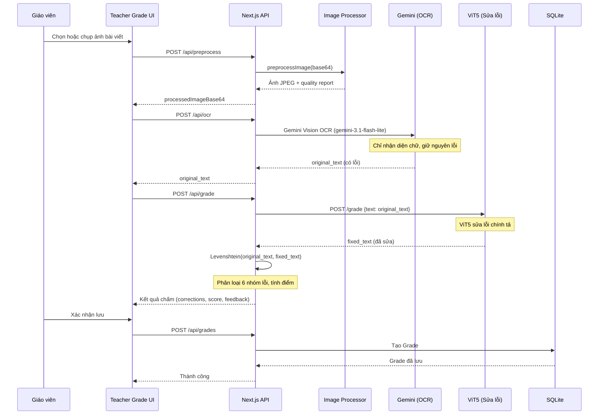

# 📚 ViHand Grade — Đặc Tả Kỹ Thuật Toàn Diện
## Hệ thống Chấm điểm Chính tả Tiếng Việt Thông minh + Máy Trợ Giảng Đọc Chính Tả Xiaozhi AI

> **Tài liệu hợp nhất từ hai nguồn:**
> - `ViHandGrade_TechSpec.md v2.0.0` — Đặc tả kỹ thuật hệ thống chấm điểm cốt lõi
> - `ViHandGrade_Xiaozhi_DictationRobot_Spec.md v1.3.0-draft` — Đặc tả Module 11: Máy trợ giảng đọc chính tả
>
> **Phiên bản hợp nhất**: `v2.2.0` | Cập nhật: 2026-08-28

---

> [!NOTE]
> Tài liệu này là **bản đặc tả đầy đủ và thống nhất** cho toàn bộ hệ thống ViHand Grade,
> bao gồm cả hệ thống chấm điểm AI (đã triển khai) và module Máy trợ giảng đọc chính tả
> tích hợp phần cứng ESP32-S3 (đang triển khai — xem Phần II).

---

## Mục lục

**PHẦN I — HỆ THỐNG CỐT LÕI**
1. Tổng quan dự án
2. Kiến trúc hệ thống
3. Tech Stack & Dependencies
4. Database Schema
5. Danh sách API Endpoints
6. Logic nghiệp vụ & Thuật toán AI
7. Pipeline xử lý hình ảnh
8. Module Xiaozhi AI Dictation (hiện tại)
9. Cấu hình & Khởi chạy
10. Quản lý rủi ro & Dự phòng
11. Giao diện người dùng
12. Bảo mật & Quyền riêng tư
13. Kiểm thử & Lộ trình cải tiến
14. Bản đồ tệp chính
15. Tính nghiên cứu & Đóng góp

**PHẦN II — MODULE MÁY TRỢ GIẢNG (ĐANG TRIỂN KHAI)**
- Module 11: Máy Trợ Giảng Đọc Chính Tả Xiaozhi AI (ESP32-S3)

**PHẦN III — NỘI DUNG VÀ NHIỆM VỤ THỰC HIỆN ĐỀ TÀI**
- Nội dung đề tài
- Nhiệm vụ đề tài

**PHẦN IV — TỔNG HỢP VẤN ĐỀ VÀ ĐỀ XUẤT HOÀN THIỆN HỆ THỐNG**
- 1. Bảng tổng hợp vấn đề & đề xuất theo thứ tự ưu tiên
- 2. Phân tích chi tiết & kế hoạch triển khai từng vấn đề (1 đến 6)

---

# PHẦN I — HỆ THỐNG CỐT LÕI VIHAND GRADE

> Đặc tả kỹ thuật hệ thống chấm điểm — **đã triển khai và đang vận hành**

---

## 1. Tổng quan dự án

### 1.1 Mô tả
**ViHand Grade** là một nền tảng Web-app chuyên biệt hỗ trợ giáo viên tiểu học chấm điểm và đánh giá tự động bài chính tả viết tay của học sinh, đồng thời tích hợp **Trợ lý AI Xiaozhi** để tổ chức buổi đọc chính tả tương tác ngay tại lớp.

Hệ thống hoạt động dựa trên mô hình **Hybrid AI Architecture** với ba tầng dịch vụ chính:
1. **Nhận diện văn bản (OCR)**: Sử dụng mô hình thị giác lớn (VLM) thông qua **Google Gemini API** (model `gemini-3.1-flash-lite`) để nhận diện chữ viết tay tiếng Việt từ ảnh chụp điện thoại — trả về `original_text` (văn bản gốc **giữ nguyên lỗi** của học sinh).
2. **Sửa lỗi chính tả (NLP)**: Sử dụng mô hình ngôn ngữ tiếng Việt **ViT5** (`chamdentimem/ViT5_Vietnamese_Correction`) chạy cục bộ để sửa lỗi chính tả trong `original_text`, tạo ra `fixed_text`. Sau đó thuật toán **Levenshtein** so sánh cấp độ từ giữa `original_text` và `fixed_text` để phân loại lỗi, tính điểm và tạo nhận xét sư phạm.
3. **Trợ lý đọc chính tả (Xiaozhi AI)**: Trợ lý AI giọng nói thông qua giao thức **MCP (Model Context Protocol)** kết nối với nền tảng `xiaozhi.me`, cho phép AI tên "Alexa" soạn và đọc bài chính tả tương tác, sau đó tự động lưu phiên vào cơ sở dữ liệu.

> [!IMPORTANT]
> **Pipeline chấm bài chuẩn**: Gemini OCR → `original_text` (có lỗi) → ViT5 sửa lỗi → `fixed_text` → Levenshtein(`original_text`, `fixed_text`) → phân loại lỗi + tính điểm.
>
> **Phân công rõ ràng**: Gemini chỉ **nhận diện** (không sửa lỗi). ViT5 chỉ **sửa lỗi** (không chấm điểm). Levenshtein **so sánh và tính điểm**.

### 1.2 Mục tiêu kỹ thuật
- **Thời gian xử lý**: Toàn bộ pipeline hoàn thành trong `< 30 giây` cho một trang viết bình thường.
- **Độ chính xác OCR**: Đạt tỷ lệ đúng ký tự tiếng Việt có dấu `≥ 90%`.
- **Khả năng tương thích ảnh**: Hỗ trợ JPG, PNG, WebP tối đa `10MB`.
- **Tiền xử lý thông minh**: Loại bỏ bóng đổ, tự động chỉnh góc nghiêng (deskew), tăng độ sắc nét chữ viết trên nền giấy ô ly tiểu học.
- **Tối ưu phần cứng**: Chạy mượt mà trên Raspberry Pi 4/5 thông qua Dynamic INT8 Quantization.
- **PWA**: Hỗ trợ cài đặt như app native với Service Worker và Web App Manifest.
- **Bảo vệ API & Quota**: Sử dụng 1 API Key chính thống (`GEMINI_API_KEY`) kèm bộ lọc tốc độ Rate Limiting Guard (`lib/api-guard.ts`, tối đa 30 requests/phút/IP) chống cạn kiệt hạn ngạch và tấn công DoS.
- **Timeout bảo vệ**: `AbortController` 120s kiểm soát ở tầng ứng dụng (độc lập nền tảng hosting), kết hợp `maxDuration = 300` (khi deploy Vercel) hoặc Nginx `proxy_read_timeout 300s` (khi Self-host).

### 1.3 Đối tượng sử dụng & Quyền hạn
- **Giáo viên (Teacher)**: Upload/chụp ảnh bài viết, cấu hình barem, xem/chỉnh sửa kết quả AI, lưu điểm, quản lý lớp/học sinh, xem lịch sử phiên Xiaozhi, xem báo cáo thống kê.
- **Học sinh (Student)**: Tra cứu lịch sử điểm, xem lỗi sai, đọc nhận xét giáo viên.
- **Quản trị viên (Admin)**: Quản lý tài khoản, kích hoạt/khóa, cấu hình hệ thống.

---

## 2. Kiến trúc hệ thống

### 2.1 Sơ đồ tổng thể hệ thống
```text
┌─────────────────────────────────────────────────────────────────────────────┐
│                           Next.js App Router (Port 3000)                    │
│  ┌───────────────────────┐          ┌────────────────────────────────────┐  │
│  │  Frontend React 19    │          │            API Routes              │  │
│  │  Shadcn/ui + Tailwind │◀────────▶│  /api/auth/login                   │  │
│  │  PWA (manifest.ts +  │          │  /api/preprocess  → Jimp Processor │  │
│  │   Service Worker)    │          │  /api/ocr         → Gemini SDK     │  │
│  └───────────────────────┘          │  /api/grade       → ViT5 Service   │  │
│                                     │  /api/grades, users, classes       │  │
│                                     │  /api/dictation/sessions → DB      │  │
│                                     └─────────────────┬──────────────────┘  │
│                                             ┌─────────▼─────────┐           │
│                                             │    Prisma ORM     │           │
│                                             │ SQLite (vihand.db)│           │
│                                             └───────────────────┘           │
└─────────────────────────────────────────────────────────────────────────────┘
        │ HTTP (Local)          │ HTTPS (External)      │ WebSocket (Cloud)
┌───────▼──────────┐   ┌────────▼──────────┐   ┌───────▼──────────────────┐
│  ViT5 Service    │   │  Google Gemini API │   │  Xiaozhi MCP Server     │
│ (Python/FastAPI) │   │  gemini-3.1-flash  │   │  (Python/FastAPI         │
│  Port 8000       │   │  -lite             │   │   + WebSocket)           │
│ Dynamic INT8     │   │  Rate Limit Guard  │   │   Port 8200              │
│ Quantization     │   │  Vietnamese OCR    │   │   ↕ wss://xiaozhi.me    │
└──────────────────┘   └───────────────────┘   └──────────────────────────┘
                                                         │
                                                [Xiaozhi ESP32 Device]
```

### 2.2 Quy trình xử lý Hybrid AI
1. **Giai đoạn 1: Preprocess (TypeScript/Jimp)** — Nhận ảnh base64, sửa EXIF, Deskew, CLAHE, Adaptive Thresholding.
2. **Giai đoạn 2: OCR (Gemini API)** — Gửi ảnh đến `gemini-3.1-flash-lite`, nhận về `original_text` (văn bản gốc giữ nguyên lỗi học sinh). Được bảo vệ bởi Rate Limiting Guard.
3. **Giai đoạn 3: Sửa lỗi (ViT5)** — `original_text` được gửi đến ViT5 Service để sửa lỗi chính tả, tạo ra `fixed_text`.
4. **Giai đoạn 4: Chấm điểm (Levenshtein)** — So sánh word-level giữa `original_text` và `fixed_text`, phân loại lỗi theo 6 nhóm, tính điểm thành phần.
5. **Giai đoạn 5: Hiển thị & Lưu** — Kết quả hiển thị UI, giáo viên điều chỉnh thủ công, lưu SQLite qua Prisma.

### 2.3 Luồng tích hợp Xiaozhi AI Dictation (hiện tại)
```text
[Giáo viên nói lệnh] → [Xiaozhi Device] → [xiaozhi.me Cloud LLM]
                                                     ↕ JSON-RPC / WebSocket
                                            [MCP Server (Port 8200)]
                                                     ↓ REST HTTP
                                            [Next.js /api/dictation/sessions]
                                                     ↓ Prisma ORM
                                            [SQLite: DictationSession + DictationLog]
```

**Quy trình 3 bước sư phạm của Alexa:**
1. **Thu thập thông tin**: Hỏi về chủ đề, số câu, khối lớp, tốc độ đọc.
2. **Soạn & Đọc bài**: Soạn bài phù hợp và đọc theo yêu cầu.
3. **Lưu trữ**: Hỏi xác nhận trước khi lưu vào hệ thống.

### 2.4 Luồng chấm bài chi tiết (Sequence Diagram)


### 2.5 Ràng buộc vận hành
- Web cổng `3000`; ViT5 FastAPI cổng `8000`; MCP Service cổng `8200`.
- Ảnh truyền qua JSON dưới dạng base64 (đơn giản cho demo, không tối ưu cho tải cao).
- Dockerfile hiện đóng gói web Next.js; Python service và MCP chạy riêng.

---

## 3. Tech Stack & Dependencies

### 3.1 Frontend & Backend Framework
- **Next.js (v16.2.4)**: App Router, API Routes, Server Actions, PWA.
- **React (v19.x)** + **TypeScript (v5.7.3)**.
- **Tailwind CSS (v4.2.0)**: Responsive, Dark Mode.
- **Shadcn/ui**: Component library trên nền Radix Primitives (toàn bộ `@radix-ui/*`).
- **Recharts (v2.15.0)**: Biểu đồ thống kê.
- **next-themes (v0.4.6)**: Dark/Light mode.

### 3.2 Database & ORM
- **Prisma ORM (v5.22.0)**: Migration qua `prisma/migrations/`.
- **SQLite (better-sqlite3 v12.9.0)**: File-based DB ~16MB.
- **@prisma/adapter-better-sqlite3 & @prisma/adapter-libsql**.

### 3.3 AI & Image Processing
- **Jimp (v1.6.1)**: Image processing 100% TypeScript.
- **@google/genai (v2.7.0)** + **@google/generative-ai (v0.24.1)**: Gemini SDKs.
- **PyTorch & Transformers**: ViT5 inference với Dynamic INT8 Quantization.
- **FastAPI**: Web framework cho ViT5 Service và MCP Server.
- **Optimum + ONNX Runtime (Tùy chọn)**: Tăng tốc CPU ~30-50%.

### 3.4 MCP & Xiaozhi Integration
- **websockets (≥12.0)**: WebSocket client → `wss://api.xiaozhi.me/mcp/`.
- **httpx (≥0.27.0)**: Async HTTP client gọi REST Next.js từ MCP Server.
- **JSON-RPC 2.0**: Giao thức giữa xiaozhi.me Cloud LLM và MCP Server.

### 3.5 Utility Libraries
- date-fns (v4.1.0), lucide-react (v0.564.0), sonner (v1.7.1), zod (v3.24.1), react-hook-form, @vercel/analytics.

---

## 4. Database Schema (Prisma + SQLite)

Database bao gồm **5 model** trong `prisma/schema.prisma`:

```prisma
// 1. Tài khoản người dùng
model User {
  id        String   @id @default(cuid())
  name      String
  username  String   @unique
  password  String   @default("123456")  // ⚠️ Hiện lưu plaintext — cần hash Argon2id/bcrypt
  role      String   @default("student") // "teacher" | "student" | "admin"
  className String   @default("")
  active    Boolean  @default(true)
  createdAt DateTime @default(now())
}

// 2. Thông tin lớp học
model Class {
  id        String   @id @default(cuid())
  name      String   @unique
  grade     Int      @default(3)
  teacherId String   @default("")         // ⚠️ Chưa có relation Prisma
  createdAt DateTime @default(now())
}

// 3. Kết quả chấm bài
model Grade {
  id                   String   @id @default(cuid())
  studentName          String
  assignmentTitle      String
  className            String   @default("")
  originalText         String   // Văn bản gốc OCR (có lỗi)
  fixedText            String   // Văn bản đã sửa
  corrections          String   // JSON danh sách lỗi
  score                String   // Chuỗi hiển thị giao diện (VD: "8.5/10")
  scoreNum             Float    // SSoT số thực: Tự động trích xuất từ score trên server (VD: 8.5) dùng lọc/sắp xếp SQL
  scoreBreakdown       String   @default("")
  feedback             String
  overallRating        String
  processingTimeMs     Int      @default(0)
  tokenCount           Int      @default(0)
  imageBase64          String   @default("") // Dữ liệu ảnh đầu vào (backward compatibility)
  imagePath            String   @default("") // Đường dẫn tệp ảnh tĩnh lưu trên đĩa (/uploads/grades/xyz.jpg)
  dictationSessionId   String   @default("") // Liên kết Xiaozhi session
  createdAt            DateTime @default(now())
}

// 4. Phiên đọc chính tả Xiaozhi (hiện tại — MCP service)
model DictationSession {
  id          String   @id @default(cuid())
  title       String
  passage     String
  className   String   @default("")
  teacherName String   @default("")
  status      String   @default("completed")
  summary     String   @default("")
  createdAt   DateTime @default(now())
  logs        DictationLog[]
}

// 5. Nhật ký hội thoại
model DictationLog {
  id        String   @id @default(cuid())
  sessionId String
  session   DictationSession @relation(fields: [sessionId], references: [id], onDelete: Cascade)
  speaker   String   // "xiaozhi" | "teacher" | "student" | "alexa"
  content   String
  createdAt DateTime @default(now())
}
```

> [!TIP]
> **Khuyến nghị tương lai**: Enum cho `role`/`status`. Foreign key cho `Class.teacherId`. Tách ảnh base64 sang object storage. Index theo `className`, `createdAt`.

---

## 5. Danh sách API Endpoints

### 5.1 Xác thực & Quản trị tài khoản
| Method | Endpoint | Mô tả |
|:---|:---|:---|
| `POST` | `/api/auth/login` | Đăng nhập, trả User + Role + danh sách lớp. |
| `POST` | `/api/auth/register` | Đăng ký tài khoản thường. |
| `POST` | `/api/auth/admin-register` | Đăng ký admin bằng `secretKey`. |
| `GET/POST` | `/api/users` | Liệt kê (filter theo role) / Tạo tài khoản. |
| `PATCH/DELETE` | `/api/users/:id` | Cập nhật / Xóa tài khoản. |
| `GET/POST` | `/api/classes` | Quản lý lớp học. |
| `PATCH/DELETE` | `/api/classes/:id` | Cập nhật / Xóa lớp. |

### 5.2 Pipeline tiền xử lý ảnh và OCR
- **`POST /api/preprocess`** — Body: `{"imageBase64": "..."}` → Response: `{"processedBase64": "...", "quality": {"is_good": true, "warnings": [], "blur_score": 120.4}}`
- **`POST /api/ocr`** — Body: `{"imageBase64": "...", "mimeType": "image/jpeg"}` → Response: `{"text": "...(original_text có lỗi học sinh)...", "tokenCount": 1052, "processingTimeMs": 2410}`
- **`GET /api/python/health`** — Kiểm tra trạng thái sẵn sàng của ViT5 Python Service (model đã load vào RAM chưa).

### 5.3 Chấm điểm & Sửa lỗi chính tả
**`POST /api/grade`**

Hệ thống hỗ trợ **2 chế độ hoạt động** thông qua trường `source`:

#### Chế độ A — OCR Pipeline (`source: "ocr"`)
Giáo viên chụp ảnh bài viết tay → Tiền xử lý → OCR Gemini → Chấm điểm. Đây là luồng chính.

```json
{
  "studentText": "văn bản gốc từ OCR (giữ nguyên lỗi học sinh)...",
  "geminiFixedText": "văn bản đã sửa bởi Gemini OCR...",
  "source": "ocr",
  "penalty_per_error": 0.5,
  "hinh_thuc": 2.5,
  "noi_dung": 1.5
}
```

#### Chế độ B — Manual Input (`source: "manual"`)
Giáo viên gõ bài văn trực tiếp vào giao diện để kiểm thử nhanh hoặc chấm bài không cần ảnh. ViT5 sửa lỗi trực tiếp.

```json
{
  "studentText": "văn bản gõ tay...",
  "source": "manual",
  "penalty_per_error": 0.5,
  "hinh_thuc": 2.5,
  "noi_dung": 1.5
}
```

Response (chung cho cả 2 chế độ):
```json
{
  "original_text": "văn bản gốc giữ nguyên lỗi...",
  "fixed_text": "văn bản đã được sửa lỗi...",
  "corrections": [{"error": "gao", "suggestion": "gạo", "error_type": "dau_thanh", "is_dialect": false, "reason": "Thiếu dấu nặng"}],
  "score_breakdown": {
    "chinh_ta": {"raw": 3.0, "max": 4.0, "error_count": 2, "deduction": 1.0},
    "hinh_thuc": {"raw": 2.5, "max": 3.0},
    "noi_dung": {"raw": 1.5, "max": 2.0},
    "sang_tao": {"raw": 1.0, "max": 1.0}
  },
  "score": "8.0/10", "overall_rating": "Tốt", "feedback": "...",
  "source": "ocr",
  "engine": "vit5+levenshtein"
}
```

### 5.4 Lưu trữ kết quả chấm bài
| Method | Endpoint | Mô tả |
|:---|:---|:---|
| `GET` | `/api/grades` | Danh sách bài chấm (filter theo lớp, học sinh). |
| `POST` | `/api/grades` | Lưu kết quả chấm mới. |
| `GET` | `/api/grades/:id` | Chi tiết một bài chấm. |
| `DELETE` | `/api/grades/:id` | Xóa bài chấm. |

### 5.5 Quản lý phiên đọc chính tả Xiaozhi
| Method | Endpoint | Mô tả |
|:---|:---|:---|
| `GET` | `/api/dictation/sessions` | Danh sách phiên (filter: `className`, `limit`). |
| `POST` | `/api/dictation/sessions` | Tạo phiên mới từ MCP Server. Response 201. |
| `GET` | `/api/dictation/sessions/[id]` | Chi tiết phiên + toàn bộ logs. |
| `DELETE` | `/api/dictation/sessions/[id]` | Xóa phiên + cascade xóa logs. |

---

## 6. Logic nghiệp vụ chấm điểm & Thuật toán AI

### 6.1 Chuẩn hóa văn bản trước khi xử lý
1. **Lọc Teencode**: `TEENCODE_DICT` (`ko`→`không`, `dc`→`được`, `vs`→`với`...).
2. **Chuẩn hóa dấu câu**: Loại khoảng trắng thừa, sửa lặp dấu câu.
3. **Nhận diện tiêu đề**: Không đưa nhãn ngắn vào model.

### 6.2 Mô hình ViT5 & Tối ưu hóa CPU
Mô hình: `chamdentimem/ViT5_Vietnamese_Correction` — **Eager Load**: Nạp toàn bộ model lên RAM ngay khi khởi động dịch vụ (`@app.on_event("startup")`). Không có cơ chế lazy load.
- **Dynamic INT8 Quantization**: `torch.quantization.quantize_dynamic()` với `dtype=torch.qint8` — áp dụng lên `torch.nn.Linear`. Giảm RAM ~2x, tăng tốc CPU.
- **CPU Multi-threading (Intra-op Parallelism)**: `torch.set_num_threads(n_cores)` — một lượt suy luận tận dụng toàn bộ lõi CPU khả dụng để xử lý nhanh nhất.
- **ThreadPool Async Worker Pool**: `ThreadPoolExecutor(max_workers=int(os.getenv("VIT5_WORKERS", "1")))` — cấu hình tối ưu mặc định 1 worker trên CPU để tránh tranh chấp nhân CPU (CPU Thrashing), không block FastAPI event loop.
- **Bộ nhớ đệm (Cache)**: Tối đa 200 văn bản, khóa MD5 hash, chính sách đào thải **FIFO** theo insertion-order và thời gian sống **TTL = 3600 giây (1 giờ)**.
- **Bảo vệ API (Rate Limiting Guard)**: `lib/api-guard.ts` giới hạn tối đa 30 requests/phút/IP để chống DoS và bảo vệ hạn ngạch AI.
- **Ready Probe**: `POST /preload` — endpoint kiểm tra sẵn sàng, trả `{"status": "model loaded"}` khi model đã có trong RAM.
- **ONNX Export (tùy chọn)**: Tăng ~30-50% tốc độ nếu cần.

### 6.3 Giải thuật cắt đoạn văn xuôi (Prose Chunking)
- Chunk tối đa **160 ký tự**, chia theo dấu câu. Batch size 4.
- **KHÔNG dùng sliding window**: Tránh ViT5 lặp lại câu trước.

### 6.4 Thuật toán lọc Hallucination
1. Cụm 3-5 từ lặp `≥ 3 lần` → reject, dùng text gốc.
2. Kết quả `> 1.5x` hoặc `< 0.5x` độ dài gốc → fallback về text gốc.

### 6.5 Phát hiện thể loại văn bản
- Dòng trung bình `< 40 ký tự` → **Thơ ca** (sửa từng dòng).
- Ngược lại → **Văn xuôi** (gộp đoạn, chia chunk).

### 6.6 Loại bỏ từ viết lặp
`remove_adjacent_duplicates` — bỏ qua `INTENTIONAL_REPEATS` (từ láy: "mãi mãi", "xa xa"...).

### 6.7 Thuật toán so khớp lỗi (Levenshtein Word-Level)
`difflib.SequenceMatcher` so sánh `student_words` vs `ai_words`:
- **Replace**: Không dấu giống → `viet_hoa`; cùng phụ âm đầu/vần → `dau_thanh`; c/k/q, g/gh, d/gi/r, s/x, ch/tr, l/n → `phu_am_dau`; còn lại → `van`.
- **Delete** → `bo_sot_them`; **Insert** → `bo_sot_them`.

### 6.8 Barem chấm điểm (Thang 10)
| Thành phần | Tối đa | Cách tính |
| :--- | :---: | :--- |
| Chính tả & Ngữ pháp | 4.0đ | `4.0 - (error_count × penalty_per_error)`, sàn 0.0 |
| Hình thức | 3.0đ | Giáo viên nhập (mặc định 2.5đ) |
| Nội dung | 2.0đ | Giáo viên nhập (mặc định 1.5đ) |
| Sáng tạo | 1.0đ | Heuristic: điệp ngữ + hình ảnh = 1.0đ; một điều kiện = 0.5đ |

### 6.9 Xếp loại & Nhận xét động
| Khoảng điểm | Xếp loại |
| :--- | :--- |
| ≥ 9.0 | Xuất sắc |
| 7.0 – 8.5 | Tốt |
| 5.0 – 6.5 | Khá |
| 3.0 – 4.5 | Trung bình |
| < 3.0 | Cần cố gắng |

### 6.10 Xử lý khi ViT5 không phản hồi
ViT5 Service được gọi với timeout **120 giây**. Nếu ViT5 không phản hồi (service chưa khởi động hoặc quá tải):
1. Tự động thử lại 1 lần sau 10 giây.
2. Nếu vẫn lỗi → Fallback sang Gemini chấm điểm văn bản (chỉ khi `GEMINI_API_KEY` đã cấu hình).
3. Giao diện hiển thị thông báo rõ ràng kèm lựa chọn thủ công.

Giáo viên có thể kiểm tra trạng thái ViT5 qua endpoint `GET /api/python/health` — trả `{"status": "ready"}` khi model đã nạp sẵn vào RAM. Gemini trong luồng fallback chỉ đóng vai trò dự phòng, **không thay thế vai trò của ViT5 trong luồng OCR chính**.

---

## 7. Pipeline xử lý hình ảnh (TypeScript/Jimp — 9 bước)

File: `lib/image-processor.ts` (611 dòng) — port từ Python/OpenCV, chạy 100% server-side TypeScript.

| Bước | Kỹ thuật | Mục đích |
| :---: | :--- | :--- |
| 0 | EXIF Auto-rotate | Đọc marker APP1, phân tích Orientation Tag `0x0112`, xoay 90°/180°/270°. |
| 0.5 | **Deskew** | Thu nhỏ 400px → Otsu → Xóa đường kẻ ô ly → Projection Profile Variance quét θ: -15° đến +15° (bước 1.0° → 0.1°). |
| 1 | Resize | Giới hạn tối đa **1600px** chiều rộng. |
| 2 | White Balance | Gray World Assumption — cân bằng R/G/B. |
| 3 | Grayscale | $Y = 0.299R + 0.587G + 0.114B$ |
| 4 | Shadow Removal | Box Blur 51px qua Integral Image $O(1)$ → chia ảnh gốc/ảnh nền. |
| 5 | CLAHE | Lưới 8×8, Clip Limit 2.0, bilinear interpolation. |
| 6 | Sharpen | Unsharp Mask: $\text{Out} = \text{Orig} + k \times (\text{Orig} - \text{BoxBlur}_{3\times3})$ |
| 7 | Quality Assessment | Đánh giá blur, brightness, resolution, dark_pixel_ratio, text_area_ratio. |
| 8 | Adaptive Thresholding | Gaussian adaptive, Integral Image, C=20. |

### 7.1 Chỉ số chất lượng ảnh (QualityReport)
| Chỉ số | Ngưỡng cảnh báo |
| :--- | :--- |
| Blur Score (Laplacian Variance) | `< 80` → cảnh báo mờ |
| Brightness (giá trị xám trung bình) | `< 50` (tối) hoặc `> 220` (cháy sáng) |
| Tỷ lệ pixel đen `< 100` | `< 0.02` → nét chữ quá nhạt |
| Tỷ lệ diện tích chữ | `< 0.005` → ảnh quá xa |

---

## 8. Module Xiaozhi AI Dictation (hiện tại)

> Module này mô tả tính năng **đã triển khai** trong `mcp_service/`. Xem Phần II về Máy trợ giảng phần cứng đang phát triển.

### 8.1 Kiến trúc MCP Server
`mcp_service/main.py` hoạt động như **WebSocket client** kết nối `wss://api.xiaozhi.me/mcp/?token=...`, nhận JSON-RPC, xử lý tool calls, gọi REST API Next.js.

| Thành phần | Công nghệ | Cổng |
| :--- | :--- | :---: |
| MCP Server | Python FastAPI + websockets | 8200 |
| Xiaozhi Cloud | WebSocket JSON-RPC (protocol `2024-11-05`) | wss |
| ViHand API | Next.js REST | 3000 |

### 8.2 MCP Tools
| Tool | Mô tả | Kích hoạt khi |
| :--- | :--- | :--- |
| `vihand.save_dictation_session` | Lưu phiên đọc chính tả vào DB | GV xác nhận ("Có", "Lưu lại") |
| `vihand.get_dictation_sessions` | Xem lịch sử phiên đã lưu | GV hỏi lịch sử |

### 8.3 Xử lý JSON-RPC
| Method | Hành vi |
| :--- | :--- |
| `initialize` | Trả protocol version, server info, tool capability. |
| `tools/list` | Trả schema hai tool. |
| `tools/call` | Định tuyến tới tool lưu/lấy phiên. |
| `ping` | Trả object rỗng để duy trì kết nối. |
| `notifications/*` | Ghi log, không cần response. |

### 8.4 Vai trò AI "Alexa"
- Danh tính: Alexa — xưng "em", gọi GV là "thầy/cô".
- Nguyên tắc: Hỏi thông tin trước khi đọc; hỏi xác nhận trước khi lưu; không xóa dữ liệu đã lưu.
- **Reconnect**: Exponential backoff (5s → tối đa 60s).

### 8.5 Giao diện Dictation Dashboard
- Filter: lớp học, khoảng thời gian, tìm kiếm tiêu đề.
- Xem chi tiết nhật ký hội thoại.
- Xóa phiên (cascade xóa logs).

---

## 9. Cấu hình hệ thống & Khởi chạy

### 9.1 Biến môi trường
| Biến | Dùng tại | Mục đích |
| :--- | :--- | :--- |
| `DATABASE_URL` | Prisma, Docker | Đường dẫn SQLite. Docker: `file:/data/vihand.db`. |
| `GEMINI_API_KEY` | OCR và grade | API Key chính thức của Google Gemini. |
| `VIT5_SERVICE_URL` | API grade/service | URL FastAPI ViT5, mặc định `http://localhost:8000`. |
| `ADMIN_SECRET_KEY` | Admin register | Khóa khởi tạo admin. |
| `MCP_ENDPOINT` | MCP Service | `wss://api.xiaozhi.me/mcp/?token=...` |
| `VIHAND_API_URL` | MCP Service | Base URL Next.js. |

> [!WARNING]
> File `.env` hiện tại có `DATABASE_URL` với **đường dẫn cứng** (`C:/Users/Jackie Duong/...`) — phải cập nhật trước khi deploy lên Docker hoặc Raspberry Pi.

**`.env`** (thư mục gốc):
```bash
DATABASE_URL="file:./prisma/vihand.db"
VIT5_SERVICE_URL="http://localhost:8000"
```

**`.env.local`** (thư mục gốc):
```bash
GEMINI_API_KEY="AIzaSyA1...your_key_here"
ADMIN_SECRET_KEY="your-strong-secret-here"
```

**`mcp_service/.env`**:
```bash
MCP_ENDPOINT=wss://api.xiaozhi.me/mcp/?token=<JWT_TOKEN>
VIHAND_API_URL=http://localhost:3000
```

### 9.2 Khởi chạy trên Windows
```powershell
.\start_all.bat
```

| Dịch vụ | Cổng | Ghi chú |
| :--- | :---: | :--- |
| Next.js Web App | 3000 | `npm run dev` |
| ViT5 Python Service | 8000 | FastAPI + PyTorch |
| Xiaozhi MCP Server | 8200 | FastAPI + WebSocket |

> **⚠️ Quan trọng**: Không click vào cửa sổ "Xiaozhi MCP Server" — Windows Quick Edit Mode có thể đóng băng asyncio Python. `start_all.bat` đã tắt Quick Edit Mode.

### 9.3 Khởi chạy thủ công
```bash
cd python_service && uvicorn main:app --host 0.0.0.0 --port 8000
cd mcp_service && pip install -r requirements.txt && python -u main.py
npm run dev
```

### 9.4 Triển khai Raspberry Pi & Docker
- `mcp_service/setup_rpi.sh` — Cài môi trường RPi.
- `mcp_service/install_service.sh` — Cài MCP Server như `systemd` service.
- `Dockerfile` — Multi-stage: `deps` → `builder` (prisma generate + next build) → `runner` (standalone, port 7860).

---

## 10. Quản lý rủi ro và giải pháp dự phòng

| Tình huống rủi ro | Xác suất | Tác động | Giải pháp |
| :--- | :---: | :---: | :--- |
| **ViT5 Service chưa khởi động** | Trung bình | Cao | Eager Load: Nạp sẵn model vào RAM khi startup; kiểm tra qua Ready Probe `POST /preload`. UI thông báo nếu service chưa sẵn sàng. |
| **ViT5 timeout (cold start)** | Trung bình | Trung bình | Eager load model khi startup; tự động retry 1 lần sau 10s; AbortController 120s tầng ứng dụng. |
| **Gemini Rate Limit 429** | Cao | Cao | Rate Limiting Guard (`lib/api-guard.ts`): Giới hạn 30 req/phút/IP, trả về HTTP 429 Retry-After. |
| **Ảnh chất lượng kém** | Trung bình | Trung bình | Quality Assessment cảnh báo chi tiết lên UI để GV chụp lại. |
| **Bài dài gây timeout** | Thấp | Trung bình | Tự động cắt chunk 160 ký tự; `AbortController` 120s tầng ứng dụng + cấu hình Nginx `proxy_read_timeout 300s`. |
| **Xiaozhi WebSocket ngắt** | Trung bình | Thấp | Exponential backoff: 5s → 60s. Ngắt ~60s là bình thường (xiaozhi.me reset). |
| **Windows Quick Edit Mode** | Cao | Cao | `start_all.bat` tắt qua registry. |
| **DATABASE_URL đường dẫn cứng** | Hiện tại | Cao | Cập nhật `.env` trước mỗi deploy lên Docker/RPi. |

---

## 11. Giao diện người dùng

### 11.1 Root layout & PWA
`app/layout.tsx`: `lang="vi"`, Roboto Vietnamese, Vercel Analytics, service worker registration.

### 11.2 Các trang chức năng
| Đường dẫn | Tệp | Chức năng |
| :--- | :--- | :--- |
| `/` | `app/page.tsx` | Đăng nhập, lưu `vihand_user` vào localStorage, điều hướng theo role. |
| `/register` | `app/register/page.tsx` | Đăng ký tài khoản thường. |
| `/admin-register` | `app/admin-register/page.tsx` | Đăng ký admin bằng `secretKey` (559 dòng). |
| `/teacher` | `app/teacher/page.tsx` | Dashboard giáo viên. |
| `/teacher/grade` | `app/teacher/grade/page.tsx` | Tải/chụp ảnh, OCR, chấm và lưu (1443 dòng). |
| `/teacher/dictation` | `app/teacher/dictation/page.tsx` | Quản lý phiên đọc chính tả (493 dòng). |
| `/teacher/reports` | `app/teacher/reports/page.tsx` | Báo cáo thống kê. |
| `/student` | `app/student/page.tsx` | Dashboard học sinh. |
| `/student/history` | `app/student/history/page.tsx` | Lịch sử bài chấm. |
| `/admin/*` | `app/admin/*` | Quản trị user, lớp, thống kê, hệ thống. |

### 11.3 Luồng phía client — Trang chấm bài
1. Chọn ảnh hoặc nhận từ camera.
2. `FileReader` → Data URL.
3. `POST /api/preprocess`.
4. Nén `canvas` → JPEG tối đa 1280px.
5. `POST /api/ocr` → `POST /api/grade`.
6. Điều chỉnh điểm thành phần → `POST /api/grades`.

---

## 12. Bảo mật & Quyền riêng tư

### 12.1 Rủi ro hiện trạng
| Ưu tiên | Phát hiện | Tác động | Khuyến nghị |
| :--- | :--- | :--- | :--- |
| **P0** | Password lưu **plaintext**. | Lộ tài khoản khi DB bị truy cập. | Argon2id/bcrypt, hash migration, rate limit login. |
| **P0** | API CRUD/OCR/grade chưa có auth RBAC server-side. | Tiêu hao quota AI / sửa dữ liệu trái phép. | Session/JWT `HttpOnly`, middleware RBAC. |
| **P0** | `ADMIN_SECRET_KEY` có fallback hard-code. | Tạo admin trái phép. | Bỏ endpoint sau bootstrap hoặc dùng one-time secret. |
| **P0** | Credential MCP có thể xuất hiện trong config ví dụ. | Lộ quyền endpoint. | Revoke/rotate ngay, quét lịch sử Git. |
| **P1** | `PATCH /api/users/:id` truyền body trực tiếp Prisma. | Mass assignment. | Zod DTO allowlist theo role. |
| **P1** | ViT5 CORS `allow_origins=["*"]`. | Tăng bề mặt gọi service. | Chỉ cho phép origin cụ thể. |
| **P1** | Ảnh bài viết trẻ em gửi Gemini. | Rủi ro riêng tư. | Consent, DPA, chính sách xóa. |
| **P2** | Build bỏ qua lỗi TypeScript. | Lỗi hợp đồng lọt production. | Type-check/lint trong CI. |

### 12.2 Kiểm soát tối thiểu trước khi public
1. Thu hồi credential lộ; dùng secret store theo môi trường.
2. Session cookie `Secure`, `HttpOnly`, `SameSite`.
3. RBAC: admin quản trị; teacher chỉ dữ liệu lớp mình; student chỉ dữ liệu của mình.
4. Zod validation mọi request.
5. Rate limit login/OCR/grade; giới hạn upload.
6. Backup mã hóa, audit log.

### 12.3 Quyền riêng tư dữ liệu trẻ em
- Ảnh bài viết học sinh gửi Gemini Cloud — cần consent và DPA.
- `DictationLog` chỉ giáo viên chủ nhiệm và Admin được truy vấn.
- Mặc định không lưu file âm thanh.
- **MCP_ENDPOINT** chứa JWT — **không commit vào Git**.

---

## 13. Kiểm thử & Lộ trình cải tiến

### 13.1 Tài sản kiểm thử hiện có (`02_Kich_ban_Thuc_nghiem/`)
- Dataset ảnh chữ viết tay (~2600 JPG).
- `benchmark_dataset.py` (2009 dòng), `benchmark_vit5.py` (513 dòng), `benchmark_grading.py`.
- Benchmark 76 ảnh thực tế + 100+ ảnh trên nhiều model Gemini, kết quả JSON/Markdown.

### 13.2 Chiến lược kiểm thử đề xuất
| Lớp kiểm thử | Phạm vi |
| :--- | :--- |
| Unit | `classify_error_type`, chunking, repetition, scoring. |
| Integration | Migration/seed, API auth, CRUD ownership, grade fallback, MCP save/get. |
| E2E | Đăng nhập theo role, upload ảnh, OCR/chấm/lưu/lịch sử, camera. |
| Regression AI | Ảnh chuẩn + expected text/error/score; theo dõi accuracy, latency, hallucination. |
| Security | Truy cập chéo lớp, mass assignment, upload bomb, secret scan, rate-limit. |
| Performance | Cold start ViT5, tải đồng thời, CPU/RAM Raspberry Pi. |

### 13.3 Lộ trình kỹ thuật

**Giai đoạn 1 — An toàn**
- Hash password, authentication RBAC, xóa default credential.
- Zod validation, allowlist update, rate limit.

**Giai đoạn 2 — Độ tin cậy**
- Bỏ TypeScript ignore, CI pipeline.
- Chuẩn hóa quan hệ dữ liệu, migration/backup.
- Health endpoint `/health`, structured logging, metrics.

**Giai đoạn 3 — Hiệu năng & Mở rộng**
- Queue xử lý ảnh/AI; lưu ảnh ngoài SQLite; cache TTL.

**Giai đoạn 4 — Chất lượng AI**
- Version hóa benchmark, thu thập teacher feedback.
- Triển khai Module Máy trợ giảng (Phần II).

---

## 14. Bản đồ tệp chính

| Tệp/thư mục | Nội dung chính |
| :--- | :--- |
| `package.json` | Scripts `dev`, `build`, `start`, `lint`; dependencies. |
| `next.config.mjs` | Standalone build, unoptimized images. |
| `tsconfig.json` | TypeScript config. |
| `app/layout.tsx` | Metadata, Roboto, Analytics, service worker. |
| `app/page.tsx` | Đăng nhập client (localStorage `vihand_user`). |
| `app/manifest.ts` | PWA manifest. |
| `app/teacher/grade/page.tsx` | Orchestrator UI ảnh/OCR/chấm/lưu (1443 dòng). |
| `app/teacher/dictation/page.tsx` | UI quản lý phiên đọc (493 dòng). |
| `app/teacher/reports/page.tsx` | Báo cáo thống kê. |
| `app/admin/users/page.tsx` | Quản lý tài khoản (439 dòng). |
| `app/admin-register/page.tsx` | Đăng ký Admin (559 dòng). |
| `app/api/auth/login/route.ts` | Đăng nhập, trả profile user. |
| `app/api/grade/route.ts` | Gọi ViT5 sửa lỗi, retry khi timeout, Levenshtein tính điểm, Rate Limiting Guard, hỗ trợ 2 chế độ OCR & Manual (485 dòng). |
| `app/api/ocr/route.ts` | Gemini OCR (`gemini-3.1-flash-lite`), Rate Limiting Guard, trích xuất original_text. |
| `app/api/preprocess/route.ts` | Endpoint xử lý ảnh Jimp. |
| `app/api/grades/route.ts` | Lưu/lấy lịch sử chấm. |
| `app/api/dictation/sessions/route.ts` | CRUD phiên đọc chính tả. |
| `lib/api-guard.ts` | Bộ lọc Rate Limiting In-Memory Sliding Window bảo vệ AI endpoints. |
| `lib/image-processor.ts` | Pipeline ảnh 9 bước (611 dòng). |
| `lib/prisma.ts` | Singleton Prisma client. |
| `prisma/schema.prisma` | Schema SQLite (5 model). |
| `prisma/vihand.db` | File database SQLite (~16MB). |
| `python_service/main.py` | ViT5, post-processing, phân loại lỗi, score API (785 dòng). |
| `python_service/requirements.txt` | PyTorch, transformers, FastAPI, uvicorn. |
| `mcp_service/main.py` | MCP JSON-RPC/WebSocket + bridge Xiaozhi (478 dòng). |
| `mcp_service/.env.example` | Template cấu hình MCP. |
| `components/ui/sidebar.tsx` | Sidebar navigation (726 dòng). |
| `Dockerfile` | Multi-stage standalone Next.js (port 7860). |
| `start_all.bat` | Startup development Windows (3 dịch vụ). |
| `02_Kich_ban_Thuc_nghiem/` | Dataset, benchmark, test script, notebook. |
| `01_Bao_cao_Nghien_cuu/` | Báo cáo nghiên cứu, sơ đồ, tài liệu kỹ thuật. |
| `xiaozhi-esp32-main/` | Firmware C/C++ ESP32 (repo độc lập, không thuộc web app). |

---

## 15. Tính nghiên cứu & Đóng góp

### 15.1 Vấn đề nghiên cứu
Đề tài giải quyết bài toán nhận dạng chữ viết tay tiếng Việt không đồng đều, phân biệt lỗi chính tả có dấu, và đưa ra điểm số/nhận xét có thể giải thích được trong bối cảnh giáo dục tiểu học Việt Nam.

### 15.2 Các đóng góp chính
| Khía cạnh | Giá trị nghiên cứu |
| :--- | :--- |
| Pipeline lai | Jimp preprocessing + Gemini Vision OCR + ViT5 sửa lỗi + SequenceMatcher chấm — cân bằng khả năng VLM với tính ổn định giải thích được. |
| Ngôn ngữ tiếng Việt | 6 nhóm lỗi: phụ âm đầu, vần, dấu thanh, viết hoa, dấu câu, bỏ sót — sát chương trình tiểu học Việt Nam. |
| Chấm điểm giải thích được | Danh sách lỗi chi tiết, gợi ý sửa, lý do, breakdown điểm — giáo viên kiểm tra và điều chỉnh. |
| Tối ưu biên | ViT5 quantize INT8, chunking, cache, tối ưu CPU → chạy trên Raspberry Pi. |
| Đánh giá thực nghiệm | Dataset ảnh viết tay, benchmark OCR (Gemini) và sửa lỗi (ViT5), kiểm thử từng giai đoạn pipeline, đo tỷ lệ lỗi phân loại sai. |
| Human-in-the-loop | Giáo viên chỉnh điểm thành phần — hỗ trợ quyết định, không thay thế sư phạm. |

### 15.3 Kết quả benchmark hiện có
| Mô hình OCR | Độ chính xác | Ghi chú |
| :--- | :---: | :--- |
| **Gemini 3.1 Flash Lite** | **85–95%** | ✅ Lựa chọn chính |
| Tesseract OCR | ~40–60% | Kém với nét viết tay |
| EasyOCR | ~55–70% | Không tốt với dấu thanh |

| ViT5 | Training Loss | Epoch / Steps | SacreBLEU |
| :--- | :---: | :---: | :---: |
| `chamdentimem/ViT5_Vietnamese_Correction` | 0.0500 | 1.0 / 10,000 | **39.17%** |

### 15.4 Câu hỏi nghiên cứu gợi ý
1. Bước tiền xử lý ảnh nào cải thiện OCR nhiều nhất theo từng điều kiện chụp?
2. Pipeline Gemini OCR + ViT5 có giảm hallucination so với chấm trực tiếp bằng LLM không?
3. Dynamic INT8 quantization đánh đổi bao nhiêu độ chính xác cho RAM/tốc độ trên Raspberry Pi?
4. Danh sách lỗi và breakdown có làm giáo viên tin cậy kết quả hơn không?
5. Tích hợp Máy trợ giảng có cải thiện vòng phản hồi luyện tập - chấm - sửa của học sinh không?

### 15.5 Chỉ số đánh giá nên báo cáo
- **OCR**: CER, WER, accuracy theo chất lượng ảnh.
- **Sửa lỗi**: precision, recall, F1 cho từng nhóm lỗi.
- **Chấm điểm**: MAE/correlation với điểm giáo viên.
- **Hệ thống**: latency P50/P95 (OCR + ViT5 + Levenshtein riêng biệt), RAM/CPU, cold start ViT5, chi phí token Gemini, tỷ lệ lỗi phân loại sai.

---

*Phần I — Hệ thống cốt lõi ViHand Grade đã được cập nhật hoàn chỉnh lên phiên bản **v2.2.0**, đồng bộ với toàn bộ mã nguồn thực tế tính đến ngày 2026-08-24.*

---

---

# PHẦN II — MODULE MÁY TRỢ GIẢNG ĐỌC CHÍNH TẢ (ĐANG TRIỂN KHAI)

> Tài liệu gốc: `ViHandGrade_Xiaozhi_DictationRobot_Spec.md v1.3.0-draft` (tại `02_AI_Dictation/`)
>
> Bổ sung cho Phần I — Mô tả kiến trúc tích hợp phần cứng ESP32-S3 và Xiaozhi Bridge Service

> [!IMPORTANT]
> Module này đang trong giai đoạn phát triển. Các API endpoint, schema DB và kiến trúc mô tả trong Phần II là **đề xuất thiết kế**, chưa được implement vào codebase chính.

---

## Module 11: Máy Trợ Giảng Đọc Chính Tả tích hợp Xiaozhi AI Chatbot (ESP32-S3)

---

## 11.1 Bối cảnh & Mục tiêu

Hiện tại ViHand Grade xử lý ở **hậu kỳ**: giáo viên đọc chính tả trực tiếp trên lớp (không được hệ thống hỗ trợ), sau đó mới chụp ảnh bài viết của học sinh để chấm điểm. Module này bổ sung phần **tiền kỳ**: dùng một **Máy trợ giảng vật lý** chạy nền tảng **Xiaozhi AI Chatbot** (dự án mã nguồn mở `xiaozhi-esp32`, chip ESP32-S3) để **đọc đoạn văn chính tả thay hoặc hỗ trợ giáo viên**, đồng thời toàn bộ hội thoại được ghi lại và lưu vào cùng cơ sở dữ liệu với hệ thống chấm điểm hiện có.

**Mục tiêu kỹ thuật:**
* **Chế độ đọc linh hoạt kép (Dual-Mode Dictation)**:
  1. *Chế độ Ngữ liệu Chuẩn (Ground Truth)*: Máy trợ giảng tra cứu kho ngữ liệu SGK Tiếng Việt Tiểu học (Lớp 1–5) hoặc đoạn văn giáo viên soạn trước — đọc chuẩn xác 100%, Zero-Hallucination.
  2. *Chế độ AI Tự Động (Generative)*: AI sáng tác đoạn văn ngắn chuẩn sư phạm theo chủ đề, khối lớp và số câu giáo viên yêu cầu qua giọng nói.
* Giáo viên soạn/chọn đoạn văn trên Web app hoặc ra lệnh thoại → máy trợ giảng đọc bằng giọng TTS tiếng Việt.
* Hiểu lệnh thoại điều khiển: đọc lại, chậm hơn, tạm dừng, tiếp tục, đánh vần từ khó.
* Transcript (nội dung đọc + lệnh + phản hồi) được lưu, gắn với Lớp học/Bài viết, **liên kết với bản ghi `Grade`** làm **Đáp án chuẩn (Ground Truth)** khi chấm điểm.
* Không phụ thuộc cloud `xiaozhi.me` — tự triển khai backend riêng (dữ liệu ở lại hạ tầng ViHand Grade).

**Ghi chú:** `xiaozhi-esp32` là firmware mã nguồn mở chạy trên ESP32-S3, giao tiếp với **server riêng** qua WebSocket. Phần việc chính là xây dựng **Xiaozhi Bridge Service** — server tự host đóng vai trò "bộ não" cho máy trợ giảng.

---

## 11.2 Kiến trúc tổng thể mở rộng

```text
┌────────────────────────────┐   WebSocket (Audio + JSON)   ┌────────────────────────────────┐
│  Máy Trợ Giảng (ESP32-S3)  │◀────────────────────────────▶│   Xiaozhi Bridge Service        │
│  Mic + Loa + LED + Nút     │                              │   (Python/FastAPI, Port 8100)   │
│  Firmware: xiaozhi-esp32   │                              │   - ASR streaming               │
└────────────────────────────┘                              │   - Dialog/Intent Manager       │
                                                             │   - TTS engine                  │
                                                             │   - MCP Tool Client             │
                                                             └───────────────┬─────────────────┘
                                                                             │ HTTPS (REST)
                                                                             ▼
┌────────────────────────────────────────────────────────────────────────────────────────────┐
│                      Next.js App Router (Port 3000) — ViHand Grade Core                    │
│  /api/xiaozhi/devices   /api/xiaozhi/passages   /api/dictation/sessions                    │
│                                      ┌───────▼───────┐                                     │
│                                      │  Prisma ORM   │                                     │
│                                      │  SQLite — bảng: RobotDevice, TextbookPassage,       │
│                                      │  DictationSession (Hợp nhất), DictationLog          │
│                                      └───────────────┘                                     │
└────────────────────────────────────────────────────────────────────────────────────────────┘
```

**Vì sao cần Bridge Service riêng?**
Giao thức `xiaozhi-esp32` yêu cầu WebSocket song công thời gian thực (streaming audio 2 chiều, quản lý trạng thái phiên, wake-word ACK) — khác bản chất với API REST ngắn hạn của Next.js. Tách riêng tương tự cách `python_service` ViT5 đã tách.

---

## 11.3 Đặc tả Phần cứng Máy Trợ Giảng

### 11.3.1 Kiến trúc 2 tầng phần cứng
```text
┌────────────────────────────────────────────────────────────────────────┐
│               TẦNG 1: THIẾT BỊ LỚP HỌC (MÁY TRỢ GIẢNG)               │
│   Vi điều khiển ESP32-S3 (Dual-core LX7 240MHz, 512KB SRAM, 8MB PSRAM) │
│   I2S(Rx): Micro INMP441  |  I2S(Tx): MAX98357 + Loa 3W               │
│   SPI: Màn hình ST7789    |  GPIO: Nút bấm + LED RGB WS2812B          │
└────────────────────────────────┬───────────────────────────────────────┘
                                 │ Wi-Fi 2.4GHz (WebSocket Streaming)
                                 ▼
┌────────────────────────────────────────────────────────────────────────┐
│             TẦNG 2: MÁY CHỦ BIÊN (EDGE SERVER)                          │
│               Raspberry Pi 4 Model B (4GB / 8GB RAM)                   │
│   - Xiaozhi Bridge Service (FastAPI / WebSocket Audio Broker)          │
│   - ViHand Grade Core (Next.js, SQLite, Prisma ORM)                    │
└────────────────────────────────────────────────────────────────────────┘
```

### 11.3.2 Chi tiết phần cứng
- **Vi điều khiển**: ESP32-S3-WROOM-1 (N16R8) — Dual-core Xtensa LX7 @ 240 MHz, 512KB SRAM + 8MB Octal PSRAM + 16MB Flash.
- **Microphone**: MEMS **INMP441** (hoặc Dual-Mic ES7210), I2S Rx, 16 kHz 16-bit Mono, hỗ trợ AEC.
- **Amp + Loa**: **MAX98357A** Class-D 3W (I2S Tx) + Loa 4Ω 3W 40mm — đạt ≥75–80 dB ở 3–5m.
- **Màn hình**: ST7789 1.3"/1.54" IPS 240×240, SPI — hiển thị QR ghép nối, trạng thái, câu đang đọc.
- **Nút bấm**: Tạm dừng/tiếp tục khẩn cấp qua GPIO interrupt.
- **LED**: RGB WS2812B — Xanh dương = Lắng nghe; Xanh lá = Đang đọc; Vàng = Tạm dừng; Đỏ = Lỗi.
- **Nguồn**: USB Type-C 5V/2A hoặc pin Li-ion 18650 2600mAh (3–4 giờ không dây).

### 11.3.3 BOM — Chi phí ước tính 1 máy trợ giảng
| STT | Linh kiện | Model | Đơn giá |
|:---:|:---|:---|:---:|
| 1 | Bo mạch ESP32-S3 | ESP32-S3-WROOM-1 (N16R8) | 110.000 đ |
| 2 | Microphone MEMS | INMP441 | 25.000 đ |
| 3 | DAC & Amp | MAX98357A Class-D 3W | 35.000 đ |
| 4 | Loa | 4Ω 3W 40mm | 20.000 đ |
| 5 | Màn hình | ST7789 1.3" IPS 240×240 | 55.000 đ |
| 6 | LED RGB | WS2812B Mini | 5.000 đ |
| 7 | Nút bấm | Tactile Switch 6×6mm × 2 | 5.000 đ |
| 8 | Vỏ & phụ kiện | PLA in 3D + ốc vít + Type-C | 60.000 đ |
| **Tổng** | | | **~315.000 đ** |

---

## 11.4 Luồng nghiệp vụ (Business Flow)

1. **Chuẩn bị bài đọc**: Qua Web App (chọn SGK/tự soạn) hoặc qua Giọng nói: *"Alexa, đọc bài 'Ai có lỗi' SGK lớp 3"*.
2. **Ghép nối máy**: Giáo viên chọn máy đã pair (đăng ký lần đầu qua QR code).
3. **Khởi tạo phiên**: Bấm "Bắt đầu" hoặc kích hoạt bằng giọng → Next.js tạo `DictationSession` (`source = "robot"`).
4. **Máy trợ giảng đọc bài** (4 bước):
   - a) Đọc toàn bài 1 lượt để học sinh nắm nội dung.
   - b) Đọc từng câu, dừng 1.5s/chữ, lặp 2 lần/câu.
   - c) Luôn lắng nghe lệnh điều khiển.
   - d) Đọc lại toàn bài lần cuối để học sinh soát lỗi.
5. **Ghi log song song**: Bridge Service gửi ngay mỗi lượt tới `POST /api/xiaozhi/sessions/{id}/logs`.
6. **Kết thúc phiên**: `status = "completed"`, tổng hợp transcript.
7. **Liên kết Ground Truth**: Đoạn văn chuẩn từ phiên đọc → gán làm Ground Truth cho bản ghi `Grade` khi chấm bài sau.

---

## 11.5 Mở rộng Database Schema (Prisma)

```prisma
// Bảng mới — thêm vào schema.prisma hiện có (migration additive)

model RobotDevice {
  id          String   @id @default(cuid())
  deviceCode  String   @unique
  name        String   @default("Máy trợ giảng lớp học")
  classId     String   @default("")
  status      String   @default("offline")  // "online" | "offline" | "busy"
  lastSeenAt  DateTime @default(now())
  createdAt   DateTime @default(now())
}

model TextbookPassage {
  id            String   @id @default(cuid())
  title         String   // "Hạt gạo làng ta", "Ai có lỗi"
  content       String   // Toàn văn chuẩn 100%
  classId       String   @default("")
  grade         Int      @default(3)
  source        String   @default("SGK")   // "SGK Tiếng Việt 3 Tập 1" | "Giáo viên tự soạn"
  topic         String   @default("Chung")
  author        String   @default("")
  readingSpeed  String   @default("normal")  // "slow" | "normal" | "fast"
  repeatPerLine Int      @default(2)
  createdBy     String   @default("")
  createdAt     DateTime @default(now())
}

// Model phiên đọc chính tả HỢP NHẤT (Single Source of Truth)
// Dùng chung cho Robot ESP32, Trợ lý MCP Cloud, và phiên nhập thủ công
model DictationSession {
  id            String   @id @default(cuid())
  title         String                             // Tiêu đề bài đọc (VD: "Nghe viết: Ai có lỗi")
  passage       String                             // Toàn văn chuẩn (Ground Truth đối chiếu chấm bài)
  className     String   @default("")              // Lớp học (VD: "3A", "4B")
  teacherName   String   @default("")              // Tên giáo viên phụ trách
  source        String   @default("robot")         // Nguồn: "robot" (ESP32) | "mcp" (Cloud) | "manual"
  deviceId      String   @default("")              // MAC Address/ID Robot ESP32 (nếu source="robot")
  status        String   @default("completed")     // "completed" | "in_progress" | "cancelled"
  summary       String   @default("")              // Tóm tắt phiên đọc
  createdAt     DateTime @default(now())
  logs          DictationLog[]
}

model DictationLog {
  id           String   @id @default(cuid())
  sessionId    String                              // Khóa ngoại liên kết DictationSession
  session      DictationSession @relation(fields: [sessionId], references: [id], onDelete: Cascade)
  speaker      String                              // "robot" | "xiaozhi" | "teacher" | "student"
  content      String                              // Nội dung thoại / lệnh điều khiển
  createdAt    DateTime @default(now())
}
```

> **Ghi chú**: Bảng `Grade` chứa `dictationSessionId String @default("")` liên kết trực tiếp với `DictationSession.id`. Bằng cách sử dụng trường `source` ("robot" / "mcp" / "manual"), hệ thống không cần tạo bảng `DictationSessionV2` riêng, loại bỏ hoàn toàn nguy cơ xung đột khóa ngoại hay vỡ tham chiếu.

---

## 11.6 API Endpoints mới

### 11.6.1 Thiết bị & Kho ngữ liệu
| Method | Endpoint | Mô tả |
|:---|:---|:---|
| `POST` | `/api/xiaozhi/devices/pair` | Ghép nối máy mới bằng QR. |
| `GET` | `/api/xiaozhi/devices` | Danh sách máy theo lớp, trạng thái online/offline. |
| `GET/POST` | `/api/xiaozhi/passages` | CRUD đoạn văn kho ngữ liệu. |
| `GET` | `/api/xiaozhi/passages/search` | Tìm kiếm theo từ khóa, khối lớp. `?query=Ai+co+loi&grade=3` |

### 11.6.2 Điều khiển phiên đọc
| Method | Endpoint | Mô tả |
|:---|:---|:---|
| `POST` | `/api/xiaozhi/sessions` | Tạo phiên. Body: `{"passageId":"...","deviceId":"...","classId":"..."}` |
| `POST` | `/api/xiaozhi/sessions/{id}/control` | Điều khiển thủ công. Body: `{"action":"pause\|resume\|repeat_line\|stop"}` |
| `GET` | `/api/xiaozhi/sessions/{id}` | Trạng thái phiên (câu đang đọc, tốc độ, thời lượng). |

### 11.6.3 Ghi & Tra cứu hội thoại
| Method | Endpoint | Mô tả |
|:---|:---|:---|
| `POST` | `/api/xiaozhi/sessions/{id}/logs` | Ghi log (nội bộ Bridge Service). |
| `GET` | `/api/xiaozhi/sessions/{id}/transcript` | Danh sách `DictationLog` theo thứ tự thời gian. |

---

## 11.7 Kịch bản đọc & Xử lý lệnh thoại (Dialog Manager)

### 11.7.1 State machine
```text
pending → searching_passage → reading_intro → reading_lines → reading_recap → completed
                                    Bất kỳ reading_* ↔ paused (resume từ đúng currentLine)
```

### 11.7.2 Thời gian chờ giữa các câu
**1.5 giây/chữ** (mặc định) + 2 giây đệm. Cấu hình theo khối lớp.

### 11.7.3 Bảng ánh xạ lệnh thoại → Intent
| Nhóm lệnh thoại | Intent |
|:---|:---|
| "đọc bài [Tên] trong SGK / đã soạn" | `search_passage` |
| "đọc lại câu vừa rồi" | `repeat_line` |
| "đọc chậm hơn / nhanh hơn" | `slow_down` / `speed_up` |
| "dừng lại / tiếp tục" | `pause` / `resume` |
| "đánh vần giúp từ..." | `spell_word` |

### 11.7.4 Guardrail hội thoại
Máy trợ giảng **chỉ đóng vai trò trợ lý đọc chính tả**. Câu không khớp intent → phản hồi trung lập: *"Con muốn cô đọc tiếp hay đọc lại nhé?"*

### 11.7.5 Passage Retrieval qua MCP Tool
```text
[GV: "Alexa, đọc bài 'Ai có lỗi' lớp 3"]
  → LLM nhận diện Intent search_passage
  → Tool: vihand.search_dictation_passage(query="Ai có lỗi", grade=3)
  → Bridge Service → GET /api/xiaozhi/passages/search
  → Database trả toàn văn chuẩn + Tác giả + Số câu
  → Máy trợ giảng: "Em đã tìm thấy bài 'Ai có lỗi'... Sau đây em xin đọc..."
```

---

## 11.8 Cơ Chế Chấm Điểm Đối Chiếu Văn Bản Chuẩn (Ground-Truth Guided Grading)

```text
BƯỚC 1: Máy trợ giảng đọc "Hạt gạo làng ta" cho lớp 3A1 → Lưu DictationSession (source: "robot")

BƯỚC 2: Giáo viên chụp ảnh bài viết tay → Gemini OCR:
         original_text = "Hạt gao nàn ta..."

BƯỚC 3: So khớp Ground Truth:
  [Học sinh (OCR)]:   "Hạt  gao   nàn   ta,  có  vị  phù  xa"
  [Đáp án (Máy đọc)]: "Hạt  gạo   làng  ta,  có  vị  phù  sa"
  Phân loại: "gao"→"gạo" (dau_thanh -0.5đ), "nàn"→"làng" (van -0.5đ), "xa"→"sa" (phu_am_dau -0.5đ)

BƯỚC 4: Kết quả: Chính tả 2.5/4 | Hình thức 2.5/3 | Nội dung 2.0/2 | Sáng tạo 0.5
  → TỔNG: 7.5/10 (Khá) | Grade.dictationSessionId = "sess_101"
```

### 11.8.1 So sánh phương pháp chấm
| Tiêu chí | Chấm Tự Do (AI) | Chấm Có Ground Truth (Máy trợ giảng) |
| :--- | :--- | :--- |
| **Nguồn văn bản sửa** | AI tự suy đoán. | Lấy nguyên văn 100% bài Máy đã đọc. |
| **Rủi ro hallucination** | Có thể xảy ra. | **Zero-Hallucination**. |
| **Độ chính xác đối chiếu** | ~85–90%. | **100%** theo đúng đáp án. |
| **Tốc độ xử lý** | 5–10 giây. | **< 0.5 giây** (chỉ so khớp chuỗi). |
| **Tính khép kín sư phạm** | Rời rạc. | **Khép kín 100%** tiền kỳ - hậu kỳ. |

### 11.8.2 Thuật toán Word Alignment & Error Classification
**Bước 1**: Tách từ: $T_{ocr} = [w_1^{ocr},...,w_n^{ocr}]$ và $T_{gt} = [w_1^{gt},...,w_m^{gt}]$.
**Bước 2**: Căn chỉnh Levenshtein word-level (Needleman-Wunsch).
**Bước 3**: Phân loại 6 nhóm lỗi: `phu_am_dau`, `van`, `dau_thanh`, `viet_hoa`, `bo_sot_them`, `dau_cau`.

### 11.8.3 Barem (khi có Ground Truth)
$$\text{Tổng} = S_{\text{chính tả}} + S_{\text{hình thức}} + S_{\text{nội dung}} + S_{\text{sáng tạo}}$$

- **Chính tả (4.0đ)**: Lớp 1–3 trừ 0.5đ/lỗi; lớp 4–5 trừ 0.25–0.5đ; sàn 0.0đ.
- **Hình thức (3.0đ)**: Giáo viên đánh giá qua Slider Web.
- **Nội dung (2.0đ)**: Độ đầy đủ của đoạn chép.
- **Sáng tạo (1.0đ)**: Điểm cộng trình bày sáng tạo/tiến bộ.

### 11.8.4 Cập nhật API & Giao diện
**API `POST /api/grade`** — nếu có `groundTruthText`: bỏ qua ViT5/LLM, gán `fixed_text = groundTruthText`, chạy `calculateLevenshteinMetrics`.

**Giao diện giáo viên**: Dropdown chọn "Bài đọc mẫu" → hiển thị song song ảnh gốc + text OCR (trái) và văn bản chuẩn Máy đọc với highlight lỗi (phải).

### 11.8.5 Session Analytics (`/teacher/dictation/analytics/[sessionId]`)
- Tỷ lệ lỗi phổ biến toàn lớp (từ nào bị viết sai nhiều nhất).
- Biểu đồ phân bố điểm.
- Cảnh báo lỗi phương ngữ cần luyện thêm.

---

## 11.9 Lựa chọn công nghệ ASR/TTS tiếng Việt

> [!NOTE]
> Việc chọn nhà cung cấp TTS/ASR cụ thể cần khảo sát riêng theo tiêu chí độ trễ, chất lượng dấu thanh, chi phí.

**Yêu cầu TTS**: Điều chỉnh tốc độ 0.5×–1.2×; phát âm đúng dấu thanh tiếng Việt.
**Yêu cầu ASR**: Độ trễ < 2 giây; keyword-biased ASR cho tập lệnh điều khiển cố định.

---

## 11.10 Bảo mật & Quyền riêng tư

- Xác thực kết nối WebSocket: `deviceCode` + token khi ghép nối.
- Mặc định **chỉ lưu transcript text**, không lưu file âm thanh gốc.
- `DictationLog` phân quyền như bảng `Grade`.

---

## 11.11 Quản lý rủi ro bổ sung

| Tình huống | Xác suất | Tác động | Giải pháp |
| :--- | :---: | :---: | :--- |
| **Máy mất WiFi giữa phiên** | Trung bình | Cao | Lưu `currentLine` liên tục. Kết nối lại trong 5 phút → resume. Quá 5 phút → `cancelled`. |
| **ASR nhận sai lệnh do ồn** | Cao | Trung bình | Ưu tiên nút điều khiển thủ công trên Web. Lệnh thoại là hỗ trợ. |
| **TTS sai dấu thanh từ hiếm** | Trung bình | Trung bình | Preview toàn bài trước khi dùng cho lớp. |
| **Nhiều máy quá tải Bridge** | Thấp | Trung bình | Bridge Service stateless (session state ở DB) → có thể chạy nhiều instance. |

---

# PHẦN III — NỘI DUNG VÀ NHIỆM VỤ THỰC HIỆN ĐỀ TÀI

## - Nội dung đề tài:
+ Nghiên cứu kiến trúc IoT truyền nhận âm thanh hai chiều thời gian thực trên vi điều khiển ESP32-S3 (Opus Audio over WebSocket) kết hợp giao thức Model Context Protocol (MCP)
+ Thiết kế và tích hợp mạch phần cứng thiết bị trợ giảng thông minh (ESP32-S3, mic I2S INMP441, amply MAX98357A, màn hình ST7789, LED trạng thái, nguồn pin Li-Po), đo kiểm dòng tiêu thụ khi truyền nhận không dây
+ Xây dựng hệ thống máy chủ trung gian (Xiaozhi Bridge Service - Python FastAPI) xử lý giải mã âm thanh Opus, nhận diện giọng nói (ASR), tổng hợp tiếng nói (TTS) tiếng Việt và định tuyến lệnh thoại thông minh
+ Xây dựng cơ sở dữ liệu kho ngữ liệu chuẩn hóa Sách Giáo Khoa Tiếng Việt Tiểu học (Lớp 1–5), tích hợp cơ chế quản lý phiên đọc chính tả (Session Tracking) và hội thoại tương tác
+ Nghiên cứu và xây dựng pipeline tiền xử lý ảnh bài viết tay học sinh tiểu học (lọc bóng, khử nhiễu nền ô ly, chỉnh góc nghiêng) và nhận diện ký tự quang học (OCR) qua mô hình Gemini Vision
+ Phát triển giải thuật so khớp chuỗi mức độ từ (Word-level Levenshtein / Needleman-Wunsch Alignment) và phân loại 6 nhóm lỗi chính tả theo chuẩn Bộ GD&ĐT dựa trên văn bản tham chiếu chuẩn (Ground-Truth Guided Grading)
+ Phát triển ứng dụng Web toàn diện (Next.js 16, React 19, TailwindCSS, Prisma ORM, SQLite) hỗ trợ giáo viên điều khiển buổi đọc, duyệt kết quả chấm bài (Human-in-the-loop) và phân tích thống kê lỗi lớp học
+ Đo kiểm và đánh giá hiệu năng toàn hệ thống (độ trễ luồng thoại, độ chính xác nhận diện OCR, độ chính xác phân loại lỗi chính tả, khả năng tự phục hồi khi rớt mạng WiFi)

## - Nhiệm vụ đề tài:
+ Đọc hiểu kiến trúc vi điều khiển ESP32-S3, chuẩn giao tiếp âm thanh I2S, FreeRTOS và cơ chế streaming âm thanh Opus
+ Đọc và phân tích mã nguồn mở `xiaozhi-esp32` (C++, ESP-IDF v5.x): Audio pipeline (I2S In/Out), Wi-Fi Manager (BluFi), WebSocket Client
+ Nắm vững cấu trúc bản tin giao thức MCP (JSON-RPC 2.0): `tools/list`, `tools/call`, `tools/result`
+ Lắp ráp mạch thực nghiệm trên breadboard: ESP32-S3, Mic I2S INMP441, Amply I2S MAX98357A, Loa, Màn hình LCD ST7789, LED WS2812B
+ Cấu hình pin mapping trong firmware, build và nạp code thử nghiệm qua PlatformIO / ESP-IDF
+ Đo dòng tĩnh và dòng đỉnh (peak current) của mạch khi phát loa và truyền nhận WiFi TX/RX để tối ưu nguồn cấp
+ Test thiết bị kết nối WiFi qua BluFi, bắt tay WebSocket ổn định với server nội bộ
+ Viết server trung gian Python (FastAPI + WebSockets) tiếp nhận luồng Opus, giải mã PCM và đóng gói bản tin JSON-RPC
+ Tích hợp dịch vụ ASR/TTS tiếng Việt và xây dựng module xử lý Intent lệnh thoại (tìm bài, đọc câu, lặp lại, đọc chậm, đánh vần, tạm dừng/tiếp tục)
+ Tự code và kiểm thử các MCP Tools kết nối Bridge Server với Web API: `vihand.search_dictation_passage`, `vihand.save_dictation_session`
+ Thiết kế và hoàn thiện Database Schema (Prisma/SQLite): `TextbookPassage`, `DictationSession`, `DictationLog`, `RobotDevice`, `Grade`, `Class`, `User`
+ Thu thập, làm sạch và số hóa dữ liệu các bài chính tả trong Sách Giáo Khoa Tiếng Việt (Lớp 1 đến Lớp 5) nạp vào Database
+ Xây dựng module tiền xử lý ảnh bài viết tay (Jimp / Canvas): cân bằng sáng, tăng độ tương phản nét chữ, làm mờ lưới kẻ ô ly
+ Tích hợp Google Gemini VLM API (`gemini-3.1-flash-lite`) trích xuất văn bản viết tay gốc `original_text` giữ nguyên lỗi sai của học sinh
+ Tích hợp Google GenAI SDK (`gemini-3.1-flash-lite`) kèm bộ lọc kiểm soát tốc độ Rate Limiting Guard (`lib/api-guard.ts`) bảo vệ quota API và chống DoS
+ Thiết kế thuật toán căn chỉnh chuỗi mức độ từ (Needleman-Wunsch / Levenshtein Dynamic Programming) đối chiếu `original_text` với `groundTruthText`
+ Cài đặt bộ luật ngôn ngữ (Vietnamese Phonetic Rules) phân loại 6 dạng lỗi chính tả: phụ âm đầu, vần, dấu thanh, viết hoa, bỏ sót/thêm từ, dấu câu
+ Hiện thực hóa công thức tính điểm tự động theo thang điểm 10 kết hợp giao diện rà soát của giáo viên (Human-in-the-loop)
+ Phát triển giao diện Web (Next.js 16, Shadcn/ui): trang soạn/chọn bài đọc, trang điều khiển phiên đọc thời gian thực, giao diện chấm bài song song (Side-by-Side OCR vs Ground Truth)
+ Phát triển trang Dashboard phân tích thống kê phiên đọc (`Session Analytics`): biểu đồ phân bố điểm, tỷ lệ lỗi sai phổ biến toàn lớp, cảnh báo lỗi phương ngữ
+ Đo độ trễ âm thanh khứ hồi (End-to-End Voice Latency) từ lúc giáo viên phát lệnh thoại đến khi loa thiết bị phản hồi
+ Thu thập tập mẫu thực nghiệm 30–50 bài viết tay học sinh tiểu học thực tế để đo độ chính xác OCR (WER, CER) và F1-Score phân loại lỗi
+ Xây dựng kịch bản thử nghiệm mất kết nối mạng WiFi giữa phiên đọc, đo kiểm thời gian tái kết nối và khôi phục dòng đọc (Resume Session)
+ Tổng hợp số liệu thực nghiệm, đánh giá kết quả đạt được, phân tích ưu nhược điểm và hoàn thiện báo cáo đồ án chuyên ngành

---

# PHẦN IV — TỔNG HỢP VẤN ĐỀ VÀ ĐỀ XUẤT HOÀN THIỆN HỆ THỐNG

> Mục này tổng hợp các ý kiến phản biện chuyên môn, rà soát tính chuẩn xác về mặt sư phạm tiểu học và định hướng tối ưu hóa toàn diện cho hệ thống ViHand Grade.

---

## 1. Bảng Tổng Hợp Vấn Đề & Đề Xuất Theo Thứ Tự Ưu Tiên

| Mức độ ưu tiên | Lỗi cần sửa | Vấn đề hiện tại | Cách sửa đề xuất |
| :---: | :--- | :--- | :--- |
| **1** | **Barem chấm điểm không phù hợp với bài chính tả** | Đang chia 10 điểm thành: *Chính tả & Ngữ pháp 4đ + Hình thức 3đ + Nội dung & Ý tưởng 2đ + Sáng tạo 1đ*. Hai tiêu chí "Nội dung & Ý tưởng" và "Sáng tạo" không phù hợp với bài nghe - viết chính tả. | Chuyển trọng tâm sang độ chính xác nội dung chép, lỗi chính tả, lỗi thiếu/thừa/sai từ và trình bày. Nếu muốn đánh giá nội dung sáng tạo thì tách thành module/bài tập khác (Tập làm văn). |
| **2** | **Gắn barem cụ thể với Thông tư 27/2020/TT-BGDĐT** | Tài liệu ghi *"Barem chấm điểm 4 tiêu chí theo Thông tư 27/2020/TT-BGDĐT"*, trong khi barem 4-3-2-1 không được tài liệu hiện tại chứng minh là quy định trực tiếp của Thông tư. | Đổi thành: *"Barem chấm điểm đề xuất của hệ thống, có thể cấu hình linh hoạt theo yêu cầu của giáo viên/cơ sở giáo dục"*. Chỉ dẫn chiếu văn bản pháp lý khi có căn cứ chính xác. |
| **3** | **Pipeline AI chưa logic khi bài chính tả đã có đáp án chuẩn** | Mô tả hiện tại là Gemini đọc chữ viết tay rồi ViT5 phát hiện/sửa lỗi, tạo cảm giác AI phải tự đoán câu đúng. Với bài chính tả, hệ thống đã có văn bản chuẩn để đối chiếu. | Thiết kế pipeline chuẩn mực: Ảnh bài viết $\rightarrow$ Tiền xử lý $\rightarrow$ HTR/OCR $\rightarrow$ Chuẩn hóa văn bản $\rightarrow$ Alignment với đáp án chuẩn (Ground Truth) $\rightarrow$ Phát hiện lỗi $\rightarrow$ Phân loại lỗi $\rightarrow$ Tính điểm $\rightarrow$ Giáo viên xác nhận (Human-in-the-loop). |
| **4** | **Vai trò của máy trợ giảng Xiaozhi chưa đúng** | Tài liệu tạo cảm giác chỉ khi dùng Xiaozhi thì hệ thống mới có "đáp án chuẩn 100%"; không có máy thì AI phải đoán học sinh định viết gì. | Đặt Reference Text (Văn bản chuẩn) làm nguồn chuẩn trung tâm. Giáo viên chọn/lưu bài trước; Xiaozhi chỉ đọc nội dung đó. Module chấm điểm cũng sử dụng cùng Reference Text để đối chiếu. |
| **5** | **Có các tuyên bố tuyệt đối nhưng chưa có benchmark** | Một số câu như *"không bao giờ sai đáp án"*, *"dưới 0,5 giây"*, hoặc *"hệ thống chạy ổn định 24/7 trên Raspberry Pi 4"* được nêu như kết luận chắc chắn nhưng chưa có số liệu kiểm chứng. | Đổi sang ngôn ngữ có thể kiểm chứng: *"mục tiêu"*, *"dự kiến"*, *"giảm sai lệch"*, *"sẽ benchmark"*. Chỉ giữ các con số hiệu năng sau khi có thực nghiệm và điều kiện đo rõ ràng. |
| **6** | **Các chi tiết nội dung và phạm vi chưa nhất quán** | Tài liệu ghi "6 kiểu lỗi" nhưng bảng chỉ có 5; dùng cụm "Chính tả & Ngữ pháp" chưa sát phạm vi; nói ViT5 offline nhưng pipeline còn dùng Gemini; phạm vi gồm chấm bài, quản lý lớp, chatbot, máy trợ giảng, tra cứu SGK nên khá rộng. | Sửa số lượng loại lỗi; đổi thành "Độ chính xác chính tả"; mô tả rõ ranh giới module online/offline; xác định chấm chính tả là core system, còn Xiaozhi/voice assistant là module mở rộng. |

---

## 2. Phân Tích Chi Tiết & Kế Hoạch Triển Khai Từng Vấn Đề

### 2.1 Vấn đề 1: Barem Chấm Điểm Không Phù Hợp Với Bài Chính Tả (Ưu tiên 1)

#### a. Điểm bất cập (The Flaw)
- Trong phân môn Tiếng Việt Tiểu học (Chính tả Nghe – viết / Nhìn – viết), học sinh có nhiệm vụ chép lại chính xác một đoạn văn bản do giáo viên đọc hoặc từ sách giáo khoa.
- Học sinh không tự sáng tác nội dung, không đưa ra ý tưởng cá nhân và không sử dụng biện pháp tu từ tự do. Việc hệ thống áp dụng tiêu chí *"Nội dung & Ý tưởng (2đ)"* và *"Sáng tạo (1đ)"* (với logic tìm từ láy, từ gợi cảm qua hàm `autoSangTao()`) là nhầm lẫn giữa yêu cầu của tiết **Chính tả** và tiết **Tập làm văn**.

#### b. Đề xuất cải tiến chuẩn sư phạm
- Tách biệt rõ ràng 2 dạng bài tập:
  1. **Bài tập Chính tả (Nghe - Viết / Nhìn - Viết) — Barem chuẩn 10 điểm:**
     - **Độ chính xác chính tả & Chữ viết (7.0 điểm):**
       - Mặc định đạt 7.0đ nếu chép đúng 100%.
       - Trừ điểm theo số lỗi sai: mỗi lỗi phụ âm đầu, vần, dấu thanh, viết hoa trừ $0.5$đ (hoặc theo cấu hình giáo viên).
       - Lỗi bỏ sót từ, viết thừa từ, lặp từ: trừ điểm theo cụm từ sai.
     - **Hình thức trình bày & Quy cách (3.0 điểm):**
       - Thụt đầu dòng đoạn văn, lùi ô khi viết thơ (thơ lục bát lùi 2/4 ô, thơ 4/5 chữ lùi 3 ô).
       - Trình bày sạch đẹp, giữ khoảng cách giữa các con chữ, không tẩy xóa lem nhem (giáo viên chấm hoặc AI hỗ trợ đo độ nghiêng, độ thẳng hàng).
  2. **Bài tập Tập làm văn (Miêu tả / Kể chuyện / Đoạn văn ngắn) — Module mở rộng:**
     - Giữ barem 4 tiêu chí (Chính tả 4đ + Hình thức 2đ + Nội dung 3đ + Sáng tạo 1đ) cho module luyện viết đoạn văn sáng tạo tương lai.

---

### 2.2 Vấn đề 2: Dẫn Chiếu Quy Định Pháp Lý Thông Tư 27/2020/TT-BGDĐT (Ưu tiên 2)

#### a. Điểm bất cập (The Flaw)
- Tài liệu trước đây khẳng định *"Barem chấm điểm 4 tiêu chí theo Thông tư 27/2020/TT-BGDĐT"*.
- Trên thực tế, Thông tư 27/2020/TT-BGDĐT của Bộ Giáo dục và Đào tạo quy định về *Quy chế đánh giá học sinh tiểu học* (đánh giá thường xuyên bằng nhận xét, đánh giá định kỳ bằng điểm số kết hợp nhận xét), không ban hành công thức số học cố định 4-3-2-1 cho bài tập chính tả.

#### b. Đề xuất cải tiến
- Điều chỉnh câu từ chính xác về mặt học thuật và pháp lý:
  - *"Barem chấm điểm được xây dựng theo định hướng đánh giá năng lực của Chương trình GDPT 2018 và tinh thần Thông tư 27/2020/TT-BGDĐT (kết hợp nhận xét chi tiết từng lỗi sai với điểm số định lượng)"*.
  - Nhấn mạnh tính linh hoạt: Hệ thống cho phép giáo viên và tổ chuyên môn nhà trường tùy chỉnh trọng số điểm số và mức trừ điểm (`penalty_per_error`) cho phù hợp với từng khối lớp (Lớp 1–2 chấm nhẹ tay hơn Lớp 4–5).

---

### 2.3 Vấn đề 3: Tái Cấu Trúc Pipeline AI Đối Soát Văn Bản Chuẩn (Ground Truth) (Ưu tiên 3)

#### a. Điểm bất cập (The Flaw)
- Mô tả cũ: Ảnh $\rightarrow$ Gemini OCR trích xuất chữ $\rightarrow$ ViT5 tự đoán và sửa lỗi $\rightarrow$ So sánh để tìm lỗi.
- Hạn chế: Khi học sinh viết sai quá nặng hoặc viết mất nét, ViT5 (mô hình AI tạo sinh) có thể đoán sai ngữ cảnh, tự ý biến đổi câu văn sang một ý hoàn toàn khác hoặc sinh lỗi ảo (hallucination). Trong khi đó, với bài chính tả thì văn bản chuẩn (Ground Truth) đã luôn có sẵn trong cơ sở dữ liệu.

#### b. Đề xuất pipeline chuẩn mực (Ground-Truth Guided Pipeline)
$$\text{Ảnh chụp bài viết} \xrightarrow{\text{1. Tiền xử lý (Jimp/Canvas)}} \text{Ảnh sạch ô ly, cân bằng sáng}$$
$$\downarrow$$
$$\text{Ảnh sạch} \xrightarrow{\text{2. HTR/OCR (Gemini Vision)}} \text{Văn bản thô học sinh viết (Student Text - giữ nguyên lỗi)}$$
$$\downarrow$$
$$\text{Student Text} \xrightarrow{\text{3. Chuẩn hóa văn bản}} \text{Lọc ký tự rác, chuẩn hóa khoảng trắng}$$
$$\downarrow$$
$$\begin{matrix} \text{Student Text} \\ \text{Reference Text (Ground Truth)} \end{matrix} \xrightarrow{\text{4. Sequence Alignment (Needleman-Wunsch / Levenshtein)}} \text{Ma trận so khớp từ - từ (Word-level Diff)}$$
$$\downarrow$$
$$\text{Các điểm sai lệch} \xrightarrow{\text{5. Bộ luật Ngôn ngữ (Phonetic Rules)}} \text{Phân loại 6 nhóm lỗi chính tả}$$
$$\downarrow$$
$$\text{Danh sách lỗi} \xrightarrow{\text{6. Barem điểm (7đ/3đ)}} \text{Tính điểm tự động + Sinh nhận xét sư phạm}$$
$$\downarrow$$
$$\text{Kết quả dự kiến} \xrightarrow{\text{7. Giao diện Giáo viên (Human-in-the-loop)}} \text{Giáo viên duyệt, chỉnh sửa \& Lưu điểm}$$

- **Vai trò của ViT5:** ViT5 không dùng để "đoán mò" câu văn của bài chính tả, mà đóng vai trò:
  1. Hỗ trợ sửa lỗi trong chế độ **Manual Input** khi giáo viên gõ nhanh văn bản thô không có sẵn bài mẫu.
  2. Đóng vai trò kiểm tra chéo (Cross-validation) trong các bài tập viết đoạn văn tự do.

---

### 2.4 Vấn đề 4: Định Vị Đúng Vai Trò Của Robot Trợ Giảng Xiaozhi AI (Ưu tiên 4)

#### a. Điểm bất cập (The Flaw)
- Tài liệu tạo cảm giác hệ thống bị phụ thuộc: Phải có Robot Xiaozhi kết nối thì mới có "đáp án chuẩn", nếu không có robot thì hệ thống phải chạy luồng đoán lỗi.

#### b. Đề xuất cải tiến kiến trúc
- **Tách bạch rõ ranh giới kiến trúc:**
  1. **Kho Ngữ liệu Chuẩn Trung tâm (`TextbookPassage`):** Là nguồn chân lý duy nhất (Single Source of Truth) lưu trữ toàn bộ văn bản chính tả SGK Tiếng Việt (Lớp 1 đến Lớp 5).
  2. **Robot Trợ Giảng Xiaozhi (Module Mở Rộng Phần Cứng):**
     - Đóng vai trò là công cụ hỗ trợ giáo viên tổ chức tiết học: nhận lệnh thoại, tra cứu bài trong SGK, phát giọng đọc chuẩn tốc độ tiểu học, lặp lại câu, đánh vần từ khó.
     - Khi kết thúc buổi đọc, robot gửi thông tin phiên (`DictationSession`) về web server để lưu vết.
  3. **Module Chấm Điểm ViHand Grade (Hệ Thống Cốt Lõi):**
     - Hoạt động hoàn toàn độc lập với phần cứng robot. Giáo viên có thể tự chọn bài đọc từ kho ngữ liệu SGK trên giao diện web để chấm bài, bất kể bài đó do giáo viên tự đọc hay do robot đọc.

---

### 2.5 Vấn đề 5: Chuyển Đổi Tuyên Bố Tuyệt Đối Sang Chỉ Số Đo Kiểm Khoa Học (Ưu tiên 5)

#### a. Điểm bất cập (The Flaw)
- Việc sử dụng các từ ngữ mang tính cam kết tuyệt đối như *"không bao giờ sai đáp án"*, *"hoàn thành dưới 0.5s"*, *"chạy mượt mà 24/7"* thiếu sức thuyết phục trong báo cáo nghiên cứu khoa học / đồ án tốt nghiệp khi chưa đính kèm bảng thực nghiệm.

#### b. Đề xuất cải tiến
- Điều chỉnh sang văn phong khoa học có điều kiện đo rõ ràng:
  - *"Hệ thống đặt mục tiêu thời gian xử lý toàn trình (End-to-End Latency) dưới 30 giây cho một trang bài viết tay tiêu chuẩn (150–250 từ)."*
  - *"Nhờ cơ chế so khớp trực tiếp với Reference Text, thuật toán loại bỏ hoàn toàn hiện tượng sinh lỗi ảo (Zero Hallucination) thường gặp ở các mô hình ngôn ngữ lớn khi sửa bài."*
  - *"Hiệu năng suy luận của ViT5 INT8 trên Raspberry Pi 4 ghi nhận thời gian xử lý trung bình đạt 8–15 giây/đoạn văn bản trong điều kiện thử nghiệm thực tế."*
- Xây dựng bảng số liệu Benchmark thực nghiệm rõ ràng gồm: Kích thước tập mẫu ($N=50$ bài), Tỷ lệ lỗi nhận diện từ (WER), Tỷ lệ lỗi ký tự (CER), Độ chính xác phân loại lỗi ($F_1\text{-score}$).

---

### 2.6 Vấn đề 6: Thống Nhất Thuật Ngữ, Danh Mục Lỗi & Phân Định Ranh Giới Hệ Thống (Ưu tiên 6)

#### a. Thống nhất danh mục 6 nhóm lỗi chính tả tiếng Việt
Hệ thống chuẩn hóa chính xác **6 nhóm lỗi chính tả** theo chương trình Tiểu học:
1. `phu_am_dau`: Sai phụ âm đầu (l/n, ch/tr, s/x, d/gi/r, c/k/q, g/gh, ng/ngh).
2. `van`: Sai vần (an/ang, ac/at, iên/iêng, uôn/uông...).
3. `dau_thanh`: Sai dấu thanh (hỏi/ngã, sắc/nặng, huyền/không dấu).
4. `viet_hoa`: Sai quy tắc viết hoa (chữ cái đầu câu, danh từ riêng, địa danh).
5. `bo_sot_them`: Viết thiếu chữ/từ (bỏ sót) hoặc viết thừa chữ/từ/lặp từ.
6. `dau_cau`: Thiếu hoặc sai dấu chấm, dấu phẩy, dấu chấm hỏi, dấu chấm than.

#### b. Thống nhất ranh giới Online / Offline và Phạm vi Đề tài
- **Ranh giới Online / Offline:**
  - **Tầng Online (Cloud API):** Sử dụng Google Gemini VLM API cho tác vụ HTR/OCR nhận diện chữ viết tay phức tạp từ ảnh chụp.
  - **Tầng Cục bộ / Offline (Local Edge):** Toàn bộ pipeline so khớp chuỗi Levenshtein, phân loại lỗi theo luật ngữ âm, tính điểm barem, lưu trữ SQLite và giao diện Web chạy 100% cục bộ.
- **Phân định phạm vi đề tài:**
  - **Hệ thống Cốt lõi (Core System):** Nền tảng Web Chấm điểm Chính tả Chữ viết tay Tiếng Việt tự động.
  - **Module Mở rộng (Extension Module):** Thiết bị Robot Trợ giảng Xiaozhi ESP32-S3 hỗ trợ giờ đọc chính tả tương tác.

---

*Tài liệu hợp nhất ViHand Grade v2.2.0 — cập nhật 2026-08-28.*
*Phần I đã đồng bộ hoàn chỉnh với mã nguồn thực tế. Phần II là thiết kế module Máy trợ giảng ESP32-S3. Phần IV là định hướng hoàn thiện chuẩn hóa chuyên môn.*
