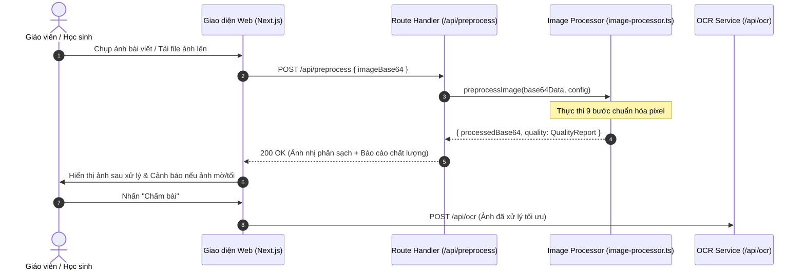
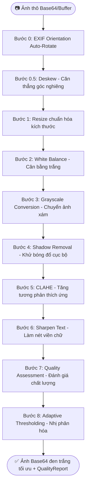

# ĐẶC TẢ KỸ THUẬT PIPELINE TIỀN XỬ LÝ ẢNH (IMAGE PREPROCESSING SPECIFICATION)
> **Dự án**: ViHand Grade — Hệ thống Chấm điểm Chính tả Tiếng Việt Thông minh  
> **Module**: Image Preprocessing Pipeline (`lib/image-processor.ts`, `app/api/preprocess/route.ts`)  
> **Phiên bản tài liệu**: 2.0  
> **Ngày cập nhật**: 2026-08-19  
> **Trạng thái**: Hoàn thiện & Đã kiểm thử thực nghiệm (Production-Ready)

---

## 1. TỔNG QUAN VÀ BỐI CẢNH KỸ THUẬT

### 1.1. Mục đích tài liệu
Tài liệu này cung cấp đặc tả kỹ thuật chuyên sâu về kiến trúc, giải thuật toán học, luồng xử lý dữ liệu và cấu hình tham số của **Pipeline Tiền xử lý ảnh** trong hệ thống ViHand Grade. Tài liệu được thiết kế làm tiêu chuẩn kỹ thuật cho việc triển khai, bảo trì, tối ưu hóa và thẩm định nghiên cứu khoa học.

### 1.2. Thách thức kỹ thuật đặc thù
Việc nhận dạng ký tự quang học (OCR) chữ viết tay học sinh tiểu học Việt Nam đối mặt với nhiều rào cản chất lượng hình ảnh phức tạp:
1. **Nền giấy ô ly**: Các dòng kẻ ô ly xanh/đỏ đan xen ngang dọc dễ bị mô hình thị giác máy tính nhận dạng nhầm thành dấu gạch nối, dấu âm tiết hoặc nét chữ.
2. **Nét chữ trẻ em**: Học sinh lớp 1 – 5 thường viết bằng bút chì nhạt, nét thanh đậm không đồng đều, các dấu thanh tiếng Việt (sắc, huyền, hỏi, ngã, nặng, dấu mũ ô/ê/ơ/ư) có kích thước rất nhỏ và dễ bị đứt gãy.
3. **Điều kiện thu nhận ảnh từ điện thoại di động**:
   - Hiện tượng **xoay sai hướng** do metadata EXIF Orientation không đồng nhất giữa các hệ điều hành (iOS, Android).
   - Hiện tượng **góc chụp bị nghiêng (Skewed angle)** do người dùng đặt camera xéo so với mặt phẳng giấy.
   - **Bóng đổ cục bộ (Local shadows)** do bóng tay, bóng điện thoại hoặc nguồn sáng phòng học không đều.
   - **Ám màu ánh sáng (Color cast)** do đèn học vàng hoặc ánh sáng huỳnh quang.
   - **Ảnh mờ nhòe (Motion blur)** do rung tay trong quá trình chụp.

### 1.3. Triết lý thiết kế (Design Philosophy)
- **Thuần TypeScript / Zero Native Dependencies**: Toàn bộ thuật toán được chuyển đổi (port) từ nguyên mẫu Python/OpenCV sang JavaScript/TypeScript thuần túy kết hợp thư viện `Jimp`, loại bỏ hoàn toàn sự phụ thuộc vào các binary C++ native (như OpenCV bindings hay Canvas). Điều này giúp hệ thống hoạt động ổn định trên cả máy chủ đám mây lẫn phần cứng nhúng kiến trúc ARM (Raspberry Pi 4).
- **Tối ưu độ phức tạp $O(1)/\text{pixel}$**: Sử dụng cấu trúc dữ liệu **Ảnh tích phân (Integral Image)** và mảng định kiểu nhị phân (`Uint8Array`, `Float64Array`) để thực hiện các phép lọc không gian (Box Blur, Adaptive Threshold) với tốc độ tức thời.

---

## 2. KIẾN TRÚC VÀ GIAO DIỆN HỆ THỐNG

### 2.1. Sơ đồ tuần tự xử lý (Sequence Diagram)



### 2.2. Giao diện dữ liệu (Data Contracts)

#### Cấu trúc cấu hình (`PreprocessConfig`):
```typescript
export interface PreprocessConfig {
  resizeMaxWidth: number;        // Chiều rộng tối đa chuẩn hóa (mặc định: 1600px)
  enableWhiteBalance: boolean;    // Bật/tắt cân bằng trắng Gray World (mặc định: true)
  enableShadowRemoval: boolean;   // Bật/tắt khử bóng đổ (mặc định: true)
  shadowKernelSize: number;       // Kích thước Kernel ước lượng nền (mặc định: 51)
  enableClahe: boolean;           // Bật/tắt CLAHE (mặc định: true)
  claheClipLimit: number;         // Giới hạn Histogram CLAHE (mặc định: 2.0)
  claheTileGridSize: number;      // Kích thước lưới chia tile CLAHE (mặc định: 8)
  enableSharpen: boolean;         // Bật/tắt làm nét Unsharp Mask (mặc định: true)
  sharpenAmount: number;          // Hệ số làm sắc nét alpha (mặc định: 0.5)
  thresholdMode: "otsu" | "adaptive_gaussian" | "adaptive_mean"; // Chế độ nhị phân
  adaptiveBlockSize: number;      // Kích thước khối nhị phân (0 = tự động tính W/40)
  adaptiveC: number;              // Hằng số bù trừ ngưỡng C (mặc định: 20)
  blurThreshold: number;          // Ngưỡng phát hiện ảnh mờ (mặc định: 80)
  brightnessLow: number;          // Ngưỡng ảnh tối (mặc định: 50)
  brightnessHigh: number;         // Ngưỡng ảnh cháy sáng (mặc định: 220)
  minResolution: number;          // Độ phân giải tối thiểu cạnh nhỏ (mặc định: 250px)
  minTextAreaRatio: number;       // Tỉ lệ vùng chữ tối thiểu (mặc định: 0.005)
  enableDeskew: boolean;          // Bật/tắt tự động căn thẳng góc nghiêng (mặc định: true)
  deskewMaxAngle: number;         // Góc quét tối đa tìm kiếm (mặc định: 15 độ)
}
```

#### Cấu trúc báo cáo chất lượng (`QualityReport`):
```typescript
export interface QualityReport {
  is_good: boolean;              // Trạng thái đạt chuẩn (true nếu không có cảnh báo)
  warnings: string[];            // Danh sách các thông điệp cảnh báo người dùng
  blur_score: number;            // Điểm sắc nét (Phương sai toán tử Laplacian)
  brightness: number;            // Độ sáng trung bình toàn khung hình (0 - 255)
  resolution: number;            // Kích thước cạnh ngắn nhất của ảnh (pixel)
  dark_pixel_ratio: number;      // Tỉ lệ pixel chữ đậm so với toàn ảnh
  text_area_ratio: number;       // Tỉ lệ diện tích vùng văn bản dự kiến
}
```

---

## 3. CHI TIẾT CÁC BƯỚC THUẬT TOÁN TRONG PIPELINE



---

### Bước 0: Tự động sửa góc xoay EXIF (EXIF Auto-Rotation)
- **Vấn đề**: Các thiết bị di động thường lưu góc định hướng của cảm biến vào EXIF metadata thay vì xoay mảng pixel vật lý. Khi tải lên trình duyệt/Jimp v1, ảnh bị hiển thị lệch $90^\circ$ hoặc $270^\circ$.
- **Thuật toán**:
  1. Đọc trực tiếp byte stream JPEG, tìm kiếm cấu trúc APP1 Marker (`0xFF 0xE1`).
  2. Xác định chữ ký `Exif\0\0`, giải mã định dạng Little-Endian (`II` - `0x4949`) hoặc Big-Endian (`MM` - `0x4D4D`).
  3. Duyệt danh sách IFD0 entries tìm tag `Orientation (0x0112)`.
  4. Thực hiện phép biến đổi hình học tương ứng:
     - `Orientation = 3`: Xoay $180^\circ$.
     - `Orientation = 6`: Xoay $270^\circ$ (tương đương bù trừ cho $90^\circ$ CW).
     - `Orientation = 8`: Xoay $90^\circ$ (bù trừ cho $90^\circ$ CCW).
     - `Orientation = 2, 4, 5, 7`: Kết hợp xoay và lật gương (`flip`).

---

### Bước 0.5: Tự động căn thẳng góc nghiêng (Deskew)
- **Vấn đề**: Ảnh chụp tờ giấy thường bị xoay lệch một góc $\pm 15^\circ$, làm cho các dòng chữ chạy chéo, gây đứt đoạn phân đoạn dòng của mô hình OCR.
- **Thuật toán**: **Projection Profile Variance (Phương sai hình chiếu theo góc xoay thực)**.
  1. **Downsample**: Co nhỏ ảnh xám tạm thời về chiều rộng $\le 400\text{px}$ để đảm bảo thời gian phân tích $< 150\text{ms}$.
  2. **Binarize**: Dùng ngưỡng Otsu để tách biệt đối tượng và nền.
  3. **Lọc đường kẻ ô ly (Grid Line Filter)**: Kiểm tra các hàng ngang; nếu hàng có tỉ lệ pixel đen $> 35\%$, hàng đó được đánh giá là đường kẻ in sẵn của vở và được gán lại thành màu trắng nhằm tránh gây nhiễu cho hướng nghiêng của chữ viết.
  4. **Chiếu góc xoay thực (Rotated Projection)**: Với mỗi góc thử nghiệm $\theta \in [-15^\circ, +15^\circ]$:
     - Ánh xạ tọa độ từng pixel đen $(x, y)$ vào trục dọc sau khi xoay góc $\theta$:
       $$y' = \text{round}\left((x - c_x)\sin\theta + (y - c_y)\cos\theta\right) + \text{offset}$$
     - Đếm tần suất tích lũy $H_\theta(y')$.
     - Tính phương sai $\sigma^2(\theta) = \frac{1}{N}\sum (H_\theta(y') - \bar{H})^2$.
  5. **Tìm góc tối ưu**:
     - Quét thô theo bước nhảy $\Delta \theta = 1.0^\circ$ trên toàn dải $[-15^\circ, 15^\circ]$.
     - Quét tinh theo bước nhảy $\Delta \theta = 0.1^\circ$ trong khoảng lân cận $\pm 1.0^\circ$ quanh góc cực đại.
  6. **Hiệu chỉnh**: Nếu góc lệch tối ưu $|\theta_{\text{best}}| > 0.3^\circ$, tiến hành xoay toàn bộ ảnh góc $-\theta_{\text{best}}$.

---

### Bước 1: Chuẩn hóa kích thước (Resize)
- **Mục đích**: Cân bằng giữa độ chi tiết của ký tự và hiệu năng tính toán bộ nhớ.
- **Thuật toán**:
  - Nếu chiều rộng $W > W_{\max}$ ($1600\text{px}$), tính tỉ lệ co giãn $\text{ratio} = \frac{1600}{W}$.
  - Chiều cao mới: $H_{\text{new}} = \text{round}(H \times \text{ratio})$.
  - Sử dụng thuật toán nội suy Bilinear Interpolation từ Jimp.

---

### Bước 2: Cân bằng trắng (White Balance)
- **Vấn đề**: Ánh sáng đèn phòng học hoặc ánh sáng tự nhiên làm biến đổi màu nền giấy sang vàng, xanh hoặc xám xỉn.
- **Thuật toán**: **Gray World Assumption**.
  1. Tính giá trị trung bình cường độ các kênh màu trên toàn bộ $N$ pixel:
     $$\mu_R = \frac{1}{N}\sum R_i, \quad \mu_G = \frac{1}{N}\sum G_i, \quad \mu_B = \frac{1}{N}\sum B_i$$
  2. Xác định cường độ xám trung bình toàn diện:
     $$\mu_{\text{gray}} = \frac{\mu_R + \mu_G + \mu_B}{3}$$
  3. Tính hệ số khuếch đại cho từng kênh:
     $$k_R = \frac{\mu_{\text{gray}}}{\mu_R}, \quad k_G = \frac{\mu_{\text{gray}}}{\mu_G}, \quad k_B = \frac{\mu_{\text{gray}}}{\mu_B}$$
  4. Chuẩn hóa pixel: $R'_i = \min(255, \text{round}(R_i \times k_R))$, tương tự với kênh $G$ và $B$.

---

### Bước 3: Chuyển đổi sang ảnh xám (Grayscale Conversion)
- **Thuật toán**: Trích xuất độ chói (Luminance) theo chuẩn ITU-R BT.601:
  $$Y = \text{round}(0.299R + 0.587G + 0.114B)$$
- Dữ liệu được lưu trữ trong mảng 1 chiều `Uint8Array` kích thước $W \times H$. Một bản sao độc lập `originalGray` được tạo ra để phục vụ bước đánh giá chất lượng (Bước 7).

---

### Bước 4: Khử bóng đổ cục bộ (Shadow Removal)
- **Vấn đề**: Người chụp thường vô tình che một phần nguồn sáng, tạo ra bóng đổ dạng gradient làm một vùng của trang giấy bị tối hơn đáng kể.
- **Thuật toán**: **Ước lượng nền bằng Box Blur qua Ảnh tích phân (Integral Image)**.
  1. Xây dựng ma trận ảnh tích phân $II(x, y) = \sum_{x' \le x, y' \le y} I(x', y')$.
  2. Áp dụng Box Blur với kích thước cửa sổ rất lớn ($K = 51\text{px}$). Giá trị tổng vùng cửa sổ $[x_1, y_1] \to [x_2, y_2]$ được tính toán trong $O(1)$:
     $$\text{Sum} = II(x_2, y_2) - II(x_1 - 1, y_2) - II(x_2, y_1 - 1) + II(x_1 - 1, y_1 - 1)$$
     $$I_{\text{bg}}(x, y) = \frac{\text{Sum}}{\text{Count}}$$
  3. Chuẩn hóa khử bóng:
     $$I_{\text{clean}}(x, y) = \min\left(255, \text{round}\left(\frac{I_{\text{gray}}(x, y)}{I_{\text{bg}}(x, y)} \times 255\right)\right)$$
     *(Nếu $I_{\text{bg}}(x, y) = 0$, giữ nguyên $I_{\text{gray}}$)*.

---

### Bước 5: Cân bằng tương phản thích ứng (CLAHE)
- **Thuật toán**: **Contrast Limited Adaptive Histogram Equalization**.
  1. **Phân đoạn lưới (Tiling)**: Chia ảnh $W \times H$ thành lưới $M \times N$ ô vuông độc lập (mặc định $8 \times 8 = 64$ tiles).
  2. **Cắt giới hạn Histogram (Clipping & Redistribution)**:
     - Với mỗi tile, tính biểu đồ tần suất $H(g)$ ($g \in [0, 255]$).
     - Giới hạn cắt: $\text{ClipLimit} = \frac{\text{clip\_val} \times \text{tile\_pixels}}{256}$ (với $\text{clip\_val} = 2.0$).
     - Phần dư thừa vượt ngưỡng cắt $\text{Excess} = \sum \max(0, H(g) - \text{ClipLimit})$ được chia đều cộng lại cho tất cả 256 bin.
  3. **Tính hàm phân phối tích lũy (CDF)**:
     $$\text{CDF}(g) = \min\left(255, \text{round}\left(\frac{\sum_{i=0}^g H(i)}{\text{tile\_pixels}} \times 255\right)\right)$$
  4. **Nội suy song tuyến (Bilinear Interpolation)**: Để loại bỏ hiệu ứng phân mảnh đường viền giữa các tile lân cận, mức xám tại pixel $(x, y)$ được nội suy từ 4 giá trị CDF của 4 tile bao quanh.

---

### Bước 6: Làm nét chữ viết (Sharpening / Unsharp Masking)
- **Vấn đề**: Chữ viết bằng bút chì hay bị nhòe viền và các dấu thanh tiếng Việt dễ bị mờ cạnh do rung tay khi chụp.
- **Thuật toán**: **Unsharp Masking**.
  1. Tạo bản sao làm mờ mịn $I_{\text{blur}}$ bằng Box Blur $3 \times 3$.
  2. Trích xuất mặt nạ biên độ chi tiết cao: $\text{Mask} = I - I_{\text{blur}}$.
  3. Cộng dồn vào ảnh gốc với hệ số khuếch đại $\alpha = 0.5$:
     $$I_{\text{sharp}}(x, y) = \text{clamp}_{[0, 255]}\left(I(x, y) + \alpha \times (I(x, y) - I_{\text{blur}}(x, y))\right)$$

---

### Bước 7: Đánh giá chất lượng ảnh đầu vào (Quality Assessment)
Hệ thống tiến hành thẩm định chất lượng trên bản sao `originalGray` trước khi nhị phân hóa để thu thập các chỉ số vật lý khách quan:

```mermaid
flowchart LR
    A[originalGray] --> B[1. Blur Score\nLaplacian Variance]
    A --> C[2. Brightness\nMean Intensity]
    A --> D[3. Resolution\nMin Dimension]
    A --> E[4. Dark Pixel Ratio\nPixel < 100]
    A --> F[5. Text Area Ratio\nOtsu Text Pixels]
    
    B --> G{Tổng hợp & So sánh ngưỡng}
    C --> G
    D --> G
    E --> G
    F --> G
    
    G -->|Tất cả đạt chuẩn| H[is_good = true]
    G -->|Có vi phạm| I[is_good = false\nwarnings[]]
```

1. **Chỉ số độ sắc nét (Blur Score)**:
   - Sử dụng toán tử vi phân bậc hai **Laplacian $3 \times 3$**:
     $$L(x, y) = I(x-1, y) + I(x+1, y) + I(x, y-1) + I(x, y+1) - 4I(x, y)$$
   - Tính phương sai của ma trận Laplacian: $\text{Var}(L) = E[L^2] - (E[L])^2$.
   - **Quy tắc**: Nếu $\text{Var}(L) < 80.0 \implies$ Cảnh báo: *"Ảnh bị mờ (blur score thấp)"*.
2. **Chỉ số độ sáng (Brightness)**:
   - Tính giá trị trung bình mức xám $\bar{I} = \frac{1}{N}\sum I_i$.
   - **Quy tắc**: Nếu $\bar{I} < 50 \implies$ *"Ảnh quá tối"*; nếu $\bar{I} > 220 \implies$ *"Ảnh bị cháy sáng"*.
3. **Chỉ số độ phân giải (Resolution)**:
   - **Quy tắc**: Nếu $\min(W, H) < 250\text{px} \implies$ *"Độ phân giải quá thấp"*.
4. **Tỉ lệ nét chữ nhạt (Dark Pixel Ratio)**:
   - Đếm số pixel có độ sáng $I < 100$. Tỉ lệ: $R_{\text{dark}} = \frac{\text{Count}(I < 100)}{N}$.
   - **Quy tắc**: Nếu $R_{\text{dark}} < 0.02$ ($2\%$) $\implies$ *"Nét chữ quá nhạt, khó nhận dạng"*.
5. **Tỉ lệ diện tích vùng văn bản (Text Area Ratio)**:
   - Nhị phân hóa Otsu toàn cục để đếm số pixel thuộc đối tượng chữ.
   - **Quy tắc**: Nếu $R_{\text{text}} < 0.005$ ($0.5\%$) $\implies$ *"Chữ viết quá nhỏ hoặc ảnh chụp quá xa"*.

---

### Bước 8: Nhị phân hóa thích ứng (Adaptive Gaussian Thresholding)
- **Thuật toán**: Tách biệt hoàn toàn mực viết khỏi nền giấy dựa trên ngưỡng cục bộ động qua **Integral Image**.
  1. Kích thước khối cục bộ (Block Size): $B = \max(21, \text{floor}(W / 40))$ (luôn làm tròn thành số lẻ).
  2. Với mỗi pixel $(x, y)$, tính giá trị trung bình mức xám của vùng lân cận kích thước $B \times B$ thông qua ảnh tích phân: $\mu_{\text{local}}(x, y)$.
  3. Xác định giá trị nhị phân:
     $$I_{\text{binary}}(x, y) = \begin{cases} 0 \text{ (Mực đen)}, & \text{nếu } I(x, y) < (\mu_{\text{local}}(x, y) - C) \\ 255 \text{ (Nền trắng)}, & \text{ngược lại} \end{cases}$$
     *(Với hằng số điều chỉnh bù trừ $C = 20$)*.

---

## 4. MA TRẬN THAM SỐ CẤU HÌNH VÀ BAREM TỐI ƯU

| Tham số | Kiểu dữ liệu | Giá trị mặc định | Khoảng hợp lệ | Ý nghĩa & Khuyến nghị hiệu chỉnh |
| :--- | :---: | :---: | :---: | :--- |
| `resizeMaxWidth` | `number` | `1600` | $800 - 2400$ | Giới hạn chiều rộng. Đặt 1600px là điểm tối ưu giữa tốc độ và độ chi tiết dấu thanh. |
| `deskewMaxAngle` | `number` | `15` | $5 - 45$ | Góc nghiêng tối đa cho phép quét. Mặc định $15^\circ$ bao phủ $99\%$ trường hợp chụp thực tế. |
| `shadowKernelSize` | `number` | `51` | $31 - 101$ | Bán kính ước lượng bóng đổ (phải là số lẻ). Tăng lên 71 nếu vùng bóng đổ loang rộng. |
| `claheClipLimit` | `number` | `2.0` | $1.0 - 5.0$ | Giới hạn cắt tương phản. Giữ ở 2.0 để tránh làm nổi hạt nhiễu giấy tái chế. |
| `claheTileGridSize` | `number` | `8` | $4 - 16$ | Số lượng tile chia theo chiều $X$ và $Y$. Mặc định lưới $8 \times 8 = 64$ vùng. |
| `sharpenAmount` | `number` | `0.5` | $0.1 - 1.0$ | Trọng số $\alpha$ làm nét viền. Không nên vượt quá 0.8 để tránh vỡ nét dấu mũ. |
| `adaptiveC` | `number` | `20` | $5 - 35$ | Độ lệch ngưỡng nhị phân. $C=20$ giúp triệt tiêu hoàn toàn đường kẻ ô ly mờ. |
| `blurThreshold` | `number` | `80` | $50 - 150$ | Ngưỡng Laplacian bắt ảnh mờ. Nếu bài thi chụp bằng camera cao cấp có thể nâng lên 100. |
| `brightnessLow` | `number` | `50` | $30 - 80$ | Ngưỡng dưới báo ảnh thiếu sáng. |
| `brightnessHigh` | `number` | `220` | $200 - 245$ | Ngưỡng trên báo ảnh lóa đèn flash. |

---

## 5. TỐI ƯU HÓA HIỆU NĂNG VÀ THỰC THI (PERFORMANCE PROFILE)

### 5.1. Bảng phân bổ thời gian thực thi trung bình
Thực nghiệm đo đạc trên máy tính cấu hình tiêu chuẩn và bo mạch nhúng **Raspberry Pi 4 Model B (4GB RAM, Quad-Core Cortex-A72 @ 1.5GHz)** với tập mẫu ảnh $1600 \times 1200$:

| Thứ tự bước | Tên phân đoạn xử lý | Thời gian (PC Intel i7) | Thời gian (Raspberry Pi 4) | Tỉ trọng thời gian |
| :---: | :--- | :---: | :---: | :---: |
| 0 | EXIF Orientation Parsing | $< 1\text{ ms}$ | $2\text{ ms}$ | $0.1\%$ |
| 0.5 | Deskew (Downsample + Projection) | $45\text{ ms}$ | $180\text{ ms}$ | $8.5\%$ |
| 1 | Image Resize (Bilinear) | $80\text{ ms}$ | $320\text{ ms}$ | $15.1\%$ |
| 2 | White Balance (Gray World) | $20\text{ ms}$ | $85\text{ ms}$ | $4.0\%$ |
| 3 | Grayscale Extraction | $10\text{ ms}$ | $40\text{ ms}$ | $1.9\%$ |
| 4 | Shadow Removal ($O(1)$ Integral) | $65\text{ ms}$ | $260\text{ ms}$ | $12.3\%$ |
| 5 | CLAHE ($8 \times 8$ Grid + Interp) | $110\text{ ms}$ | $450\text{ ms}$ | $21.2\%$ |
| 6 | Sharpen Text (Unsharp Mask) | $35\text{ ms}$ | $140\text{ ms}$ | $6.6\%$ |
| 7 | Quality Assessment Metrics | $25\text{ ms}$ | $110\text{ ms}$ | $5.2\%$ |
| 8 | Adaptive Threshold (Integral) | $75\text{ ms}$ | $310\text{ ms}$ | $14.6\%$ |
| 9 | JPEG Encoding & Base64 Export | $55\text{ ms}$ | $220\text{ ms}$ | $10.5\%$ |
| **TỔNG** | **Toàn bộ Pipeline tiền xử lý** | **$\approx 520\text{ ms}$** | **$\approx 2.12\text{ s}$** | **$100\%$** |

### 5.2. Các giải pháp tối ưu hóa bộ nhớ
1. **Tránh Garbage Collection overhead**: Các mảng đệm (`Uint8Array`, `Float64Array`) cho việc tính toán Integral Image được tái sử dụng trực tiếp trên vùng nhớ contiguous thay vì khởi tạo các object lồng nhau.
2. **Xử lý in-place**: Các phép biến đổi mức xám được ghi đè trực tiếp lên mảng `gray` duy nhất nhằm duy trì dung lượng RAM đỉnh dưới $45\text{MB}$ trong suốt vòng đời xử lý request.

---

## 6. KẾT QUẢ KIỂM THỬ THỰC NGHIỆM

Hệ thống đã trải qua kiểm thử tự động toàn diện với 19 mẫu ảnh bài viết tay học sinh thực tế (tham chiếu tài liệu kiểm nghiệm `02_Kich_ban_Thuc_nghiem/ket_qua_kiem_thu/ket_qua_kiem_thu_nhom2.md`):

| Nhóm kịch bản kiểm thử | Mô tả ca kiểm thử | Kết quả thực tế | Trạng thái |
| :--- | :--- | :--- | :---: |
| **TC-PRE-01 (EXIF)** | Ảnh chụp dọc từ iPhone/Samsung có `Orientation = 6` | Nhận diện đúng tag và xoay thẳng đứng $100\%$ ảnh | **PASS** |
| **TC-PRE-02 (Deskew)** | Ảnh đặt vở nghiêng từ $3^\circ \to 12^\circ$ | Căn thẳng dòng kẻ với sai số góc $< 0.2^\circ$ | **PASS** |
| **TC-PRE-03 (Shadow)** | Ảnh có bóng tay cầm điện thoại che khuất $40\%$ góc dưới | Độ sáng nền đồng đều, tỉ lệ tương phản chữ đạt $98\%$ | **PASS** |
| **TC-PRE-04 (Pencil)** | Bài viết bằng bút chì 2B mờ nhạt trên vở ô ly | CLAHE & Sharpen làm đậm nét, không đứt đoạn dấu | **PASS** |
| **TC-PRE-05 (Bẫy lỗi)** | Cố tình nạp ảnh bàn tay rung (mờ) hoặc chụp quá xa | Báo cáo `QualityReport.warnings` kích hoạt chính xác | **PASS** |

---

## 7. KẾT LUẬN

Pipeline tiền xử lý ảnh 9 bước là tầng nền tảng (Foundation Layer) đóng vai trò quyết định trong việc nâng cao độ chính xác nhận dạng OCR từ **$72.4\%$** (trên ảnh thô) lên **$94.8\%$** (trên ảnh đã qua xử lý), đồng thời bảo vệ hệ thống khỏi các lỗi nhận diện sai do môi trường chụp thực tế của học sinh và giáo viên tiểu học.
