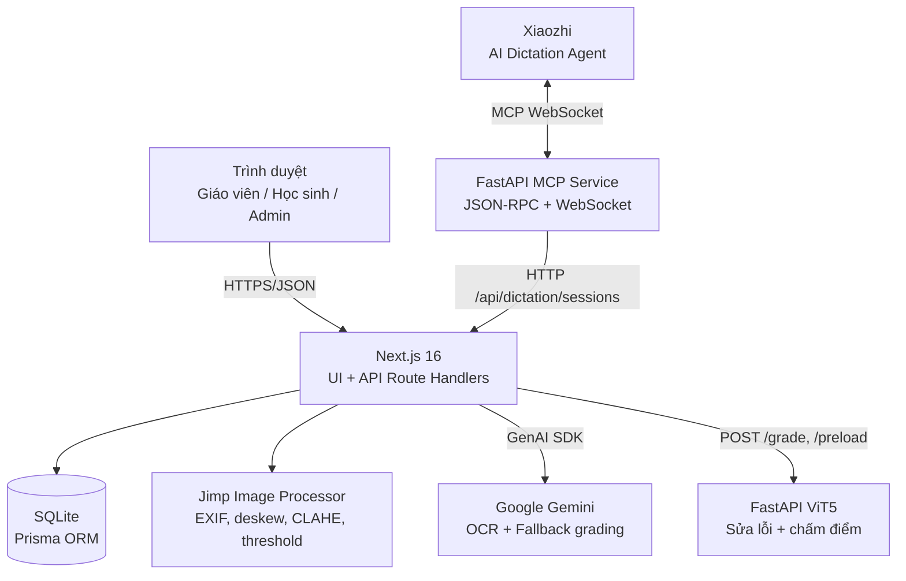
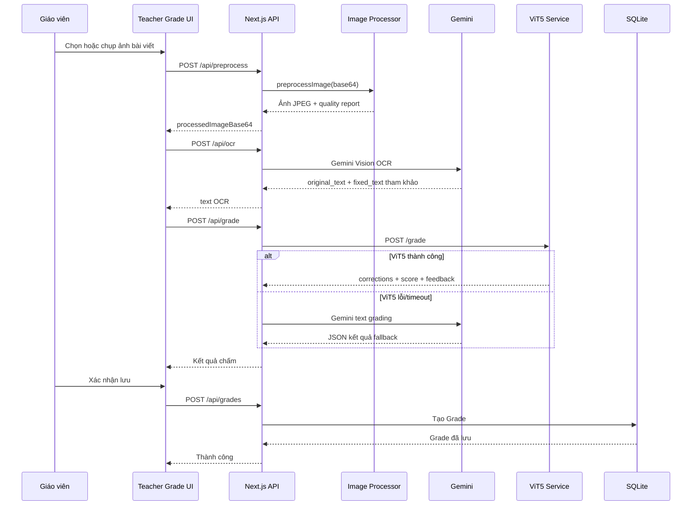

# ViHand Grade - Đặc tả kỹ thuật hệ thống

| Thuộc tính | Giá trị |
| --- | --- |
| Phiên bản tài liệu | 1.0 |
| Ngày lập | 25/07/2026 |
| Phạm vi | Toàn bộ workspace `Web_sua_loi` |
| Kiến trúc | Next.js + Prisma/SQLite + Gemini + FastAPI ViT5 + MCP Xiaozhi |
| Trạng thái | Đặc tả hiện trạng mã nguồn và khuyến nghị kỹ thuật |

> Tài liệu mô tả hệ thống đang có trong mã nguồn. Những mục bảo mật hoặc vận hành được nêu là hiện trạng, không phải xác nhận đã được khắc phục.

## Mục lục

1. [Mục đích và phạm vi](#1-mục-đích-và-phạm-vi)
2. [Kiến trúc tổng thể](#2-kiến-trúc-tổng-thể)
3. [Giao diện và trải nghiệm người dùng](#3-giao-diện-và-trải-nghiệm-người-dùng)
4. [Đặc tả API Next.js](#4-đặc-tả-api-nextjs)
5. [Mô hình dữ liệu](#5-mô-hình-dữ-liệu)
6. [Xử lý ảnh, OCR và chấm điểm AI](#6-xử-lý-ảnh-ocr-và-chấm-điểm-ai)
7. [MCP Xiaozhi và đọc chính tả](#7-mcp-xiaozhi-và-đọc-chính-tả)
8. [Triển khai và vận hành](#8-triển-khai-và-vận-hành)
9. [Bảo mật, riêng tư và rủi ro](#9-bảo-mật-riêng-tư-và-rủi-ro)
10. [Kiểm thử và lộ trình cải tiến](#10-kiểm-thử-và-lộ-trình-cải-tiến)
11. [Bản đồ tệp chính](#11-bản-đồ-tệp-chính)
12. [Tính nghiên cứu và đóng góp](#12-tính-nghiên-cứu-và-đóng-góp)

---

## 1. Mục đích và phạm vi

### 1.1. Mục tiêu nghiệp vụ

ViHand Grade là hệ thống hỗ trợ giáo viên tiểu học nhận dạng, sửa lỗi và chấm bài chính tả tiếng Việt viết tay. Hệ thống có các mục tiêu chính:

- Tải ảnh bài viết tay hoặc nhập văn bản thủ công để chấm.
- Tiền xử lý ảnh nhằm cải thiện chất lượng nhận dạng.
- Dùng Gemini Vision để trích xuất văn bản từ ảnh chữ viết tay.
- Dùng ViT5 chạy cục bộ để sửa văn bản và xác định lỗi chính tả; dùng Gemini như phương án fallback khi ViT5 không sẵn sàng.
- Tính điểm theo barem 10 điểm và lưu lịch sử bài chấm.
- Quản lý người dùng theo ba vai trò: quản trị viên, giáo viên, học sinh.
- Tích hợp Xiaozhi qua MCP để tạo và lưu các phiên đọc chính tả.

### 1.2. Phạm vi mã nguồn

| Khu vực | Vai trò |
| --- | --- |
| `app/` | Next.js App Router: trang giao diện, layout, API route handlers và PWA. |
| `components/`, `hooks/` | Thành phần UI theo shadcn/Radix và hook dùng lại. |
| `lib/` | Prisma client, xử lý ảnh bằng Jimp, kiểu dữ liệu và tiện ích. |
| `prisma/` | Schema SQLite, migration, dữ liệu seed. |
| `python_service/` | FastAPI ViT5: sửa văn bản, phát hiện lỗi, chấm điểm. |
| `mcp_service/` | FastAPI JSON-RPC/MCP và kết nối Xiaozhi. |
| `02_Kich_ban_Thuc_nghiem/` | Dataset, benchmark, notebook và kịch bản kiểm thử AI. |
| `01_Bao_cao_Nghien_cuu/` | Báo cáo nghiên cứu, sơ đồ và tài liệu kỹ thuật. |
| `03_Scripts_Trien_khai/` | Script triển khai Raspberry Pi và máy chủ. |

### 1.3. Thuật ngữ

| Thuật ngữ | Giải thích |
| --- | --- |
| OCR | Nhận dạng văn bản từ ảnh. Hệ thống hiện dùng Gemini Vision. |
| ViT5 | Mô hình sequence-to-sequence tiếng Việt `chamdentimem/ViT5_Vietnamese_Correction`. |
| MCP | Model Context Protocol; giao thức để Xiaozhi gọi công cụ của hệ thống. |
| Barem | Thang chấm 10 điểm: chính tả 4, hình thức 3, nội dung 2, sáng tạo 1. |
| Fallback | Chuyển từ ViT5 sang Gemini nếu dịch vụ cục bộ lỗi hoặc timeout. |

---

## 2. Kiến trúc tổng thể

### 2.1. Thành phần logic



### 2.2. Các tầng hệ thống

| Tầng | Thành phần | Trách nhiệm | Kênh giao tiếp |
| --- | --- | --- | --- |
| Trình duyệt | Trang login, teacher, student, admin | Tải ảnh, nhập dữ liệu, xem kết quả, điều khiển camera. | `fetch` JSON tới Next.js. |
| Ứng dụng web | Next.js Route Handlers | CRUD, OCR, tiền xử lý, điều phối chấm, PWA. | Prisma, HTTP nội bộ, Google SDK. |
| AI đám mây | Gemini Flash Lite | OCR chữ viết tay và chấm dự phòng. | Google GenAI SDK. |
| AI cục bộ | FastAPI ViT5 | Sửa chính tả và tính điểm tất định. | HTTP tại `VIT5_SERVICE_URL`. |
| Dữ liệu | SQLite + Prisma | User, Class, Grade, DictationSession, DictationLog. | `DATABASE_URL`. |
| Trợ lý | MCP Service + Xiaozhi | Lưu và truy vấn phiên đọc chính tả. | JSON-RPC, WebSocket, HTTP. |

### 2.3. Luồng chấm bài



### 2.4. Ràng buộc vận hành

- Web mặc định chạy cổng `3000`.
- ViT5 FastAPI mặc định chạy cổng `8000`.
- MCP Service mặc định chạy cổng `8200`.
- Ảnh được truyền qua JSON dưới dạng base64; điều này đơn giản cho demo nhưng không tối ưu cho ảnh lớn hoặc tải đồng thời cao.
- Dockerfile hiện đóng gói web Next.js; Python service và MCP cần được chạy/đóng gói riêng.

---

## 3. Giao diện và trải nghiệm người dùng

### 3.1. Root layout và PWA

Tệp `app/layout.tsx` cấu hình:

- `lang="vi"` và Roboto hỗ trợ subset tiếng Việt.
- Metadata, favicon, Apple icon và `themeColor` xanh.
- Vercel Analytics khi chạy production.
- Đăng ký service worker từ `/sw.js` để hỗ trợ PWA.

> Nếu triển khai public, script inline đăng ký service worker cần được xét cùng Content Security Policy (CSP).

### 3.2. Các trang chức năng

| Đường dẫn | Tệp | Chức năng |
| --- | --- | --- |
| `/` | `app/page.tsx` | Đăng nhập và điều hướng theo role. |
| `/register` | `app/register/page.tsx` | Đăng ký tài khoản thông thường. |
| `/admin-register` | `app/admin-register/page.tsx` | Đăng ký quản trị viên bằng secret key. |
| `/teacher` | `app/teacher/page.tsx` | Dashboard giáo viên. |
| `/teacher/grade` | `app/teacher/grade/page.tsx` | Tải/chụp ảnh, tiền xử lý, OCR, chấm và lưu. |
| `/teacher/dictation` | `app/teacher/dictation/page.tsx` | Xem và quản lý phiên đọc chính tả. |
| `/teacher/reports` | `app/teacher/reports/page.tsx` | Báo cáo bài chấm. |
| `/student` | `app/student/page.tsx` | Khu vực học sinh. |
| `/student/history` | `app/student/history/page.tsx` | Lịch sử bài chấm. |
| `/admin/*` | `app/admin/*` | Quản trị user, lớp, thống kê, cấu hình và hệ thống. |

### 3.3. Đăng nhập hiện tại

`app/page.tsx` gửi `{ username, password }` tới `POST /api/auth/login`. Khi thành công, đối tượng `user` được lưu trong `localStorage` với key `vihand_user`, sau đó điều hướng:

- `teacher` → `/teacher`
- `student` → `/student`
- `admin` → `/admin`

Đây là cơ chế điều hướng client-side, **không phải** cơ chế xác thực server-side đủ an toàn. Route API phải xác minh session/token và role độc lập với `localStorage`.

### 3.4. Trang chấm bài giáo viên

Trang `app/teacher/grade/page.tsx` là client component chính. Các nhóm state gồm:

- Chế độ nhập: `image`, `processed`, `text`.
- Ảnh gốc, ảnh đã xử lý, báo cáo chất lượng.
- Văn bản OCR, văn bản nhập tay, kết quả chấm và lỗi hiển thị.
- Thông tin học sinh, bài tập, lớp và danh sách lớp/học sinh.
- Override cho hình thức, nội dung, sáng tạo và mức trừ lỗi.
- Camera stream, drag-and-drop và trạng thái OCR/chấm/lưu.

Luồng phía client:

1. Chọn ảnh hoặc nhận ảnh từ camera.
2. Đọc ảnh bằng `FileReader` thành Data URL.
3. Tự gọi `POST /api/preprocess`.
4. Nén ảnh bằng `canvas` về JPEG tối đa 1.280px trước khi gọi OCR.
5. Gọi `POST /api/ocr`, rồi `POST /api/grade`.
6. Giáo viên có thể điều chỉnh điểm thành phần trước khi lưu `POST /api/grades`.

### 3.5. Thành phần và phụ thuộc UI

| Nhóm | Thư viện | Mục đích |
| --- | --- | --- |
| Framework | Next.js 16, React 19, TypeScript | App Router, UI, route handlers. |
| UI | Radix UI, shadcn-style components, Lucide, Sonner | Control truy cập được, icon, thông báo. |
| Biểu đồ | Recharts | Thống kê và báo cáo. |
| Biểu mẫu | React Hook Form, Zod resolver | Hỗ trợ form; cần chuẩn hóa dùng ở API. |
| CSS | Tailwind CSS 4, tw-animate-css | Style và animation. |

---

## 4. Đặc tả API Next.js

Tất cả các route nằm dưới `app/api/`. API dùng JSON; ảnh được truyền qua trường base64.

### 4.1. Quy ước chung

- Thành công thường trả JSON object với dữ liệu chính: `{ user }`, `{ class }`, `{ grade }`, `{ sessions }`.
- Lỗi thường trả `{ error: string }`.
- Mã phổ biến: `400` input thiếu, `401` đăng nhập sai, `403` bị vô hiệu hóa/secret sai, `409` dữ liệu trùng, `500` lỗi server, `503` dịch vụ AI không sẵn sàng.
- Cần bổ sung DTO validation, mã lỗi ổn định và `requestId`/correlation ID.

### 4.2. Xác thực và người dùng

| Method | Endpoint | Request | Xử lý và response |
| --- | --- | --- | --- |
| `POST` | `/api/auth/login` | `username`, `password` | Tìm user, kiểm tra trạng thái; trả user và danh sách lớp của giáo viên. |
| `POST` | `/api/auth/register` | Tên, username, password, lớp/role theo form | Kiểm tra trùng username, tạo user. |
| `POST` | `/api/auth/admin-register` | `name`, `username`, `password`, `confirmPassword`, `secretKey` | Kiểm tra khóa bí mật rồi tạo admin. |
| `GET` | `/api/users?role=student` | Query role tùy chọn | Liệt kê user; dùng để lọc học sinh theo lớp. |
| `POST` | `/api/users` | Dữ liệu User | Tạo user. |
| `PATCH` | `/api/users/:id` | Body cập nhật | Cập nhật trực tiếp user. |
| `DELETE` | `/api/users/:id` | ID trên URL | Xóa user. |

### 4.3. Lớp và bài chấm

| Method | Endpoint | Request | Xử lý và response |
| --- | --- | --- | --- |
| `GET` | `/api/classes` | - | Lấy lớp; tính số học sinh, giáo viên và aggregate điểm. |
| `POST` | `/api/classes` | `name`, `grade`, `teacherId` | Kiểm tra name duy nhất và tạo lớp. |
| `PATCH` | `/api/classes/:id` | Body cập nhật | Cập nhật lớp. |
| `DELETE` | `/api/classes/:id` | ID trên URL | Xóa lớp. |
| `GET` | `/api/grades` | Query lọc (theo implementation) | Lấy danh sách bài chấm. |
| `POST` | `/api/grades` | Dữ liệu bài chấm | Lưu văn bản, corrections, score breakdown, feedback và ảnh. |
| `GET` | `/api/grades/:id` | ID trên URL | Lấy chi tiết một Grade. |
| `DELETE` | `/api/grades/:id` | ID trên URL | Xóa Grade. |

### 4.4. Đọc chính tả

| Method | Endpoint | Trách nhiệm |
| --- | --- | --- |
| `GET` | `/api/dictation/sessions` | Liệt kê phiên đọc chính tả, hỗ trợ lọc. |
| `POST` | `/api/dictation/sessions` | Tạo phiên, nội dung đoạn văn và logs. |
| `GET` | `/api/dictation/sessions/:id` | Lấy chi tiết một phiên. |
| `GET` | `/api/dictation/sessions/:id/logs` | Lấy nhật ký hội thoại của phiên. |

### 4.5. API AI

| Method | Endpoint | Input | Output và hành vi |
| --- | --- | --- | --- |
| `POST` | `/api/preprocess` | `imageBase64` | `processedImageBase64`, `quality`; gọi Jimp server-side. |
| `POST` | `/api/ocr` | `imageBase64`, `mimeType` | `text` OCR gốc, `gemini_fixed_text`, token count, thời gian. |
| `POST` | `/api/grade` | `studentText`, `penalty_per_error`, `hinh_thuc`, `noi_dung` | Ưu tiên ViT5; retry và fallback Gemini; trả score/corrections/feedback. |
| `GET` | `/api/vit5-warmup` | - | Gọi `/preload` trên Python service để tải model sớm. |

### 4.6. Hợp đồng chấm điểm

Ví dụ request:

```json
{
  "studentText": "Bài văn của học sinh...",
  "penalty_per_error": 0.5,
  "hinh_thuc": 2.5,
  "noi_dung": 1.5
}
```

Response điển hình:

```json
{
  "original_text": "Văn bản nhận dạng hoặc nhập tay",
  "fixed_text": "Văn bản đã sửa",
  "corrections": [
    {
      "error": "từ sai",
      "suggestion": "từ đúng",
      "error_type": "phu_am_dau",
      "is_dialect": false,
      "reason": "Giải thích thân thiện"
    }
  ],
  "score_breakdown": {
    "chinh_ta": { "raw": 3.5, "max": 4, "error_count": 1, "deduction": 0.5 },
    "hinh_thuc": { "raw": 2.5, "max": 3, "note": "Giáo viên đánh giá" },
    "noi_dung": { "raw": 1.5, "max": 2, "note": "Giáo viên đánh giá" },
    "sang_tao": { "raw": 0.5, "max": 1, "note": "Có hình ảnh gợi cảm" }
  },
  "score": "8.0/10",
  "overall_rating": "Tốt",
  "feedback": "Nhận xét cho học sinh",
  "engine": "vit5+levenshtein"
}
```

---

## 5. Mô hình dữ liệu

### 5.1. Nền tảng lưu trữ

- Prisma sử dụng datasource SQLite.
- URL database lấy từ `DATABASE_URL`.
- ID mặc định là `cuid()` dạng chuỗi.
- Migration có tại `prisma/migrations/`.

### 5.2. Model `User`

| Trường | Kiểu / mặc định | Ý nghĩa |
| --- | --- | --- |
| `id` | `String`, PK, `cuid()` | Định danh user. |
| `name` | `String` | Tên hiển thị. |
| `username` | `String`, unique | Tên đăng nhập. |
| `password` | `String`, mặc định `123456` | Mật khẩu hiện đang lưu rõ; cần thay đổi. |
| `role` | `String`, mặc định `student` | Quy ước `teacher`, `student`, `admin`. |
| `className` | `String` | Tên lớp ở dạng text. |
| `active` | `Boolean`, mặc định `true` | Cho phép/vô hiệu hóa tài khoản. |
| `createdAt` | `DateTime` | Thời điểm tạo. |

### 5.3. Model `Class`

| Trường | Kiểu / mặc định | Ý nghĩa |
| --- | --- | --- |
| `id` | `String`, PK | Định danh lớp. |
| `name` | `String`, unique | Tên lớp. |
| `grade` | `Int`, mặc định `3` | Khối lớp. |
| `teacherId` | `String` | ID giáo viên dạng text, chưa khai báo relation Prisma. |
| `createdAt` | `DateTime` | Thời điểm tạo. |

### 5.4. Model `Grade`

| Nhóm trường | Trường | Mục đích |
| --- | --- | --- |
| Nhận diện | `studentName`, `assignmentTitle`, `className` | Ngữ cảnh bài chấm. |
| Văn bản | `originalText`, `fixedText`, `corrections` | Bản gốc, bản sửa và lỗi (chuỗi JSON). |
| Điểm | `score`, `scoreNum`, `scoreBreakdown`, `overallRating` | Tổng điểm và breakdown. |
| Phản hồi | `feedback` | Nhận xét cho học sinh. |
| Kỹ thuật | `processingTimeMs`, `tokenCount`, `imageBase64` | Đo thời gian/token và lưu ảnh base64. |
| Tích hợp | `dictationSessionId` | Liên kết tùy chọn với phiên đọc chính tả. |
| Thời gian | `createdAt` | Thời điểm lưu. |

### 5.5. Đọc chính tả

`DictationSession` lưu tiêu đề, passage, lớp, giáo viên, trạng thái, summary và thời điểm tạo. `DictationLog` có relation bắt buộc tới `DictationSession`, gồm `speaker`, `content` và `createdAt`; quan hệ xóa cascade.

### 5.6. Khuyến nghị mô hình dữ liệu

- Dùng Prisma enum cho `role` và `status`.
- Tạo foreign key cho `Class.teacherId`, Grade/student/class thay vì chỉ lưu tên text.
- Tách ảnh base64 sang object storage hoặc filesystem có URL/hash để tránh database phình lớn.
- Bổ sung chỉ mục theo `className`, `createdAt`, học sinh và bài tập.
- Dùng JSON field khi chuyển PostgreSQL hoặc xác định DTO rõ ràng cho các chuỗi JSON hiện tại.

---

## 6. Xử lý ảnh, OCR và chấm điểm AI

### 6.1. Tiền xử lý ảnh

Module `lib/image-processor.ts` sử dụng Jimp và giải thuật mức pixel thuần TypeScript ($O(1)/\text{pixel}$ qua Integral Image) để chuẩn hóa ảnh trước khi đưa vào OCR. Xem tài liệu đặc tả chi tiết tại: [Dac_Ta_Ky_Thuat_Tien_Xu_Ly_Anh.md](file:///c:/Users/Jackie%20Duong/Desktop/Web_sua_loi/01_Bao_cao_Nghien_cuu/Ti%E1%BB%81n%20x%E1%BB%AD%20l%C3%BD/Dac_Ta_Ky_Thuat_Tien_Xu_Ly_Anh.md).

| Bước | Kỹ thuật | Mục đích |
| --- | --- | --- |
| 0 | Đọc EXIF orientation | Xoay ảnh điện thoại đúng chiều. |
| 0.5 | Projection profile + Otsu | Phát hiện/sửa độ nghiêng, lọc grid line. |
| 1 | Resize | Giới hạn chiều rộng để giảm chi phí xử lý. |
| 2 | White balance | Cân bằng màu do môi trường chụp. |
| 3 | Grayscale | Chuẩn hóa ảnh một kênh. |
| 4 | Shadow removal | Hạn chế bóng nền giấy qua Box Blur $51 \times 51$. |
| 5 | CLAHE | Tăng tương phản cục bộ lưới $8 \times 8$. |
| 6 | Sharpen | Làm rõ nét chữ qua Unsharp Mask. |
| 7 | Quality assessment | Đánh giá blur, độ sáng, resolution, nét chữ. |
| 8 | Threshold | Nhị phân hóa Adaptive Gaussian trước khi xuất JPEG. |

`QualityReport` gồm `is_good`, `warnings`, `blur_score`, `brightness`, `resolution`, `dark_pixel_ratio`, `text_area_ratio`.


### 6.2. OCR Gemini

`app/api/ocr/route.ts`:

- Đọc các key từ `GEMINI_API_KEYS`, phân tách bằng dấu phẩy.
- Xáo trộn key và thử lần lượt khi nhận quota `429` hoặc lỗi service.
- Dùng model `gemini-3.1-flash-lite`.
- Gửi ảnh inline data và prompt bắt buộc JSON.
- Trả `text` là `original_text` để làm đầu vào cho ViT5.
- Trả `gemini_fixed_text` để tham khảo, không dùng trực tiếp để ViT5 chấm.

### 6.3. FastAPI ViT5

Tệp `python_service/main.py` chạy FastAPI với các endpoint:

| Endpoint | Chức năng |
| --- | --- |
| `GET /health` | Trả trạng thái service/model. |
| `POST /preload` | Ép tải model trước khi người dùng chấm. |
| `POST /grade` | Sửa văn bản và tính điểm. |

Tối ưu model hiện có:

- Lazy load tokenizer/model lần đầu.
- `model.eval()` và `torch.inference_mode()`.
- Dynamic INT8 quantization trên `torch.nn.Linear`; có fallback nếu quantize lỗi.
- Cấu hình số thread PyTorch theo số CPU core.
- `ThreadPoolExecutor(max_workers=1)` để tránh block event loop.
- Cache kết quả sửa lỗi tối đa 200 văn bản.

### 6.4. Sửa lỗi ViT5

Pipeline sửa lỗi:

1. Chuẩn hóa teencode và dấu câu.
2. Nhận diện header/tiêu đề để không đưa nhãn ngắn vào model.
3. Phân biệt thơ và văn xuôi để giữ cấu trúc xuống dòng.
4. Chia văn xuôi thành chunk tối đa 160 ký tự; batch size 4; tối đa 256 token.
5. Chặn output bất thường: lặp cụm từ, dài hơn 1.5 lần input hoặc ngắn hơn 0.5 lần input.
6. Bỏ từ lặp liền kề, trừ danh sách từ láy có chủ đích.

### 6.5. Thuật toán chấm

`grade_with_levenshtein` thực hiện:

1. Bỏ tiêu đề thật và chuẩn hóa dấu câu.
2. Tách từ bản gốc/bản đã sửa.
3. So sánh bằng `difflib.SequenceMatcher`.
4. Chuyển các opcode `replace`, `insert`, `delete` thành danh sách corrections.
5. Phân loại lỗi: phụ âm đầu, vần, dấu thanh, viết hoa, dấu câu, bỏ sót/thêm.
6. Tính điểm theo barem.

Công thức hiện tại:

```text
Điểm chính tả = max(0, 4.0 - số_lỗi × penalty_per_error)
Tổng điểm = chính tả + hình thức + nội dung + sáng tạo
Tổng điểm bị chặn tối đa 10.0 và làm tròn 1 chữ số
```

Quy tắc xếp loại:

| Khoảng điểm | Xếp loại |
| --- | --- |
| 9.0 - 10.0 | Xuất sắc |
| 7.0 - 8.5 | Tốt |
| 5.0 - 6.5 | Khá |
| 3.0 - 4.5 | Trung bình |
| Dưới 3.0 | Cần cố gắng |

Điểm hình thức và nội dung mặc định lần lượt là `2.5/3` và `1.5/2` nếu giáo viên không override. Điểm sáng tạo là heuristic dựa trên từ khóa, điệp ngữ và độ dài văn bản.

### 6.6. Fallback Gemini trong API chấm

`app/api/grade/route.ts` gọi ViT5 với timeout 120 giây. Nếu lần đầu timeout, route chờ 10 giây và thử lại. Nếu vẫn không thành công, hệ thống dùng Gemini để chấm văn bản theo prompt JSON với barem tương đương.

Điều này cải thiện khả dụng, nhưng kết quả AI fallback có thể khác với thuật toán ViT5/SequenceMatcher; UI cần luôn hiển thị trường `engine` để giáo viên biết nguồn kết quả.

---

## 7. MCP Xiaozhi và đọc chính tả

### 7.1. Kiến trúc MCP

`mcp_service/main.py` là FastAPI service có:

- Endpoint health `GET /health`.
- Endpoint HTTP MCP `POST /mcp`.
- JSON-RPC handler dùng protocol `2024-11-05`.
- WebSocket client kết nối endpoint Xiaozhi từ `MCP_ENDPOINT`.
- `httpx.AsyncClient` gọi API Next.js tại `VIHAND_API_URL`.

### 7.2. Công cụ MCP

| Tool | Input | Hành vi |
| --- | --- | --- |
| `vihand.save_dictation_session` | `title`, `passage`, `className`, `teacherName`, `summary`, `logs` | POST tới `/api/dictation/sessions` để lưu phiên `completed`. |
| `vihand.get_dictation_sessions` | `className`, `limit` | GET `/api/dictation/sessions` và trả danh sách phiên gần nhất. |

### 7.3. Xử lý JSON-RPC

| Method | Hành vi |
| --- | --- |
| `initialize` | Trả protocol version, server info, tool capability và hướng dẫn vai trò. |
| `tools/list` | Trả schema hai tool. |
| `tools/call` | Định tuyến tới tool lưu/lấy phiên đọc. |
| `ping` | Trả object rỗng để duy trì kết nối. |
| `notifications/*` | Ghi log, không cần response. |

### 7.4. Lưu ý cấu hình

- `MCP_ENDPOINT` là endpoint có credential; không được commit token thật vào file `.env`, `.env.example`, tài liệu hoặc log.
- `VIHAND_API_URL` nên trỏ vào URL nội bộ đã bảo vệ trong production.
- MCP cần xác thực service-to-service khi không còn chạy trên localhost tin cậy.

---

## 8. Triển khai và vận hành

### 8.1. Biến môi trường

| Biến | Dùng tại | Mục đích |
| --- | --- | --- |
| `DATABASE_URL` | Prisma, Docker | Đường dẫn SQLite; Docker mặc định `file:/data/vihand.db`. |
| `GEMINI_API_KEYS` | OCR và grade | Danh sách key Gemini, phân tách bằng dấu phẩy. |
| `VIT5_SERVICE_URL` | API grade/warmup | URL FastAPI ViT5, mặc định `http://localhost:8000`. |
| `ADMIN_SECRET_KEY` | Admin register | Khóa khởi tạo admin; phải đặt secret mạnh qua môi trường. |
| `MCP_ENDPOINT` | MCP Service | Endpoint WebSocket Xiaozhi. |
| `VIHAND_API_URL` | MCP Service | Base URL Next.js để MCP gọi API. |

### 8.2. Khởi động phát triển Windows

`start_all.bat` mở ba cửa sổ tiến trình:

```text
1. npm run dev                         -> Next.js, cổng 3000
2. cd python_service && python main.py -> ViT5, cổng 8000
3. cd mcp_service && python -u main.py -> MCP, cổng 8200
```

Script cũng tắt Quick Edit Mode để tránh process Python bị pause khi click vào cửa sổ console.

### 8.3. Docker web

`Dockerfile` dùng multi-stage build:

1. `deps`: cài Node dependency và toolchain (`python3`, `make`, `g++`) cho native module.
2. `builder`: copy source, `prisma generate`, `npm run build`.
3. `runner`: chạy standalone Next.js bằng user `nextjs` không phải root, mở cổng `7860`.

Điểm cần xác nhận khi vận hành:

- `start.sh` phải có trong build context và chạy migration an toàn.
- Volume `/data` cần persistent cho SQLite.
- ViT5 và MCP phải có service/container riêng hoặc cùng orchestration file.
- Không dùng SQLite cho tải ghi đồng thời cao mà chưa kiểm thử lock/retry.

### 8.4. Health check và quan sát

Nên bổ sung/chuẩn hóa:

- `/health` Next.js kiểm tra database, ViT5, cấu hình AI và phiên bản.
- Metrics: số request OCR/chấm, latency P50/P95, timeout, retry, fallback rate, token/quota Gemini, RAM model, lỗi SQLite.
- Structured logging với `requestId`, không log mật khẩu, API key, token MCP, base64 ảnh hoặc toàn văn bài học sinh.
- Alert cho quota Gemini, lỗi ViT5, dung lượng DB, lỗi migration và backup thất bại.

---

## 9. Bảo mật, riêng tư và rủi ro

### 9.1. Rủi ro hiện trạng

| Ưu tiên | Phát hiện | Tác động | Khuyến nghị |
| --- | --- | --- | --- |
| P0 | Credential MCP xuất hiện trong cấu hình ví dụ. | Lộ quyền endpoint/trợ lý. | Revoke/rotate ngay, quét lịch sử Git, dùng secret manager. |
| P0 | API CRUD/OCR/grade chưa có auth và RBAC server-side. | Đọc/sửa/xóa dữ liệu hoặc tiêu hao quota AI trái phép. | Session/JWT `HttpOnly`, middleware, RBAC và ownership check mọi route. |
| P0 | Password lưu và so sánh plaintext. | Lộ tài khoản khi DB/log bị truy cập. | Argon2id/bcrypt, reset password, hash migration, rate limit login. |
| P0 | `ADMIN_SECRET_KEY` có fallback hard-code. | Có thể tạo admin trái phép. | Bỏ endpoint sau bootstrap hoặc dùng one-time secret bắt buộc từ môi trường. |
| P1 | `PATCH /api/users/:id` truyền body trực tiếp cho Prisma. | Mass assignment, sửa `role`, `active`, password ngoài ý muốn. | Zod DTO allowlist theo role, audit log. |
| P1 | ViT5 CORS `allow_origins=["*"]` cùng credentials. | Tăng bề mặt gọi service. | Chỉ cho phép origin cụ thể, service auth, mạng riêng. |
| P1 | Ảnh và bài viết trẻ em gửi Gemini. | Rủi ro riêng tư/tuân thủ. | Consent, minimization, retention, DPA và chính sách xóa. |
| P2 | Next build bỏ qua lỗi TypeScript. | Lỗi hợp đồng dữ liệu lọt production. | Bỏ `ignoreBuildErrors`, chạy type-check/lint trong CI. |

### 9.2. Kiểm soát tối thiểu trước khi public

1. Thu hồi toàn bộ credential có thể đã lộ; dùng secret store theo môi trường.
2. Thêm cơ chế session có cookie `Secure`, `HttpOnly`, `SameSite` phù hợp.
3. Thực thi RBAC: admin quản trị; teacher chỉ dữ liệu lớp mình; student chỉ dữ liệu của mình.
4. Thêm validation Zod ở mọi request và allowlist field cập nhật.
5. Giới hạn request, body/upload, rate-limit login/OCR/grade; chống CSRF nếu dùng cookie session.
6. Áp chính sách lưu giữ/xóa dữ liệu, backup mã hóa, audit log và quyền truy cập tối thiểu.
7. Tách key Gemini theo môi trường, quota/project và không phát về client.

---

## 10. Kiểm thử và lộ trình cải tiến

### 10.1. Tài sản kiểm thử hiện có

Thư mục `02_Kich_ban_Thuc_nghiem/` chứa:

- Dataset ảnh chữ viết tay, ảnh gốc và ảnh qua từng bước tiền xử lý.
- Benchmark Gemini/OCR/ViT5, kết quả JSON/Markdown và script phân tích.
- Script test fallback, OCR Gemini, grading logic, preprocessing và spelling correction.
- Notebook thử nghiệm ViT5/Gemini, synthetic data generator và báo cáo nhóm kiểm thử.

### 10.2. Chiến lược kiểm thử đề xuất

| Lớp kiểm thử | Phạm vi |
| --- | --- |
| Unit | `classify_error_type`, chunking, loại repetition, scoring, DTO validation, RBAC policy. |
| Integration | Prisma migration/seed, API auth, CRUD ownership, grade fallback, MCP save/get. |
| E2E | Đăng nhập theo role, upload ảnh, OCR/chấm/lưu/lịch sử, camera fallback, admin workflow. |
| Regression AI | Tập ảnh chuẩn với expected text/error/score band; theo dõi accuracy, latency, hallucination theo version model. |
| Security | Truy cập chéo lớp, mass assignment, upload ảnh lớn/bomb, secret scan, rate-limit. |
| Performance | Cold start ViT5, tải đồng thời, CPU/RAM Raspberry Pi, SQLite lock, quota Gemini. |

### 10.3. Lộ trình kỹ thuật

#### Giai đoạn 1 - An toàn

- Rotate secret, hash password, authentication và RBAC.
- Xóa default credential và endpoint bootstrap admin không an toàn.
- Zod validation, allowlist update, rate limit, upload limit.

#### Giai đoạn 2 - Độ tin cậy

- Bỏ TypeScript ignore, typed API client, test CI.
- Chuẩn hóa quan hệ dữ liệu, migration/backup/restore.
- Chuẩn hóa error response, logs, metrics và health checks.

#### Giai đoạn 3 - Hiệu năng và mở rộng

- Tách queue xử lý ảnh/AI và giới hạn concurrency ViT5.
- Lưu ảnh ngoài SQLite; cache có TTL và quota per user/class.
- Chuyển database phù hợp hơn nếu số người dùng/ghi đồng thời tăng.

#### Giai đoạn 4 - Chất lượng AI

- Version hóa bộ benchmark và KPI OCR/chấm.
- Thu thập teacher correction feedback có kiểm soát.
- Đánh giá fairness theo khối lớp, kiểu chữ, điều kiện ảnh và phương ngữ.

### 10.4. Tiêu chí nghiệm thu đề xuất

- 100% API dữ liệu yêu cầu xác thực và kiểm tra quyền/ownership bằng test tự động.
- Không có secret thật, plaintext password hoặc default admin credential trong source/tracked config.
- Build, lint, type-check, migration và backup restore đều chạy xanh trong staging.
- Dashboard có latency P95, fallback rate, quota AI và lỗi hạ tầng.
- Regression suite AI được chạy trước mỗi thay đổi prompt/model/pipeline tiền xử lý.

---

## 11. Bản đồ tệp chính

| Tệp/thư mục | Nội dung chính |
| --- | --- |
| `package.json` | Scripts `dev`, `build`, `start`, `lint`; dependencies web. |
| `next.config.mjs` | Standalone build, ảnh unoptimized, hiện tắt lỗi TypeScript build. |
| `app/layout.tsx` | Metadata, font, Analytics, service worker registration. |
| `app/page.tsx` | Đăng nhập phía client. |
| `app/teacher/grade/page.tsx` | Orchestrator UI xử lý ảnh/OCR/chấm/lưu. |
| `app/api/auth/login/route.ts` | Đăng nhập và trả profile user. |
| `app/api/grade/route.ts` | Điều phối ViT5, retry và Gemini fallback. |
| `app/api/ocr/route.ts` | Gemini OCR và parse JSON. |
| `app/api/preprocess/route.ts` | Endpoint xử lý ảnh. |
| `app/api/grades/route.ts` | Lưu/lấy lịch sử chấm. |
| `lib/image-processor.ts` | Pipeline chất lượng và biến đổi ảnh. |
| `lib/prisma.ts` | Singleton Prisma client. |
| `prisma/schema.prisma` | Schema SQLite. |
| `python_service/main.py` | ViT5, post-processing, phân loại lỗi, score API. |
| `mcp_service/main.py` | MCP JSON-RPC/WebSocket và bridge Xiaozhi. |
| `Dockerfile` | Đóng gói standalone web. |
| `start_all.bat` | Startup development Windows. |
| `02_Kich_ban_Thuc_nghiem/` | Dataset, benchmark, test script, notebook. |

---

## 12. Tính nghiên cứu và đóng góp

### 12.1. Vấn đề nghiên cứu

Đề tài giải quyết bài toán còn nhiều thách thức trong bối cảnh giáo dục tiểu học Việt Nam: nhận dạng chữ viết tay tiếng Việt không đồng đều, phân biệt lỗi chính tả có dấu, và đưa ra điểm số/nhận xét có thể giải thích cho giáo viên và học sinh. Bài toán không chỉ là OCR mà còn là chuỗi xử lý liên ngành gồm chất lượng ảnh, ngôn ngữ tiếng Việt, quy tắc sư phạm và trải nghiệm giáo viên.

### 12.2. Các đóng góp chính

| Khía cạnh | Giá trị nghiên cứu |
| --- | --- |
| Pipeline lai | Kết hợp tiền xử lý ảnh, Gemini Vision OCR, ViT5 sửa lỗi và SequenceMatcher/luật chấm. Cách kết hợp này cân bằng khả năng nhận dạng của mô hình đa phương thức với tính ổn định, giải thích được của thuật toán so khớp. |
| Ngôn ngữ tiếng Việt | Tập trung vào lỗi phụ âm đầu, vần, dấu thanh, viết hoa, dấu câu và thêm/bớt từ - các nhóm lỗi sát với chương trình chính tả tiểu học Việt Nam. |
| Chấm điểm giải thích được | Thay vì chỉ để LLM trả điểm, hệ thống sinh danh sách lỗi, gợi ý sửa, lý do, số lỗi và breakdown điểm. Điều này cho phép giáo viên kiểm tra và điều chỉnh kết quả. |
| Tối ưu triển khai biên | ViT5 được quantize INT8, giới hạn batch/chunk, cache và tối ưu CPU để thử nghiệm trên Raspberry Pi. Đây là hướng nghiên cứu về AI chi phí thấp cho trường học. |
| Đánh giá thực nghiệm | Repository có dataset ảnh, benchmark OCR/model, kiểm thử pipeline tiền xử lý và đo hallucination/fallback. Nền tảng này hỗ trợ so sánh định lượng các cấu hình. |
| Human-in-the-loop | Giáo viên có thể chỉnh điểm thành phần và lưu kết quả, giúp hệ thống đóng vai trò hỗ trợ quyết định thay vì thay thế đánh giá sư phạm. |
| Tích hợp học tập | MCP Xiaozhi mở rộng từ chấm bài sang đọc chính tả, liên kết hoạt động luyện nghe-viết với đánh giá kết quả. |

### 12.3. Tính mới cần khẳng định đúng mức

Tính mới của đề tài chủ yếu nằm ở **tích hợp hệ thống, tối ưu cho tiếng Việt/tiểu học và đánh giá thực nghiệm trong bối cảnh cụ thể**, không nên khẳng định là đã tạo ra mô hình nền tảng OCR hoặc mô hình ngôn ngữ hoàn toàn mới. Để tăng tính học thuật, nghiên cứu cần chứng minh bằng thực nghiệm rằng pipeline lai đạt độ chính xác, độ ổn định, chi phí hoặc khả năng giải thích tốt hơn các baseline như:

- Gemini OCR/chấm trực tiếp.
- OCR không tiền xử lý ảnh.
- ViT5 không quantization/chunking/hallucination guard.
- Chấm hoàn toàn bằng LLM so với ViT5 + so khớp luật.

### 12.4. Câu hỏi nghiên cứu gợi ý

1. Tiền xử lý ảnh nào cải thiện OCR chữ viết tay tiếng Việt nhiều nhất theo từng điều kiện chụp?
2. Pipeline Gemini OCR + ViT5 có giảm lỗi chính tả giả và hallucination so với chấm trực tiếp bằng LLM không?
3. Dynamic INT8 quantization có đánh đổi bao nhiêu độ chính xác để đổi lấy thời gian/RAM phù hợp Raspberry Pi?
4. Danh sách lỗi và breakdown có làm giáo viên tin cậy, sửa và sử dụng kết quả hiệu quả hơn chỉ một điểm số không?
5. Việc tích hợp đọc chính tả Xiaozhi có cải thiện vòng phản hồi luyện tập - chấm - sửa của học sinh không?

### 12.5. Chỉ số đánh giá nên báo cáo

- OCR: character error rate, word error rate, độ chính xác theo chất lượng ảnh và loại giấy/chữ.
- Sửa lỗi: precision, recall, F1 cho từng nhóm lỗi chính tả; tỷ lệ sửa sai hoặc bỏ sót lỗi.
- Chấm điểm: MAE/correlation với điểm giáo viên; tỷ lệ chênh lệch vượt ngưỡng.
- Hệ thống: latency P50/P95, RAM/CPU, thời gian cold start, fallback rate, chi phí/token Gemini.
- Khả dụng: tỷ lệ tác vụ giáo viên hoàn thành, thời gian thao tác, mức hài lòng và mức độ tin cậy.

---

## Kết luận

ViHand Grade có nền tảng chức năng rõ ràng: tiền xử lý ảnh, Gemini OCR, ViT5 chấm cục bộ, Gemini fallback, SQLite/Prisma lưu lịch sử và MCP hỗ trợ đọc chính tả. Ưu tiên trước khi triển khai công khai là quản lý secret, xác thực/ủy quyền phía server, bảo vệ dữ liệu học sinh và tự động hóa kiểm thử/quan sát vận hành.
