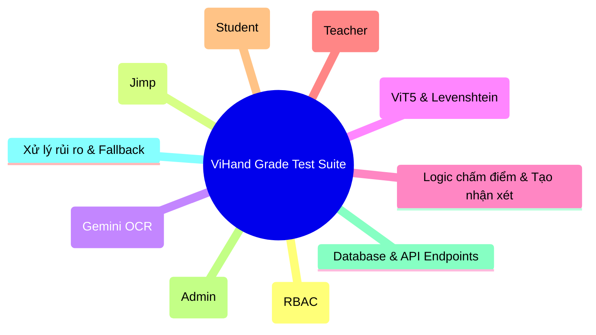
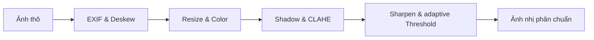
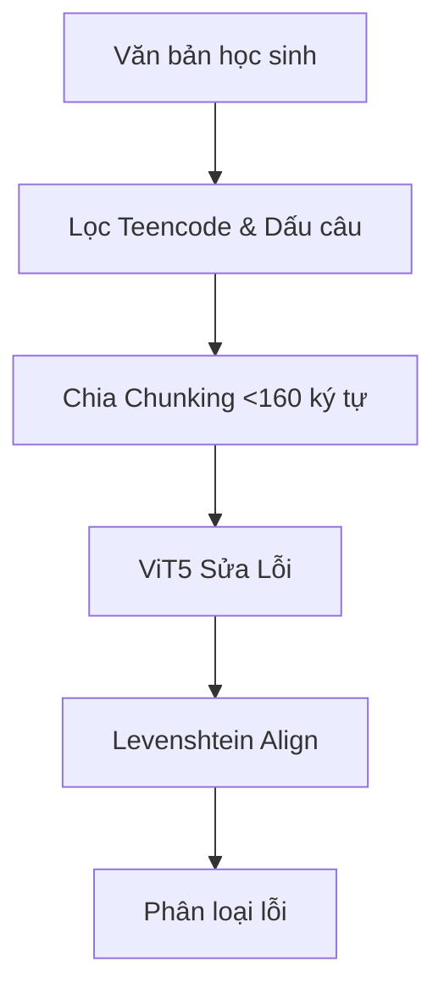

# 📋 DANH SÁCH TESTCASE CHI TIẾT - HỆ THỐNG VIHAND GRADE
> **Hệ thống Chấm điểm Chính tả Tiếng Việt Thông minh**  
> **Phiên bản Đặc tả Testcase**: `v1.2.0`  
> **Ngày cập nhật**: 2026-07-09  

---

## 🛠️ TỔNG QUAN HỆ THỐNG KIỂM THỬ
Tài liệu này định nghĩa danh sách các kịch bản kiểm thử (Test Cases) chi tiết cho hệ thống **ViHand Grade** dựa trên tài liệu Đặc tả Kỹ thuật (Technical Specification) và Sơ đồ Giải thuật của dự án. 

Hệ thống kiểm thử được chia thành 10 nhóm chính bao phủ toàn bộ luồng từ giao diện (Frontend Next.js), các dịch vụ API, Image Pipeline, mô hình AI (OCR Gemini & NLP ViT5), cho đến cơ sở dữ liệu SQLite:



---

## 🔑 NHÓM 1: ĐĂNG NHẬP, XÁC THỰC & PHÂN QUYỀN (RBAC)

### TC-AUTH-01: Đăng nhập thành công với vai trò Giáo viên (Teacher)
*   **Loại kiểm thử**: Functional Test (Kiểm thử chức năng)
*   **Điều kiện tiên quyết**: Tài khoản Giáo viên (`username: "giao_vien_demo"`, `password: "123456"`, `role: "teacher"`) đã tồn tại trong DB.
*   **Các bước thực hiện**:
    1. Truy cập trang chủ `/` (Trang đăng nhập).
    2. Nhập tên đăng nhập `giao_vien_demo`.
    3. Nhập mật khẩu đúng `123456`.
    4. Nhấn nút "Đăng nhập".
*   **Dữ liệu đầu vào**: `username: "giao_vien_demo"`, `password: "123456"`.
*   **Kết quả mong đợi**:
    *   Hệ thống gọi API `POST /api/auth/login` trả về mã trạng thái `200 OK`.
    *   Người dùng được chuyển hướng đến trang dashboard dành cho giáo viên `/teacher`.
    *   Giao diện hiển thị đúng tên giáo viên và các chức năng của giáo viên (Quản lý lớp học, Tạo bài chấm).

### TC-AUTH-02: Đăng nhập thành công với vai trò Học sinh (Student)
*   **Loại kiểm thử**: Functional Test
*   **Điều kiện tiên quyết**: Tài khoản Học sinh (`username: "hoc_sinh_demo"`, `password: "123456"`, `role: "student"`) đã tồn tại trong DB.
*   **Các bước thực hiện**:
    1. Truy cập trang đăng nhập `/`.
    2. Nhập `hoc_sinh_demo` và mật khẩu `123456`.
    3. Nhấn "Đăng nhập".
*   **Dữ liệu đầu vào**: `username: "hoc_sinh_demo"`, `password: "123456"`.
*   **Kết quả mong đợi**:
    *   API `POST /api/auth/login` trả về `200 OK`.
    *   Người dùng được điều hướng đến trang dành riêng cho học sinh `/student`.
    *   Giao diện hiển thị lịch sử bài chấm cá nhân, không có nút chấm điểm hay quản lý lớp.

### TC-AUTH-03: Đăng nhập thất bại do sai thông tin xác thực
*   **Loại kiểm thử**: Exception Test (Kiểm thử ngoại lệ)
*   **Điều kiện tiên quyết**: Không có.
*   **Các bước thực hiện**:
    1. Truy cập trang đăng nhập `/`.
    2. Nhập tên đăng nhập đúng nhưng mật khẩu sai, hoặc nhập tài khoản không tồn tại.
    3. Nhấn "Đăng nhập".
*   **Dữ liệu đầu vào**: `username: "giao_vien_demo"`, `password: "sai_mat_khau"`.
*   **Kết quả mong đợi**:
    *   API trả về mã lỗi `401 Unauthorized` hoặc lỗi logic tương ứng.
    *   Giao diện không chuyển hướng, hiển thị thông báo lỗi trực quan: *"Tên đăng nhập hoặc mật khẩu không chính xác"*.

### TC-AUTH-04: Kiểm soát phân quyền truy cập trực tiếp URL (Access Control)
*   **Loại kiểm thử**: Security Test (Kiểm thử bảo mật)
*   **Điều kiện tiên quyết**: Người dùng đã đăng nhập dưới vai trò Học sinh (Student).
*   **Các bước thực hiện**:
    1. Đăng nhập tài khoản Học sinh.
    2. Cố gắng truy cập trực tiếp các đường dẫn quản trị bằng cách gõ trên thanh địa chỉ trình duyệt: `/teacher`, `/admin`, `/api/users`.
*   **Dữ liệu đầu vào**: Địa chỉ URL `/teacher`, `/admin`.
*   **Kết quả mong đợi**:
    *   Trình duyệt không cho phép truy cập, tự động điều hướng về `/student` hoặc trang báo lỗi `403 Forbidden` / `401 Unauthorized`.
    *   Các API bảo mật trả về mã lỗi thích hợp để bảo vệ dữ liệu.

---

## 📷 NHÓM 2: PIPELINE TIỀN XỬ LÝ ẢNH (IMAGE PREPROCESSING)
> Bộ xử lý ảnh sử dụng thư viện **Jimp** (`lib/image-processor.ts`) qua API `/api/preprocess`.



### TC-PRE-01: Tự động sửa góc xoay EXIF (Auto-rotate)
*   **Loại kiểm thử**: Functional Test
*   **Điều kiện tiên quyết**: Chuẩn bị một ảnh chụp bài viết dạng JPEG chứa thẻ EXIF Orientation với góc xoay 90 độ (chụp dọc bằng điện thoại nhưng ảnh lưu bị ngang).
*   **Các bước thực hiện**:
    1. Gọi API hoặc tải ảnh này lên module chấm bài của Giáo viên.
*   **Dữ liệu đầu vào**: File ảnh chụp dọc có thông số EXIF Orientation = 6.
*   **Kết quả mong đợi**:
    *   Jimp phân tích thành công tag `0x0112` và xoay ảnh lại 90 độ theo chiều kim đồng hồ.
    *   Ảnh hiển thị ở trạng thái đứng thẳng, đúng hướng đọc tự nhiên của người dùng.

### TC-PRE-02: Căn thẳng góc nghiêng của trang giấy (Deskew)
*   **Loại kiểm thử**: Functional Test
*   **Điều kiện tiên quyết**: Chuẩn bị ảnh chụp vở ô ly bị nghiêng một góc khoảng -8 độ (nghiêng sang trái).
*   **Các bước thực hiện**:
    1. Upload ảnh nghiêng lên hệ thống.
*   **Dữ liệu đầu vào**: Ảnh chụp lệch góc nghiêng.
*   **Kết quả mong đợi**:
    *   Hệ thống chạy thuật toán Projection Profile để phát hiện các dòng kẻ ô ly của vở và góc nghiêng chính xác.
    *   Thực hiện xoay ảnh bù trừ (khoảng +8 độ) để ảnh đầu ra thẳng hàng dọc và ngang.

### TC-PRE-03: Resize ảnh đảm bảo hiệu năng
*   **Loại kiểm thử**: Boundary Test (Kiểm thử biên)
*   **Điều kiện tiên quyết**: Chuẩn bị ảnh có độ phân giải rất lớn (ví dụ: 4000x3000 pixel, dung lượng 8MB).
*   **Các bước thực hiện**:
    1. Tải ảnh dung lượng lớn lên hệ thống.
*   **Dữ liệu đầu vào**: File ảnh kích thước 4000x3000 pixel.
*   **Kết quả mong đợi**:
    *   Hệ thống resize ảnh về chiều rộng tối đa `1600px`, đồng thời giữ nguyên tỷ lệ khung hình (aspect ratio).
    *   Dung lượng ảnh giảm xuống đáng kể giúp giảm chi phí truyền tải qua mạng và token OCR.

### TC-PRE-04: Khử bóng đổ cục bộ (Shadow Removal)
*   **Loại kiểm thử**: Functional Test
*   **Điều kiện tiên quyết**: Ảnh chụp bài viết bị che bóng ở một góc (ví dụ: bóng của điện thoại hoặc bóng bàn tay).
*   **Các bước thực hiện**:
    1. Tải ảnh có bóng che lên hệ thống.
*   **Dữ liệu đầu vào**: Ảnh có vùng tối/bóng đổ chiếm khoảng 30% diện tích.
*   **Kết quả mong đợi**:
    *   Bộ lọc Box Blur with kernel 51px ước lượng thành công ảnh nền chiếu sáng.
    *   Thuật toán chia pixel gốc cho ảnh nền, triệt tiêu bóng đổ hiệu quả, trả về nền giấy sáng đều màu.

### TC-PRE-05: CLAHE tăng tương phản và Nhị phân hóa thích ứng
*   **Loại kiểm thử**: Functional Test
*   **Điều kiện tiên quyết**: Ảnh chụp vở viết bằng bút mực nhạt màu trên nền giấy ô ly đậm.
*   **Các bước thực hiện**:
    1. Tải ảnh nét chữ nhạt lên.
*   **Dữ liệu đầu vào**: Ảnh có độ tương phản kém giữa chữ và nền giấy.
*   **Kết quả mong đợi**:
    *   CLAHE chia lưới 8x8, cân bằng histogram cục bộ giúp nét chữ đậm rõ hơn và khống chế nhiễu ở mức Clip Limit = 2.0.
    *   Bước nhị phân hóa Adaptive Thresholding chuyển đổi ảnh về dạng 2 màu đen trắng thuần túy (nhị phân), giữ lại nét chữ đen sắc nét và loại bỏ toàn bộ lưới ô ly nền.

### TC-PRE-06: Đánh giá chất lượng ảnh đầu vào (Quality Assessment)
*   **Loại kiểm thử**: Exception / Boundary Test
*   **Điều kiện tiên quyết**: Chuẩn bị hai ảnh thử nghiệm:
    *   Ảnh 1: Bị nhòe nghiêm trọng do rung tay khi chụp.
    *   Ảnh 2: Chụp trong điều kiện tối đen hoặc ngược sáng nặng.
*   **Các bước thực hiện**:
    1. Tải lần lượt hai ảnh lên hệ thống.
*   **Dữ liệu đầu vào**: Ảnh mờ (Laplacian Variance < 80) và ảnh tối (độ sáng trung bình < 50).
*   **Kết quả mong đợi**:
    *   Hệ thống tính toán chỉ số chất lượng và phát hiện lỗi.
    *   Trả về báo cáo chất lượng chứa cảnh báo tương ứng: `{"is_good": false, "warnings": ["Ảnh bị nhòe/mờ", "Ảnh thiếu sáng"]}`.
    *   Giao diện hiển thị hộp thoại hoặc banner cảnh báo giáo viên đề nghị chụp lại để đảm bảo độ chính xác.

---

## ☁️ NHÓM 3: NHẬN DIỆN CHỮ VIẾT TAY (GEMINI OCR)
> API `/api/ocr` gọi Google Gemini Vision API (`gemini-3.1-flash-lite`) với cơ chế xoay vòng Key.

### TC-OCR-01: Nhận diện chính xác chữ viết tay nguyên bản tiếng Việt
*   **Loại kiểm thử**: Functional Test
*   **Điều kiện tiên quyết**: Ảnh đã qua tiền xử lý có chữ viết tay rõ ràng, chứa một số từ viết sai chính tả có chủ đích của học sinh (ví dụ: *"hộc xinh đi hộc"*).
*   **Các bước thực hiện**:
    1. Gửi ảnh nhị phân đến API `/api/ocr`.
*   **Dữ liệu đầu vào**: Ảnh nhị phân chứa câu *"hộc xinh đi hộc"*.
*   **Kết quả mong đợi**:
    *   Gemini trả về đúng chuỗi ký tự tiếng Việt nguyên bản bao gồm cả lỗi sai: `"hộc xinh đi hộc"`.
    *   Mô hình thực hiện đúng prompt hướng dẫn: chỉ trích xuất chữ viết tay thô, tuyệt đối không tự ý sửa đổi từ viết sai chính tả.

### TC-OCR-02: Xoay vòng API Keys khi gặp lỗi Rate Limit (429)
*   **Loại kiểm thử**: Exception / Failover Test (Kiểm thử dự phòng)
*   **Điều kiện tiên quyết**: Cấu hình danh sách `GEMINI_API_KEYS` trong `.env.local` với ít nhất 2 keys, trong đó key đầu tiên giả lập bị hết lượt dùng (Rate Limit 429 hoặc Resource Exhausted).
*   **Các bước thực hiện**:
    1. Thực hiện yêu cầu OCR từ giao diện.
*   **Dữ liệu đầu vào**: Ảnh chấm điểm thông thường.
*   **Kết quả mong đợi**:
    *   Khi key 1 trả về mã trạng thái `429`, hệ thống bắt được ngoại lệ (catch error).
    *   Hệ thống tự động chuyển sang key thứ 2 và thực hiện lại yêu cầu OCR mà không làm gián đoạn trải nghiệm của người dùng.
    *   Giao diện hiển thị kết quả thành công và ghi nhận log hệ thống đã xoay vòng API Key.

---

## 🤖 NHÓM 4: SỬA LỖI CHÍNH TẢ & SO KHỚP (VIT5 & LEVENSHTEIN)
> Dịch vụ FastAPI Python kết hợp thuật toán so khớp Levenshtein cấp độ từ (`difflib.SequenceMatcher`).



### TC-ALIGN-01: Tiền xử lý teencode và dấu câu
*   **Loại kiểm thử**: Functional Test
*   **Điều kiện tiên quyết**: Dịch vụ ViT5 đang hoạt động.
*   **Các bước thực hiện**:
    1. Truyền văn bản học sinh chứa teencode và lỗi dấu câu thừa vào API `/api/grade`.
*   **Dữ liệu đầu vào**: Chuỗi `"hôm nay ko đi học  ?? e rất bùn ."`
*   **Kết quả mong đợi**:
    *   Từ điển `TEENCODE_DICT` thay thế `"ko"` thành `"không"`.
    *   Chuẩn hóa khoảng trắng dấu câu chuyển `"  ??"` thành `"? "` và `" ."` thành `". "`.
    *   Văn bản đưa vào mô hình ViT5 là văn bản đã được làm sạch sơ bộ.

### TC-ALIGN-02: Giải thuật cắt câu văn xuôi tránh vòng lặp (Prose Chunking)
*   **Loại kiểm thử**: Boundary Test
*   **Điều kiện tiên quyết**: Bài viết của học sinh là một đoạn văn dài (khoảng 350 ký tự, nhiều câu).
*   **Các bước thực hiện**:
    1. Gửi đoạn văn dài tới hệ thống chấm điểm.
*   **Dữ liệu đầu vào**: Đoạn văn xuôi tiếng Việt dài > 160 ký tự.
*   **Kết quả mong đợi**:
    *   Hệ thống cắt đoạn văn thành các phần nhỏ (chunk) dựa vào các dấu ngắt câu (`.`, `,`, `?`, `!`), đảm bảo mỗi chunk tối đa `160 ký tự`.
    *   **Không sử dụng cửa sổ trượt (sliding window)** để ngăn chặn việc model bị rối ngữ cảnh gây lặp từ (hallucination loop).

### TC-ALIGN-03: Tự động phân loại và xử lý Thơ ca vs Văn xuôi
*   **Loại kiểm thử**: Functional Test
*   **Điều kiện tiên quyết**: Chuẩn bị 2 bài viết:
    *   Bài 1: Thơ lục bát (mỗi dòng ngắn, trung bình < 40 ký tự).
    *   Bài 2: Đoạn văn kể chuyện (dòng dài liên tục).
*   **Các bước thực hiện**:
    1. Lần lượt chấm điểm 2 bài viết trên.
*   **Dữ liệu đầu vào**: Một bài thơ và một đoạn văn xuôi.
*   **Kết quả mong đợi**:
    *   Với bài thơ: Hệ thống phát hiện độ dài dòng trung bình < 40 ký tự, tự động kích hoạt chế độ **Thơ ca**, giữ nguyên cấu trúc xuống dòng và gửi từng dòng đơn lẻ đi sửa lỗi chính tả.
    *   Với đoạn văn: Gộp các dòng liên tục trước khi xử lý ngắt đoạn thông thường.

### TC-ALIGN-04: Loại bỏ từ lặp do lỗi viết tay (Adjacent Duplicates Removal)
*   **Loại kiểm thử**: Functional Test
*   **Điều kiện tiên quyết**: Văn bản chứa từ lặp vô ý và từ lặp nghệ thuật.
*   **Các bước thực hiện**:
    1. Chấm bài viết chứa chuỗi *"em thích đi đi học"* và *"ngày ngày em vẫn xa xa học bài"*.
*   **Dữ liệu đầu vào**: Chuỗi có từ lặp kề nhau.
*   **Kết quả mong đợi**:
    *   Từ lặp vô ý *"đi đi"* bị loại bỏ một từ, sửa thành *"đi"*.
    *   Các từ lặp có nghĩa nằm trong danh sách loại trừ `INTENTIONAL_REPEATS` như *"ngày ngày"*, *"xa xa"* được giữ nguyên không bị xóa.

### TC-ALIGN-05: So khớp Levenshtein và Phân loại lỗi chính tả chi tiết
*   **Loại kiểm thử**: Functional Test
*   **Điều kiện tiên quyết**: Văn bản học sinh có nhiều loại lỗi chính tả khác nhau.
*   **Các bước thực hiện**:
    1. Gửi văn bản học sinh lên API chấm điểm và kiểm tra trường dữ liệu phân loại lỗi `corrections`.
*   **Dữ liệu đầu vào**:
    *   Học sinh viết: `"hà nội sôn sao mùi hoa sửa"`
    *   AI sửa đúng: `"Hà Nội xôn xao mùi hoa sữa"`
*   **Kết quả mong đợi**:
    *   Hệ thống so khớp và phân loại chính xác các loại lỗi:
        *   `"hà nội"` -> `"Hà Nội"`: Lỗi viết hoa (`viet_hoa`).
        *   `"sôn sao"` -> `"xôn xao"`: Lỗi phụ âm đầu (`phu_am_dau`).
        *   `"sửa"` -> `"sữa"`: Lỗi dấu thanh (`dau_thanh`).
        *   `"mùi"` -> `"mùi"`: Không báo lỗi.

### TC-ALIGN-06: Phát hiện lỗi thêm từ và thiếu từ (Delete & Insert)
*   **Loại kiểm thử**: Functional Test
*   **Các bước thực hiện**:
    1. Chấm bài có học sinh viết thừa hoặc thiếu chữ so với văn bản gốc chuẩn của giáo viên.
*   **Dữ liệu đầu vào**:
    *   Bài học sinh: `"em đi học trường mầm non"`
    *   Bài chuẩn: `"em đi học tại trường mầm non"`
*   **Kết quả mong đợi**:
    *   Phát hiện từ thiếu `"tại"` (hành động `delete` trên văn bản chuẩn) -> Lỗi bỏ sót chữ (`bo_sot_them`).

---

## 📈 NHÓM 5: NGHIỆP VỤ CHẤM ĐIỂM & FEEDBACK (GRADING LOGIC)

### TC-GRADE-01: Tính điểm chính tả theo barem (Thang 4.0 điểm)
*   **Loại kiểm thử**: Functional & Boundary Test
*   **Điều kiện tiên quyết**: Thiết lập trừ `0.5đ` cho mỗi lỗi chính tả phát hiện được.
*   **Các bước thực hiện**:
    1. Chấm thử bài viết có 3 lỗi chính tả.
    2. Chấm thử bài viết có 10 lỗi chính tả.
*   **Dữ liệu đầu vào**: Bài viết 3 lỗi và bài viết 10 lỗi.
*   **Kết quả mong đợi**:
    *   Với bài 3 lỗi: Điểm chính tả = $4.0 - (3 \times 0.5) = 2.5$ điểm.
    *   Với bài 10 lỗi: Điểm chính tả = $4.0 - (10 \times 0.5) = -1.0$ -> Hệ thống khống chế điểm sàn tối thiểu là `0.0` điểm (không bị âm điểm).

### TC-GRADE-02: Tự động chấm điểm sáng tạo (Thang 1.0 điểm)
*   **Loại kiểm thử**: Functional Test
*   **Các bước thực hiện**:
    1. Chấm bài viết 1: Ngắn, viết đơn giản.
    2. Chấm bài viết 2: Đủ dài (> 40 từ), diễn đạt trôi chảy.
    3. Chấm bài viết 3: Có cấu trúc điệp từ (lặp >= 3 lần) và chứa từ nghệ thuật (*"lấp lánh"*, *"như là"*).
*   **Kết quả mong đợi**:
    *   Bài 1: Điểm sáng tạo = `0.0`.
    *   Bài 2: Điểm sáng tạo = `0.5`.
    *   Bài 3: Điểm sáng tạo = `1.0`.

### TC-GRADE-03: Tổng hợp điểm số và xếp loại học lực (Thang 10)
*   **Loại kiểm thử**: Functional Test
*   **Các bước thực hiện**:
    1. Tính tổng điểm từ các thành phần: Chính tả (4.0đ) + Hình thức (3.0đ) + Nội dung (2.0đ) + Sáng tạo (1.0đ).
    2. Kiểm tra nhãn xếp loại (overallRating) tương ứng với tổng điểm.
*   **Dữ liệu đầu vào**: Bài chấm đạt tổng điểm lần lượt là `9.5`, `7.5`, `5.5`, `4.0`, `2.5`.
*   **Kết quả mong đợi**: Xếp loại trả về chính xác:
    *   `9.5` điểm -> **Xuất sắc**
    *   `7.5` điểm -> **Tốt**
    *   `5.5` điểm -> **Khá**
    *   `4.0` điểm -> **Trung bình**
    *   `2.5` điểm -> **Cần cố gắng**

### TC-GRADE-04: Tạo nhận xét sư phạm động (Feedback Generation)
*   **Loại kiểm thử**: Functional Test
*   **Các bước thực hiện**:
    1. Gửi yêu cầu chấm điểm bài viết có số lượng lỗi khác nhau và kiểm tra nội dung trường `feedback`.
*   **Dữ liệu đầu vào**: Bài viết 0 lỗi, bài viết 2 lỗi, bài viết 5 lỗi.
*   **Kết quả mong đợi**:
    *   0 lỗi: *"Bài viết xuất sắc! Con không mắc lỗi chính tả nào. Tiếp tục phát huy nhé!"*
    *   2 lỗi: *"Bài viết tốt! Con chỉ mắc 2 lỗi nhỏ. Chú ý sửa những từ đã được đánh dấu để bài viết hoàn thiện hơn nhé."*
    *   5 lỗi: *"Con còn mắc 5 lỗi chính tả trong bài. Con hãy xem lại từng lỗi được chỉ ra và luyện tập thêm nhé! Cố gắng lên!"*

---

## 👨‍🏫 NHÓM 6: GIAO DIỆN GIÁO VIÊN (TEACHER DASHBOARD)

### TC-UI-TEACHER-01: Luồng tải ảnh và hiển thị kết quả chấm điểm AI
*   **Loại kiểm thử**: Integration Test (Kiểm thử tích hợp)
*   **Các bước thực hiện**:
    1. Giáo viên truy cập trang `/teacher/grade`.
    2. Chọn lớp học (ví dụ: *"3A1"*) và tên học sinh (ví dụ: *"Nguyễn Văn A"*).
    3. Nhấp chọn file ảnh hoặc kéo thả ảnh bài viết của học sinh vào vùng upload.
    4. Nhấp nút "Bắt đầu chấm điểm".
*   **Kết quả mong đợi**:
    *   Hệ thống hiển thị trạng thái loading rõ ràng trong quá trình xử lý (vòng xoay hoặc thanh tiến trình).
    *   Sau tối đa 30 giây, kết quả hiện ra trực quan:
        *   Một bên hiển thị ảnh gốc hoặc ảnh sau khi tiền xử lý.
        *   Một bên hiển thị văn bản học sinh viết với các từ sai được tô màu đỏ (click vào hiện tooltip sửa lỗi và lý do sai).
        *   Bảng điểm chi tiết (Chính tả, Hình thức, Nội dung, Sáng tạo) và Lời nhận xét được sinh tự động.

### TC-UI-TEACHER-02: Tính năng chỉnh sửa kết quả thủ công (Human-in-the-loop)
*   **Loại kiểm thử**: UI/UX Test
*   **Điều kiện tiên quyết**: Đã có kết quả chấm nháp của AI trên giao diện.
*   **Các bước thực hiện**:
    1. Giáo viên nhấp vào điểm "Hình thức" hoặc "Nội dung" để thay đổi điểm số.
    2. Giáo viên sửa trực tiếp lời nhận xét của AI trong ô văn bản (Textarea).
    3. Giáo viên nhấp vào một từ bị AI báo lỗi sai để xác nhận lại là học sinh viết đúng (loại bỏ lỗi sai đó).
    4. Nhấn nút "Lưu bài chấm".
*   **Kết quả mong đợi**:
    *   Giao diện cập nhật điểm tổng số ngay lập tức khi thay đổi các điểm thành phần.
    *   Hộp thoại sửa lỗi cập nhật trạng thái của từ tương ứng.
    *   Bấm lưu thành công, dữ liệu được ghi nhận vào DB SQLite với các thông tin đã chỉnh sửa thủ công của giáo viên.

### TC-UI-TEACHER-03: Xem biểu đồ phổ điểm và thống kê lớp học
*   **Loại kiểm thử**: UI/UX Test
*   **Điều kiện tiên quyết**: Đã có dữ liệu điểm của lớp *"3A1"* trong cơ sở dữ liệu.
*   **Các bước thực hiện**:
    1. Giáo viên chọn lớp *"3A1"* trên Dashboard `/teacher`.
    2. Xem phần biểu đồ phân bố điểm số và danh sách thống kê lỗi hay gặp của lớp.
*   **Kết quả mong đợi**:
    *   Biểu đồ phổ điểm hiển thị chính xác số lượng học sinh theo từng khoảng điểm (ví dụ: bao nhiêu em Xuất sắc, Tốt, Khá).
    *   Hiển thị đúng danh sách các lỗi chính tả phổ biến nhất lớp (ví dụ: 60% học sinh sai phụ âm đầu ch/tr).

---

## 👦 NHÓM 7: GIAO DIỆN HỌC SINH (STUDENT DASHBOARD)

### TC-UI-STUDENT-01: Học sinh tra cứu lịch sử và chi tiết bài chấm
*   **Loại kiểm thử**: Functional & UI Test
*   **Điều kiện tiên quyết**: Học sinh đăng nhập thành công vào trang `/student`. Giáo viên đã lưu ít nhất 1 bài chấm của học sinh này.
*   **Các bước thực hiện**:
    1. Xem danh sách các bài kiểm tra chính tả đã chấm hiển thị trên bảng.
    2. Nhấp chọn một bài chấm cụ thể (ví dụ: *"Nghe viết: Ai có lỗi"*).
*   **Kết quả mong đợi**:
    *   Bảng hiển thị đầy đủ thông tin: Tiêu đề bài viết, Ngày chấm, Điểm số, Xếp loại.
    *   Trang chi tiết bài chấm hiển thị:
        *   Ảnh bài viết gốc của học sinh.
        *   Đoạn văn đối chiếu: Phần chữ viết tay (OCR) và phần sửa lỗi của giáo viên/AI được đánh dấu làm nổi bật các lỗi sai.
        *   Điểm số chi tiết và lời nhận xét sư phạm của giáo viên.
        *   Trạng thái hiển thị là **Read-only (chỉ đọc)**, học sinh không thể chỉnh sửa bất kỳ trường thông tin nào.

### TC-UI-STUDENT-02: Xem thống kê các lỗi thường gặp cá nhân
*   **Loại kiểm thử**: Functional Test
*   **Các bước thực hiện**:
    1. Học sinh truy cập mục "Phân tích học tập" hoặc xem widget thống kê trên trang `/student`.
*   **Kết quả mong đợi**:
    *   Hệ thống tổng hợp tất cả các lỗi sai từ lịch sử chấm bài của học sinh này.
    *   Hiển thị biểu đồ tròn hoặc danh sách tỷ lệ lỗi (ví dụ: lỗi dấu thanh chiếm 50%, lỗi viết hoa chiếm 30%).

---

## 👑 NHÓM 8: GIAO DIỆN QUẢN TRỊ VIÊN (ADMIN DASHBOARD)

### TC-UI-ADMIN-01: Quản lý người dùng (Thêm, Sửa, Khóa tài khoản)
*   **Loại kiểm thử**: Integration Test
*   **Điều kiện tiên quyết**: Đăng nhập tài khoản với quyền Admin.
*   **Các bước thực hiện**:
    1. Truy cập trang `/admin`.
    2. Tạo tài khoản giáo viên mới (`giao_vien_moi`), cấp quyền `teacher`.
    3. Tìm kiếm và chọn tài khoản học sinh cũ, nhấp chọn nút "Khóa tài khoản" (set `active: false`).
    4. Thử đăng nhập bằng tài khoản học sinh đã bị khóa.
*   **Kết quả mong đợi**:
    *   Tài khoản giáo viên mới được tạo thành công và lưu vào SQLite.
    *   Tài khoản học sinh bị khóa không thể đăng nhập vào hệ thống, hiển thị thông báo: *"Tài khoản đã bị vô hiệu hóa"*.

### TC-UI-ADMIN-02: Quản lý cấu hình tham số hệ thống
*   **Loại kiểm thử**: Functional Test
*   **Các bước thực hiện**:
    1. Admin truy cập phần "Cấu hình hệ thống".
    2. Thay đổi giá trị trừ điểm của một lỗi chính tả (`penalty_per_error`) từ `0.5` thành `0.2` điểm.
    3. Nhấn lưu cấu hình.
    4. Sử dụng tài khoản giáo viên để tiến hành chấm một bài viết có 3 lỗi chính tả.
*   **Kết quả mong đợi**:
    *   Cấu hình mới được lưu và áp dụng ngay lập tức.
    *   Điểm chính tả của bài viết mới chấm là: $4.0 - (3 \times 0.2) = 3.4$ điểm (thay vì 2.5đ như trước).

---

## 💾 NHÓM 9: DATABASE & REST API ENDPOINTS
> Kiểm thử trực tiếp cấu trúc dữ liệu và phản hồi của các API Routes trong Next.js.

### TC-API-DB-01: Lưu trữ thông tin bài chấm thành công vào SQLite
*   **Loại kiểm thử**: Database Integration Test
*   **Các bước thực hiện**:
    1. Thực hiện gọi API `POST /api/grades` gửi dữ liệu bài chấm hoàn chỉnh của học sinh.
*   **Dữ liệu đầu vào (JSON Payload)**:
    ```json
    {
      "studentName": "Trần Thị B",
      "assignmentTitle": "Chính tả: Quê hương",
      "className": "3A1",
      "originalText": "que huong la chum khe ngot",
      "fixedText": "Quê hương là chùm khế ngọt",
      "corrections": "[]",
      "score": "10/10",
      "scoreNum": 10.0,
      "scoreBreakdown": "{}",
      "feedback": "Bài viết hoàn hảo!",
      "overallRating": "Xuất sắc",
      "imageBase64": "data:image/png;base64,..."
    }
    ```
*   **Kết quả mong đợi**:
    *   API trả về mã trạng thái `201 Created` kèm JSON chứa `id` của bản ghi mới tạo.
    *   Kiểm tra cơ sở dữ liệu SQLite (`vihand.db`) thông qua Prisma Client thấy dữ liệu đã được chèn chính xác vào bảng `Grade` với đầy đủ các trường thông tin, bao gồm cả chuỗi Base64 của ảnh.

### TC-API-DB-02: Truy vấn lịch sử chấm điểm theo bộ lọc (API Filter)
*   **Loại kiểm thử**: Functional Test
*   **Các bước thực hiện**:
    1. Gửi yêu cầu `GET /api/grades` kèm tham số lọc lớp học hoặc tên học sinh.
*   **Dữ liệu đầu vào**: `GET /api/grades?className=3A1&studentName=Trần`
*   **Kết quả mong đợi**:
    *   API trả về `200 OK`.
    *   Danh sách kết quả trả về chỉ chứa các bài chấm của học sinh thuộc lớp *"3A1"* và có tên chứa cụm từ *"Trần"*.

---

## 🚨 NHÓM 10: QUẢN LÝ RỦI RO, DỰ PHÒNG & BẢO MẬT (FAILOVER & PERFORMANCE)

### TC-RISK-01: Cơ chế dự phòng khi dịch vụ NLP ViT5 bị lỗi (Fallback to Gemini)
*   **Loại kiểm thử**: Failover Test (Kiểm thử dự phòng nóng)
*   **Điều kiện tiên quyết**: Dịch vụ ViT5 ở cổng 8000 bị tắt (hoặc giả lập sập mạng bằng cách đổi tạm thời `VIT5_SERVICE_URL` sang một cổng không tồn tại như `http://localhost:9999`).
*   **Các bước thực hiện**:
    1. Giáo viên tiến hành tải ảnh và bấm nút chấm điểm bài viết từ giao diện.
*   **Dữ liệu đầu vào**: Ảnh bài viết học sinh thông thường.
*   **Kết quả mong đợi**:
    *   Hệ thống gọi API `/api/grade`, nhận thấy dịch vụ ViT5 không phản hồi (timeout hoặc lỗi kết nối).
    *   Không trả lỗi về giao diện ngay, hệ thống tự động ghi nhận log lỗi `"ViT5 service unavailable, initiating fallback..."`.
    *   Tự động chuyển đổi luồng xử lý: gọi Gemini API kèm prompt quy định barem chấm điểm để thực hiện sửa lỗi chính tả và tính điểm.
    *   Giao diện hiển thị kết quả chấm điểm thành công cho giáo viên duyệt (với trường `engine` ghi nhận là `"gemini_fallback"`).

### TC-RISK-02: Xử lý bài viết có dung lượng ảnh cực lớn hoặc kích thước không phù hợp
*   **Loại kiểm thử**: Boundary & Robustness Test (Kiểm thử độ bền bỉ)
*   **Các bước thực hiện**:
    1. Thử tải lên một file ảnh định dạng lạ (ví dụ: TIFF, GIF) hoặc file ảnh JPG có dung lượng lên đến `15MB` (vượt ngưỡng cho phép 10MB).
*   **Dữ liệu đầu vào**: File ảnh 15MB.
*   **Kết quả mong đợi**:
    *   Hệ thống bắt lỗi ngay tại phía client (Frontend validation) hoặc ở API tiền xử lý.
    *   Không làm sập tiến trình máy chủ.
    *   Hiển thị thông báo rõ ràng cho người dùng: *"Kích thước file ảnh vượt quá giới hạn cho phép (Tối đa 10MB). Vui lòng thử lại với ảnh nhỏ hơn"*.

### TC-RISK-03: Kiểm thử tải đồng thời và tối ưu hóa CPU (Concurrency Test)
*   **Loại kiểm thử**: Performance Test (Kiểm thử hiệu năng)
*   **Điều kiện tiên quyết**: Dịch vụ ViT5 đang chạy trên CPU.
*   **Các bước thực hiện**:
    1. Gửi đồng thời 5 yêu cầu chấm điểm đến API `/api/grade` từ các tab trình duyệt khác nhau.
*   **Kết quả mong đợi**:
    *   FastAPI chạy mô hình ViT5 suy luận trên ThreadPoolExecutor, không block tiến trình xử lý chính.
    *   Các request được xếp hàng xử lý tuần tự hoặc song song tùy theo cấu hình CPU Thread mà không làm nghẽn hoặc crash dịch vụ FastAPI.
    *   Thời gian xử lý trung bình mỗi request dưới 30 giây.
    *   CPU máy chủ tăng tải cao nhưng giảm ngay về mức bình thường sau khi hoàn thành suy luận.

---

## 📊 KẾT LUẬN & ĐỀ XUẤT KIỂM THỬ THỰC TẾ
Để triển khai danh sách testcase này hiệu quả nhất, đội ngũ kiểm thử phát triển hệ thống nên áp dụng quy trình kiểm thử tự động kết hợp thủ công:
1. **Kiểm thử tự động (Automation Testing)**:
   * Sử dụng **Playwright** hoặc **Cypress** để tự động hóa các kịch bản Giao diện (Nhóm 1, 6, 7, 8).
   * Sử dụng **Jest** / **Supertest** để kiểm thử các đầu API của Next.js (Nhóm 9).
   * Viết script Python bằng **Locust** để giả lập tải đồng thời nhằm đo hiệu năng CPU khi chạy ViT5 (Nhóm 10).
2. **Kiểm thử thủ công (Manual Testing)**:
   * Giáo viên trực tiếp chụp ảnh bài viết thực tế trong các điều kiện ánh sáng và góc chụp khác nhau để tối ưu hóa bộ tiền xử lý Jimp (Nhóm 2).
